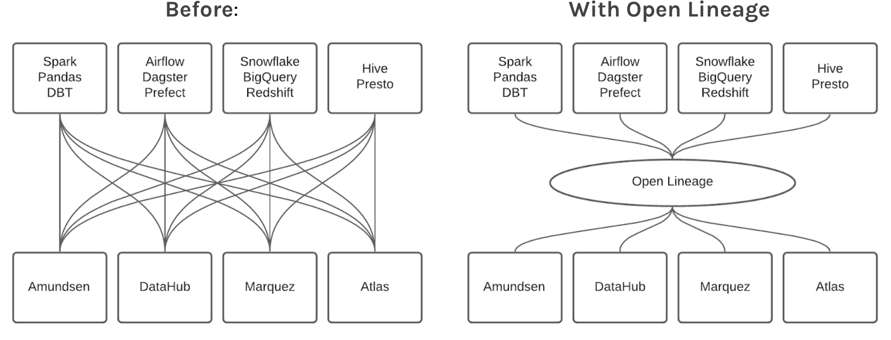
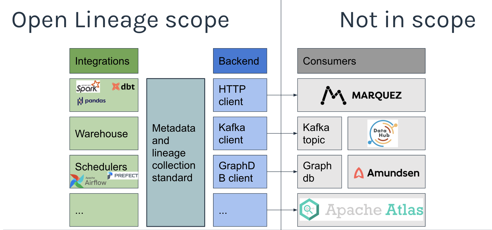

# OpenLineage

## Overview
OpenLineage is an Open standard for metadata and lineage collection designed to instrument jobs as they are running.
It defines a generic model of run, job, and dataset entities identified using consistent naming strategies.
The core lineage model is extensible by defining specific facets to enrich those entities.

## Problem
 

### Before
- Duplication of effort: Each project has to instrument all jobs
- Integrations are external and can break with new versions

### With OpenLineage
- Effort of integration is shared
- Integration can be pushed in each project: no need to play catch up

## Scope
OpenLineage defines the metadata for running jobs and the corresponding events.
A configurable backend allows to choose what protocol to send the events to.
 

## Core model

 

 A facet is an atomic piece of metadata attached to one of the core entities.
 See the spec for more details.

## Spec
The [specification](spec/OpenLineage.md) is defined using OpenAPI and allows extension through custom facets.
