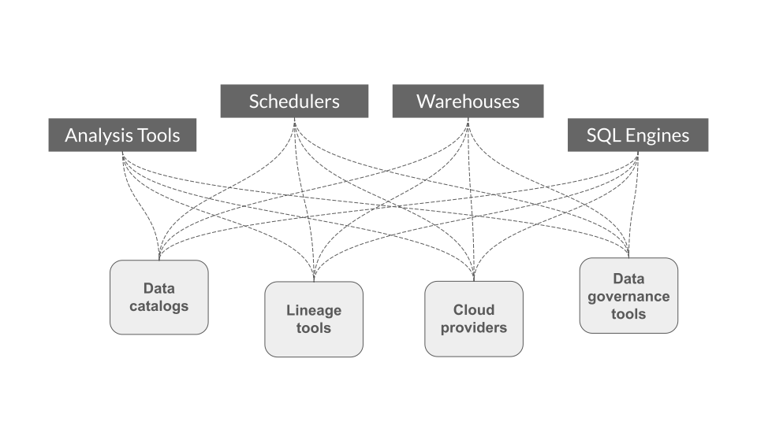

<!-- SPDX-License-Identifier: Apache-2.0 -->

  
  

## Badges

## Overview
OpenLineage is an Open standard for metadata and lineage collection designed to instrument jobs as they are running.
It defines a generic model of run, job, and dataset entities identified using consistent naming strategies.
The core lineage model is extensible by defining specific facets to enrich those entities.

## Status

OpenLineage is an [LF AI & Data Foundation](https://lfaidata.foundation/projects/openlineage) sandbox project under active development and we'd love your help!

## Problem

### Before

- Duplication of effort: Each project has to instrument all jobs
- Integrations are external and can break with new versions

### With OpenLineage

- Effort of integration is shared
- Integration can be pushed in each project: no need to play catch up

## Scope
OpenLineage defines the metadata for running jobs and the corresponding events.
A configurable backend allows to choose what protocol to send the events to.
 

## Core model

 

 A facet is an atomic piece of metadata attached to one of the core entities.
 See the spec for more details.

## Spec
The [specification](spec/OpenLineage.md) is defined using OpenAPI and allows extension through custom facets.

## Integrations

OpenLineage repository contains integrations with several systems.

- [Apache Spark](https://github.com/OpenLineage/OpenLineage/tree/main/integration/spark)
- [Apache Airflow](https://github.com/OpenLineage/OpenLineage/tree/main/integration/airflow)
- [Dagster](https://github.com/OpenLineage/OpenLineage/tree/main/integration/dagster)
- [dbt](https://github.com/OpenLineage/OpenLineage/tree/main/integration/dbt)

## Related projects
- [Marquez](https://marquezproject.ai/): Marquez is an [LF AI & DATA](https://lfaidata.foundation/) project to collect, aggregate, and visualize a data ecosystem's metadata. It is the reference implementation of the OpenLineage API.
  - [OpenLineage collection implementation](https://github.com/MarquezProject/marquez/blob/main/api/src/main/java/marquez/api/OpenLineageResource.java)
- [Egeria](https://egeria.odpi.org/): Egeria Open Metadata and Governance. A metadata bus.

## Community
- Slack: [OpenLineage.slack.com](http://bit.ly/OpenLineageSlack)
- Twitter: [@OpenLineage](https://twitter.com/OpenLineage)
- Gougle group: [openlineage@googlegroups.com](https://groups.google.com/g/openlineage)

## Talks
 - [Metadata day 2020. Open Lineage lightning talk](https://www.youtube.com/watch?v=anlV5Er_BpM)
 - [Open Core Summit 2020. Observability for data pipelines. OpenLineage project launch](https://www.coss.community/coss/ocs-2020-breakout-julien-le-dem-3eh4)
 - [Data Driven NYC Feb 2021. Data Observability and Pipelines: OpenLineage and Marquez](https://mattturck.com/datakin/)
 - [Big Data Technology Warsaw Summit. Data lineage and Observability with Marquez and OpenLineage](https://conference.bigdatatechwarsaw.eu/julien-le-dem/)

## Contributing

See [CONTRIBUTING.md](https://github.com/OpenLineage/OpenLineage/blob/main/CONTRIBUTING.md) for more details about how to contribute.
