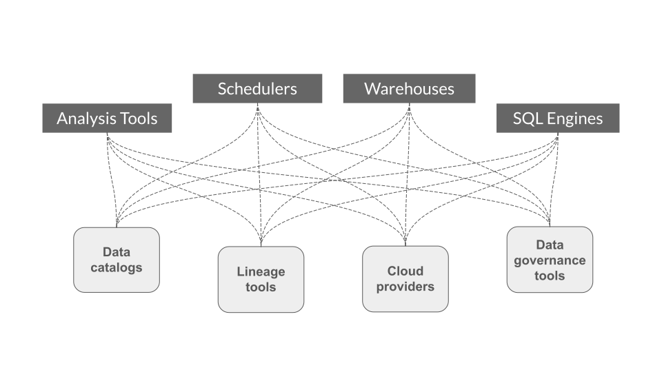
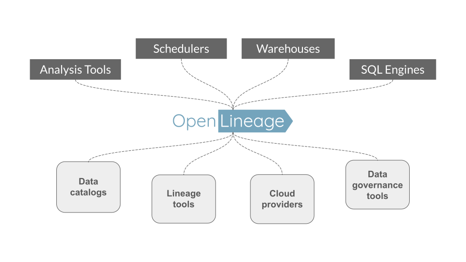

  

## Overview
OpenLineage is an Open standard for metadata and lineage collection designed to instrument jobs as they are running.
It defines a generic model of run, job, and dataset entities identified using consistent naming strategies.
The core lineage model is extensible by defining specific facets to enrich those entities.

OpenLineage is an [LF AI & Data Foundation](https://lfaidata.foundation/projects/openlineage) Graduate project under active development, and we welcome contributions.

## Problem

### Before

- Duplication of effort: each project has to instrument all jobs
- Integrations are external and can break with new versions

### With OpenLineage

- The effort of integration is shared
- An integration can be pushed in each project: no need to play catch up

## Scope
OpenLineage defines the metadata for running jobs and the corresponding events.
A configurable backend allows the user to choose what protocol to send the events to.
 

## Core model

 

 A facet is an atomic piece of metadata attached to one of the core entities.
 See the spec for more details.

## Spec
The [specification](spec/OpenLineage.md) is defined using OpenAPI and allows extension through custom facets.

## Integration matrix

The OpenLineage repository contains integrations with several systems.

| Name| Table-level lineage| Column-level lineage |
| ----| ------------------ | -------------------- |
|[Apache Spark](https://github.com/OpenLineage/OpenLineage/tree/main/integration/spark)| :white_check_mark: | :white_check_mark:1 |
|[Apache Airflow](https://github.com/OpenLineage/OpenLineage/tree/main/integration/airflow)| :white_check_mark: | :white_check_mark:2 |
|[Dagster](https://github.com/OpenLineage/OpenLineage/tree/main/integration/dagster)| :white_check_mark: | :x: |
|[dbt](https://github.com/OpenLineage/OpenLineage/tree/main/integration/dbt) |:white_check_mark: | :white_check_mark: |
|[Flink](https://github.com/OpenLineage/OpenLineage/tree/main/integration/flink)|:white_check_mark: | :x: |

1. Does not support `SELECT *` queries with JDBC.
2. Supports SQL-based operators other than BigQuery.

## Related projects
- [Marquez](https://marquezproject.ai/): Marquez is an [LF AI & DATA](https://lfaidata.foundation/) project to collect, aggregate, and visualize a data ecosystem's metadata. It is the reference implementation of the OpenLineage API.
  - [OpenLineage collection implementation](https://github.com/MarquezProject/marquez/blob/main/api/src/main/java/marquez/api/OpenLineageResource.java)
- [Egeria](https://egeria.odpi.org/): Egeria offers open metadata and governance for enterprises - automatically capturing, managing and exchanging metadata between tools and platforms, no matter the vendor.

## Community
- Website: [openlineage.io](http://openlineage.io)
- Slack: [OpenLineage.slack.com](https://join.slack.com/t/openlineage/shared_invite/zt-3arpql6lg-Nt~hicnDsnDY_GK_LEX06w)
- Twitter: [@OpenLineage](https://twitter.com/OpenLineage)
- Mailing list: [openlineage-tsc](https://lists.lfaidata.foundation/g/openlineage-tsc)
- Wiki: [OpenLineage+Home](https://wiki.lfaidata.foundation/display/OpenLineage/OpenLineage+Home)
- LinkedIn: [13927795](https://www.linkedin.com/groups/13927795/)
- YouTube: [channel](https://www.youtube.com/channel/UCRMLy4AaSw_ka-gNV9nl7VQ)
- Mastodon: [@openlineage@fostodon.org](openlineage@fosstodon.org)

## Talks
- [Flink Forward, October 2024. Data Lineage for Apache Flink with OpenLineage](https://www.flink-forward.org/berlin-2024/agenda#data-lineage-for-apache-flink-with-openlineage)
- [Airflow Summit, September 2024. Activating operational metadata with Airflow, Atlan and OpenLineage](https://airflowsummit.org/sessions/2024/activating-operational-metadata-with-airflow-atlan-and-openlineage/)
- [Kafka Summit, March 2024. OpenLineage for Stream Processing](https://www.confluent.io/events/kafka-summit-london-2024/openlineage-for-stream-processing/)
- [Data Council Austin, March 2024. Data Lineage: We've Come a Long Way](https://www.youtube.com/watch?v=OE1o4D_iWfw)
- [Data+AI Summit June 2023. Cross-Platform Data Lineage with OpenLineage](https://www.databricks.com/dataaisummit/session/cross-platform-data-lineage-openlineage/)
- [Berlin Buzzwords, June 2023. Column-Level Lineage is Coming to the Rescue](https://youtu.be/xFVSZCCbZlY)
- [Berlin Buzzwords, June 2022. Cross-Platform Data Lineage with OpenLineage](https://www.youtube.com/watch?v=pLBVGIPuwEo)
- [Berlin Buzzwords, June 2021. Observability for Data Pipelines with OpenLineage](https://2021.berlinbuzzwords.de/member/julien-le-dem)
- [Data Driven NYC, February 2021. Data Observability and Pipelines: OpenLineage and Marquez](https://mattturck.com/datakin/)
- [Big Data Technology Warsaw Summit, February 2021. Data lineage and Observability with Marquez and OpenLineage](https://bigdatatechwarsaw.eu/edition-2021/)
- [Metadata Day 2020. OpenLineage Lightning Talk](https://www.youtube.com/watch?v=anlV5Er_BpM)
- [Open Core Summit 2020. Observability for Data Pipelines: OpenLineage Project Launch](https://www.coss.community/coss/ocs-2020-breakout-julien-le-dem-3eh4)

## Contributing

See [CONTRIBUTING.md](https://github.com/OpenLineage/OpenLineage/blob/main/CONTRIBUTING.md) for more details about how to contribute.

## Report a Vulnerability

If you discover a vulnerability in the project, please [open an issue](https://github.com/OpenLineage/OpenLineage/issues/new/choose) and attach the "security" label.

## Star History

----
SPDX-License-Identifier: Apache-2.0\
Copyright 2018-2025 contributors to the OpenLineage project
