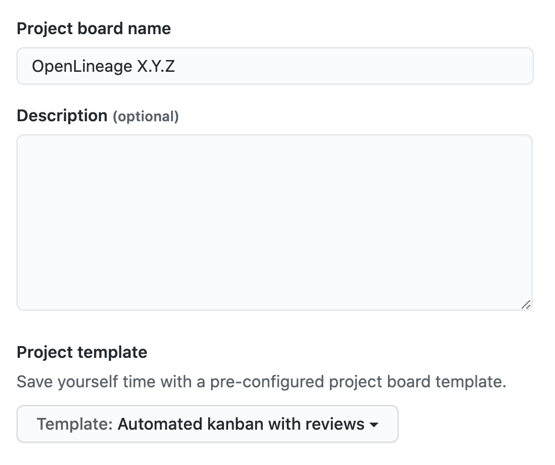
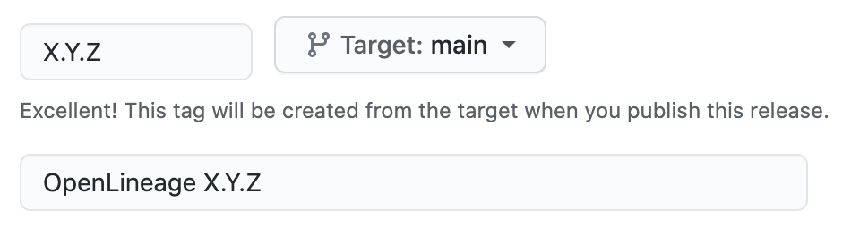

# Releasing

1. Update [`CHANGELOG.md`](CHANGELOG.md)
2. Tag the release and prepare for the next version with: ([bump2version](https://pypi.org/project/bump2version/) is a dependency. You'll need to install it if you don't have it)

   ```bash
   $ ./new-version.sh --release-version X.Y.Z --next-version X.Y.Z
   ```

   > **Tip:** Use `--help` to see script usage

3. Visit [CI](https://app.circleci.com/pipelines/github/OpenLineage/OpenLineage?branch=main) to see the progress of the release! :rocket:
4. Visit [sonatype](https://oss.sonatype.org) to promote _java_ artifacts
5. Create a [new project](https://github.com/OpenLineage/OpenLineage/projects/new) board for the _next_ release using the _automated kanban_ template:

   

6. Before closing the project board for the _current_ release, move any open issues to the project board created in **step 5**
7. Draft a [new release](https://github.com/OpenLineage/OpenLineage/releases/new) using the release notes for `X.Y.Z` in **step 1** as the release description:

   

----
SPDX-License-Identifier: Apache-2.0\
Copyright 2018-2022 contributors to the OpenLineage project