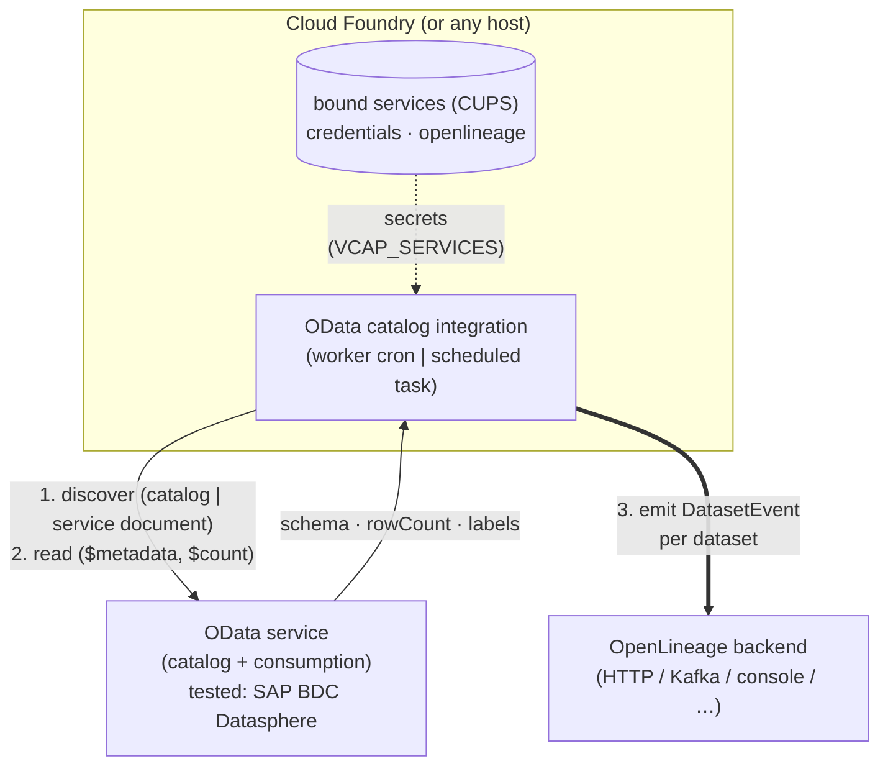

# OpenLineage Integration for OData Catalogs

Scans OData v4 services on a schedule and emits one OpenLineage `DatasetEvent` per dataset,
carrying its schema, row count and last-updated time. Events go to any OpenLineage transport
(HTTP, Kafka, console, …).

It finds datasets either through the SAP Datasphere catalog or, for any other OData v4 service,
through the standard service document. Both modes have been run against an **SAP Business Data
Cloud (BDC) Datasphere** tenant, the only system it is verified with today.

> **Status: experimental.** Configuration, emitted facets and behaviour may change without notice.
> The integration is **read-only**: it issues OData `GET` requests and never writes to the source
> system, so it cannot disrupt anything running there.
>
> Because it was built against Datasphere first, the config section (`datasphere:`), the secret keys
> (`DATASPHERE_*`) and the `app/datasphere` package still carry that name in both discovery modes.

> This is an independent, community-maintained project, not affiliated with, sponsored by or
> endorsed by SAP SE. SAP and SAP Datasphere are trademarks or registered trademarks of SAP SE or
> its affiliates in Germany and other countries. You bring your own tenant, licence and credentials;
> none are included with this project.

## How it finds datasets

Reading a dataset is always standard OData v4: EDMX from `$metadata`, `$count`,
`$orderby=<col> desc&$top=1`, and `@odata.nextLink` paging. Only **discovery**, deciding which
entity sets to read, has two modes, set by `datasphere.discovery.type`:

| Mode | How datasets are found | Grouping (space) | Namespace |
|---|---|---|---|
| `catalog` (default) | SAP Datasphere catalog service: `catalog/spaces`, then `spaces('<id>')/assets` | Datasphere space | `sap:datasphere://<host>` |
| `services` | the standard OData v4 **service document** of each configured service root; every entity set becomes a dataset | the `name` you give each service | `odata://<host>` |

`services` mode works with any OData v4 service reachable under `base_url`: no catalog needed,
just the service root paths:

```yaml
datasphere:
  base_url: "https://my-host.example"
  tenant_host: "my-host.example"
  discovery:
    type: services
    services:
      - {name: SALES, path: /odata/v4/sales}      # -> SALES.<EntitySet> for each entity set
```

`$metadata` is fetched once per service and shared by all its entity sets. Each entity set is
mapped to its entity type through the `EntityContainer`, as the spec defines, so set and type
names may differ.

### What the Datasphere catalog supports

The catalog is itself an OData v4 service (entity sets `spaces` and `assets`, linked by navigation
properties). Checked against an SAP BDC Datasphere tenant:

| Feature | Result | Used |
|---|---|---|
| Service document, `$metadata` | standard | — |
| `$filter=name eq 'A' or name eq 'B'` | works | yes: `spaces.include` is sent to the server |
| `$filter=name in ('A','B')` (OData 4.01) | **silently ignored**, returns every space | no |
| `$select`, `$orderby`, `$skip`, `$count` | work | — |
| `$expand=assets` | works, but `$top` is also applied to the expanded assets (non-standard); nested options such as `assets($top=1)` are rejected | no |
| top-level `assets` entity set (with `spaceName`) | works | no; per-space listing keeps one failing space from hiding the rest |
| listing consumption services without the catalog | not available (404) | — |

Two quirks shape the client. The catalog rejects form-style `+` for spaces in query options
(`$filter=name+eq+…` is HTTP 400), so the client always encodes spaces as `%20`. The data services
accept either. Each asset's relational URL is an ordinary OData service root whose service document
lists exactly one entity set, so `services` mode can also point at individual Datasphere assets.

## What it emits

One `DatasetEvent` per dataset in each enabled space. Standard OpenLineage facets are used wherever
one exists; the only custom facet is `odataError`.

- **namespace**: `sap:datasphere://<tenant-host>` (`catalog` mode) or `odata://<tenant-host>` (`services` mode)
- **name**: `<space>.<asset>`, the stable technical identifier
- **facets**
  - **`schema`**: columns (name, EDM type, business label as `description`) from `$metadata`.
  - **`dataQualityMetrics`**: `rowCount` from `$count`, and `lastUpdated` (see
    [lastUpdated](#lastupdated--when-was-data-last-written)) with a `lastUpdatedSource` note.
  - **`documentation`**: the asset's business name.
  - **`catalog`**: `framework: sap-datasphere` (or `odata` in `services` mode), `type: odata`, the technical name, the space, the
    metadata/data URLs (`metadataUri` / `warehouseUri`), and the remaining catalog attributes
    (`businessName`, `space`, `spaceLabel`, `entitySet`, `accessModel`,
    `supportsAnalyticalQueries`, `hasParameters`, analytical URLs) in `catalogProperties`.
  - **`dataSource`**: the tenant host and base URL.
  - **`symlinks`**: the OData data URL(s) where the dataset can actually be read, split into
    `namespace` (`scheme://host`) and `name` (path). The event `name` stays the stable logical id.
  - **`odataError`** *(custom, only on failure)*: `operation`, `httpStatus`, `message`, `url`,
    `correlationId` for each OData call that failed. A dataset whose count or schema request fails
    still produces an event saying what went wrong instead of being dropped.

## Architecture



```
worker.py / run_task.py         entrypoints (daemon with cron | one-shot task)
        │
   tasks/odata_to_ol.py         orchestration (idempotent; errors captured per dataset)
        │
   ┌────┴──────────────────┬──────────────────────┐
 OdataClient             LastUpdatedResolver     LineageEmitter
 (OData v4 reads,        (monitoring |           (standard OpenLineage
  pluggable auth)         max_timestamp_column |  transport)
      │                   design_time)
 Discovery
 (catalog | services)
```

Each of these can be replaced without touching the orchestration: auth (`app/auth`), discovery
(`app/datasphere/discovery.py`), OData client (`app/datasphere`), lastUpdated strategy (`app/lastupdated`), secrets (`app/secrets`) and transport
(OpenLineage config).

## Connectivity

There is one OData client. Two independent settings decide how it connects: the service root
(`datasphere.odata_base_path`) and the auth method (`datasphere.auth.type`). Any combination is
allowed; these are the two that matter for Datasphere:

| `odata_base_path` | `auth.type` | Datasphere API | Status |
|---|---|---|---|
| `/dwaas-core/odata/v4` (default) | `cookie` | catalog + consumption behind the web UI (undocumented) | tested against a BDC Datasphere tenant |
| `/api/v1/datasphere/consumption` | `oauth2_client_credentials` | official OData consumption API | implemented, not yet tested against a live tenant |

The cookie path needs no admin rights, which makes it the quickest way to try the integration. It
relies on an undocumented API that may change between releases, so it is meant for evaluation, not
production. The OAuth path, including token caching and refresh on 401, is fully implemented. It
assumes the official API exposes the same `catalog` structure, which is still to be confirmed.

Credentials are only ever sent over `https://`. `base_url`, the OAuth token URL and every request
URL (including `@odata.nextLink` values returned by the server) are checked, and anything else is
refused.

## Quickstart (local)

```bash
cd integration/odata
uv sync --extra dev

cp config/config.example.yaml config/config.yaml   # set base_url, tenant_host, spaces.include
cp config/.env.example .env                        # set DATASPHERE_COOKIE (see below)

# One-shot scan; the default console transport prints the events:
uv run python -m app.run_task odata_to_ol

# Or run as a daemon on the cron schedule in config.yaml:
uv run python -m app.worker
```

Without `uv`: `python -m venv .venv && . .venv/bin/activate && pip install -r requirements-dev.txt`,
then the same `python -m …` commands.

### Getting a session cookie (Datasphere)

1. Log in to your tenant in a browser (`https://<tenant>.<region>.hcs.cloud.sap`).
2. Open **DevTools → Network** and trigger any backend call, e.g. preview a table.
3. Pick a request to a `/dwaas-core/...` URL and copy its `Cookie` request header. In Chrome,
   **Copy → Copy as cURL** and take the value after `-b`.
4. Put the whole string on one line in `.env`:

   ```dotenv
   DATASPHERE_COOKIE=__VCAP_ID__=<...>; JSESSIONID=<...>; __VCAP_ID_META__=<...>
   ```

Copy the entire header, not just `JSESSIONID`:

| Cookie | Why |
|---|---|
| `JSESSIONID` | The authenticated session. Without it: 401. |
| `__VCAP_ID__` | Cloud Foundry routing. The data gateway is instance-routed and can return 401 without it, even with a valid session. |
| `__VCAP_ID_META__` | Present on some tenants; include it when it is there. |

The session expires. When requests start returning 401, copy a fresh cookie.

## Configuration

Non-secret settings live in `config/config.yaml` (start from `config/config.example.yaml`). Secrets
come from `.env` locally or from bound services on Cloud Foundry; they are never read from the YAML.

Any setting can be overridden with an environment variable named `DS_OL__<section>__<key>` (double
underscores for nesting), e.g. `DS_OL__SCHEDULER__CRON="*/15 * * * *"`. Unknown keys, in the YAML
or in an override, are rejected at startup, so a typo fails instead of being silently ignored.

- **`spaces`**: `include` / `exclude` lists select which spaces are scanned.
- **`lastupdated.strategies`**: tried in order; the first that yields a value wins.
- **`openlineage.transport`**: any standard OpenLineage transport config.

### lastUpdated — when was data last written?

| Strategy | Source | Notes |
|---|---|---|
| `monitoring` | admin monitoring API | the real data-write time; needs the DW Administrator role (403 otherwise). Scaffold only. |
| `max_timestamp_column` | latest value of a timestamp column via `$orderby … desc&$top=1` | works today. The column is picked from the schema using `timestamp_column_patterns`. It reports the newest *value*, which only means "last written" for change timestamps. On a calendar dimension it returns the end of the calendar (e.g. 2050-12-31), so keep the patterns specific. |
| `design_time` | view deployment / modification date | fallback; describes when the definition changed, not the data. |

`lastUpdatedSource` on the facet records which strategy and column produced the value.

### Choosing a transport

`console` is the default and safe for local runs. An `http` transport looks like this:

```yaml
openlineage:
  transport:
    type: "http"
    url: "https://<your-openlineage-endpoint>"
    auth:
      type: "api_key"
      api_key: "${OPENLINEAGE_API_KEY}"   # resolved from .env / bound services
    compression: "gzip"
```

`${VAR}` placeholders are resolved from the secrets provider. An unresolved placeholder is a
startup error, never an empty string. Any OpenLineage-compatible backend works; see the
[transport docs](https://openlineage.io/docs/client/python/#transports) for the full list.

## Cloud Foundry

Two deployment shapes are provided (`manifest.yml`, `manifest-task.yml`):

- **Worker** with the built-in cron: a route-less app with `health-check-type: process` and one
  instance, running `python -m app.worker`. Deploy with `cf push`.
- **Scheduled task** (recommended): `cf push -f manifest-task.yml --task` (stages the app without
  starting it), then have SAP Job Scheduling Service start `python -m app.run_task odata_to_ol` on a cron. The task reuses the app's
  droplet, environment and bindings.

Credentials come from user-provided services, read through `app/secrets.py`. The key names are the
same locally (`.env`) and on CF (`VCAP_SERVICES`):

```bash
cf cups datasphere-oauth -p '{"DATASPHERE_TOKEN_URL":"...","DATASPHERE_CLIENT_ID":"...","DATASPHERE_CLIENT_SECRET":"..."}'
cf cups openlineage      -p '{"OPENLINEAGE_API_KEY":"..."}'
```

Logs go to stdout as JSON and containers run in UTC. SIGTERM allows about 10 s to shut down. Every
run is idempotent, so emitting the same snapshot twice is harmless.

## Development

```bash
cd integration/odata
uv sync --extra dev
uv run pytest            # unit tests, no network access
uv run ruff check . && uv run ruff format --check .
```

In the monorepo, `openlineage-python` is resolved from `client/python` through
`[tool.uv.sources]`, so client changes are tested against this integration in CI.
`requirements.txt` keeps the published PyPI pin, which is what the Cloud Foundry buildpack installs.

## Future work

- **Verify `services` mode on a non-SAP OData v4 service.** So far it has only been run against
  Datasphere asset service roots.
- **More discovery sources.** Other catalogs (e.g. SAP Gateway's catalog service) can be added as
  further `discovery.type` values; each only has to produce service roots and entity sets.
- **Neutral naming.** Rename the Datasphere-specific config section, secret keys and package. The
  `catalog`-mode namespace needs a separate decision, since changing it changes dataset identity.
- **Verify the OAuth consumption API** against a live tenant.
- **Real data-write `lastUpdated`** via the admin monitoring API (the `monitoring` strategy is
  scaffolded).
- **Tags.** Datasphere tags are not in the OData catalog; they sit behind a separate repository
  API. Once wired, emit them with the standard `tags` facet and allow filtering by tag alongside
  `spaces.include` / `exclude`.
- **Extra extractors** for object dependencies (view-to-source lineage), task-chain runs, data flows
  and ownership, each contributing its own facet.

----
SPDX-License-Identifier: Apache-2.0\
Copyright 2018-2026 contributors to the OpenLineage project
