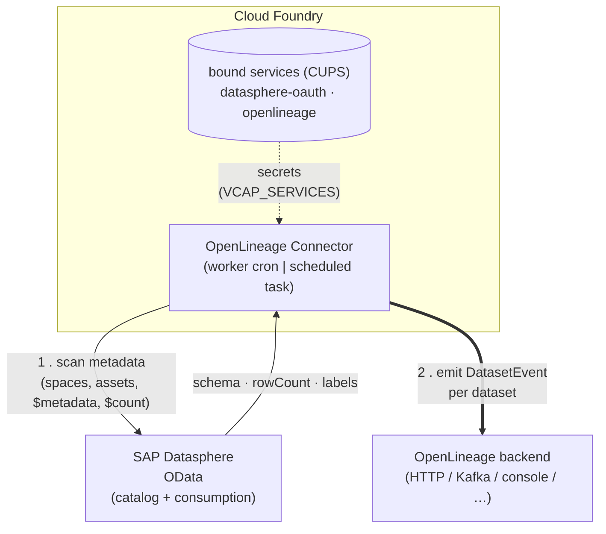

# OpenLineage Connector for SAP Datasphere

> This is an independent, community-maintained project. It is not affiliated with, sponsored by,
> endorsed by, or otherwise associated with SAP SE or its affiliates.
>
> SAP and SAP Datasphere are trademarks or registered trademarks of SAP SE or its affiliates in
> Germany and other countries.

> **Status: experimental.** This connector is an early-stage proof of concept. Its configuration,
> emitted facets, and behaviour may change without notice, and the OAuth consumption path has not yet
> been verified against a live tenant (see [Connectivity](#connectivity)). It runs as a separate,
> read-only application alongside SAP Datasphere — it only reads metadata over OData and never writes
> to the tenant — so its experimental state cannot disrupt or break any processes running in SAP
> Datasphere.

The **OpenLineage Connector for SAP Datasphere** is an independent integration, compatible with the
SAP® Datasphere solution, that emits [OpenLineage](https://openlineage.io/) metadata from the SAP
environment. It periodically
scans SAP Datasphere metadata over OData and emits an OpenLineage `DatasetEvent` per dataset —
including the dataset schema and a **data-quality facet** with `rowCount` and `lastUpdated` — to any
OpenLineage transport (HTTP, Kafka, console, …).

You supply your own SAP Datasphere tenant, license, configuration, and credentials; none are included
with or distributed by this project.

The transport is standard OpenLineage config, so the connector is **vendor-neutral**: it emits to any
OpenLineage-compatible backend. Datadog is one possible endpoint used as an example below.

## What it emits

For each dataset in each enabled space, one `DatasetEvent`. The mapping favours **standard**
OpenLineage facets — a custom facet is used only where the spec has no equivalent.

- `namespace`: `sap:datasphere://<tenant-host>`
- `name`: `<space>.<asset>` (the stable technical identifier)
- facets:
  - **`schema`** — columns (name, type, and per-column **business label** as `description`) and keys,
    from OData `$metadata`.
  - **`dataQualityMetrics`** — `rowCount` (OData `$count`) and `lastUpdated` (see below), plus a
    `lastUpdatedSource` note.
  - **`documentation`** — the asset's **business name** (human label) as the description.
  - **`catalog`** — `framework: sap-datasphere`, the **technical name**, the containing space, the
    relational/analytical OData URLs (`metadataUri`/`warehouseUri`), and SAP-specific bits
    (`spaceLabel`, `supportsAnalyticalQueries`, `hasParameters`, `entitySet`) in `catalogProperties`.
  - **`dataSource`** — the source tenant host and base URL.
  - **`symlinks`** — alternate, resolvable coordinates for the same dataset: the OData consumption
    data URL(s) (relational/analytical), split into `namespace` (`scheme://host`) and `name` (path).
    The dataset's OpenLineage `name` is the stable logical id; the symlink is where the data actually
    lives, so a consumer can fetch it without parsing the name.
  - **`tags`** — *(future)* the standard tag facet, once a tag source is wired (tags are not in the
    OData catalog today — see [Future work](#future-work)).
  - **`odataError`** *(custom)* — present only when an OData call returned a non-2xx status; records
    `operation`, `httpStatus`, `message`, `url`, `correlationId`. Datasets that error still produce an
    event that explains what failed, instead of being silently dropped.

## Architecture

### Deployment

The connector runs on **Cloud Foundry**, polls SAP Datasphere over OData on a schedule, and emits
OpenLineage events to any configured OpenLineage backend.



### Components

```
worker.py / run_task.py         entrypoints (daemon w/ cron  |  one-shot task)
        │
   tasks/odata_to_ol.py         orchestration (idempotent; per-dataset error capture)
        │
   ┌────┴─────────────┬───────────────────────┐
 DatasphereClient   LastUpdatedResolver     LineageEmitter
 (pure OData:       (monitoring|max_col|    (standard OpenLineage
  catalog+consumption) design_time)          transport)
  + pluggable auth)
```

Key seams: **auth** (`app/auth`), **OData client** (`app/datasphere`), **lastUpdated strategy**
(`app/lastupdated`), **secrets** (`app/secrets`), and **transport** (OpenLineage config). Each is
swappable without touching orchestration.

## Connectivity

There is a single OData client. How it connects is set by two **independent** knobs — the OData
service root (`datasphere.odata_base_path`) and the auth method (`datasphere.auth.type`). The two
useful combinations:

| `odata_base_path` | `auth.type` | API | Status |
|---|---|---|---|
| `/dwaas-core/odata/v4` (default) | `cookie` | `dwaas-core` OData catalog + consumption (undocumented) | works today, no admin needed |
| `/api/v1/datasphere/consumption` | `oauth2_client_credentials` | official OData consumption API + catalog | code complete; unverified against a live OAuth tenant |

The default (`/dwaas-core` + cookie) is the only combination usable without the DW Administrator role
(required to create an OAuth client). It is unofficial and may change between SAP Datasphere releases. The
OAuth path is fully implemented — including client-credentials token caching and refresh — but has
not yet been exercised against a live OAuth-enabled tenant, and it assumes that API exposes the same
`catalog` structure (to be verified). Base path and auth are orthogonal: any combination is allowed.

## Quickstart (local)

```bash
python -m venv .venv && . .venv/bin/activate
pip install -r requirements-dev.txt

cp config/config.example.yaml config/config.yaml
cp config/.env.example .env
# Put a browser session cookie in .env as DATASPHERE_COOKIE -- see "Getting a session cookie" below.

# One-shot scan (defaults to console transport -> prints events):
python -m app.run_task odata_to_ol

# Daemon mode (runs on the cron schedule in config.yaml):
python -m app.worker
```

### Getting a session cookie (fastest way to test)

A browser **session cookie** is the quickest way to try the connector against a live tenant: it needs
no admin role and no OAuth client — just log in to SAP Datasphere as yourself and reuse the browser
session.
It's ideal for local testing/iteration; for production use OAuth (see [Connectivity](#connectivity)).

1. Log in to your SAP Datasphere tenant in a browser (e.g.
   `https://<tenant>.<region>.hcs.cloud.sap`).
2. Open **DevTools → Network**, then do anything that hits the backend — e.g. open a space or preview
   a table. Click a request to a `/dwaas-core/...` URL, and copy its **`Cookie`** request header
   (in Chrome: right-click the request → **Copy → Copy as cURL**, then take the value after `-b`/
   `--cookie`). You can also read the values under **Application → Cookies**.
3. Paste the **whole** cookie string into `.env` on one line:

   ```dotenv
   DATASPHERE_COOKIE=__VCAP_ID__=<...>; JSESSIONID=<...>; __VCAP_ID_META__=<...>
   ```

**Which parts to include — use the full string, not just `JSESSIONID`:**

| Cookie | Why it's needed |
|---|---|
| `JSESSIONID` | The actual authenticated session — without it you get 401. |
| `__VCAP_ID__` | Cloud Foundry **routing** cookie. The data-access gateway is instance-routed and can 401 without it, even with a valid `JSESSIONID`. |
| `__VCAP_ID_META__` | Present in some tenants; include it if it's there. |

When in doubt, copy the entire `Cookie` header verbatim. The value is session-scoped and **expires**
(re-grab it when you start getting 401s) — another reason it's for testing, not production.

## Configuration

Non-secret settings live in `config/config.yaml` (see `config/config.example.yaml`); secrets come
from `.env` locally or bound services in Cloud Foundry. Any setting can be overridden by an env var
using `DS_OL__<section>__<key>` (double underscores for nesting), e.g.
`DS_OL__SCHEDULER__CRON="*/15 * * * *"`.

- **spaces**: `include` / `exclude` lists control which spaces are scanned.
- **lastupdated.strategies**: ordered; first to yield a value wins.
- **openlineage.transport**: standard OpenLineage transport config (see below).

### `lastUpdated` — "last time data was written"

The genuine data-write time for persisted/replicated objects lives in the admin **monitoring** API,
which requires DW Administrator (HTTP 403 otherwise). Strategies, in recommended order:

1. `monitoring` — real data-write time *(scaffold; needs admin/OAuth)*.
2. `max_timestamp_column` — `MAX()` of a change-timestamp column via OData *(works today)*; column
   auto-detected from schema using `timestamp_column_patterns`.
3. `design_time` — view `deployment_date`/`modification_date` *(fallback; labelled as definition time,
   not data-write time)*.

`lastUpdatedSource` on the emitted facet records which strategy/column produced the value.

### Choosing a transport

Set `openlineage.transport` to any standard OpenLineage transport (`console`, `http`, `kafka`, …).
The default is `console`, which prints events and is safe for local runs. A generic `http` transport
looks like this:

```yaml
openlineage:
  transport:
    type: "http"
    url: "https://<your-openlineage-endpoint>"
    auth:
      type: "api_key"
      api_key: "${OPENLINEAGE_API_KEY}"            # ${VAR} is resolved from env/secrets
    compression: "gzip"
```

`${VAR}` placeholders in the transport config are resolved from the SecretsProvider, so no keys are
committed.

Any OpenLineage-compatible backend works. For example, to send events to **Datadog** point the `http`
transport `url` at `https://data-obs-intake.datadoghq.com` (or use OpenLineage's own `datadog`
transport type, available on recent client versions). See the
[OpenLineage transport docs](https://openlineage.io/docs/client/python/#transports) for the full list.

## Cloud Foundry

Two supported shapes (see `manifest.yml` and `manifest-task.yml`):

- **Worker** (embedded cron): route-less app, `health-check-type: process`, `instances: 1`,
  `command: exec python -m app.worker`. Deploy with `cf push`.
- **Scheduled** (recommended): push staged with `cf push -f manifest-task.yml --no-start`, then have
  **SAP Job Scheduling Service** launch a CF task running `python -m app.run_task odata_to_ol` on a
  cron schedule. A task reuses the app's droplet, env, and bindings.

Credentials are provided as **user-provided services** (CUPS) and read via `app/secrets.py` (`cfenv`);
the same key names work locally (`.env`) and in CF (`VCAP_SERVICES`). Example:

```bash
cf cups datasphere-oauth -p '{"DATASPHERE_TOKEN_URL":"...","DATASPHERE_CLIENT_ID":"...","DATASPHERE_CLIENT_SECRET":"..."}'
cf cups openlineage      -p '{"OPENLINEAGE_API_KEY":"..."}'
```

Operational notes: log to stdout (JSON), containers run UTC, SIGTERM has a ~10s grace window, and each
run is idempotent (re-emitting a snapshot is safe).

## Future work

- **Tags → tag-based filtering.** SAP Datasphere assets can carry tags, but tags are **not** exposed by
  the OData catalog used here — they live behind a separate data-builder/repository API. Once that is
  wired, tags should be emitted via the **standard OpenLineage `tags` facet** (`TagsDatasetFacet`),
  and the scan should support **selecting/excluding assets by tag** (alongside the existing
  space `include`/`exclude`), so a tenant can lineage-track only tagged/certified assets.
- **Custom extractors.** The collection step is a fixed schema + rowCount + lastUpdated pass. We may
  want pluggable **extractors** that pull other SAP Datasphere metadata — e.g. object dependencies /
  view-to-source lineage, task-chain runs, data-flow definitions, ownership, or persistency stats —
  each contributing its own (preferably standard) OpenLineage facet, without touching orchestration.
- **Real data-write `lastUpdated`.** The genuine content-refresh time needs the admin monitoring API
  (the `monitoring` strategy is scaffolded) or the OAuth consumption backend.
- **Verify the `consumption` (OAuth) backend** against a live OAuth-enabled tenant (code is complete).

## Development

Standard install (uses the **published** `openlineage-python` client from PyPI, as pinned in
`requirements.txt` — this is what Cloud Foundry deploys too):

```bash
pip install -r requirements-dev.txt
pytest        # unit tests (no network)
ruff check .  # lint
```

Inside the OpenLineage monorepo, CI instead resolves `openlineage-python` from the in-repo
`client/python` via `[tool.uv.sources]`, so client changes are tested against this integration:

```bash
uv sync --extra dev
uv run pytest tests/
```
