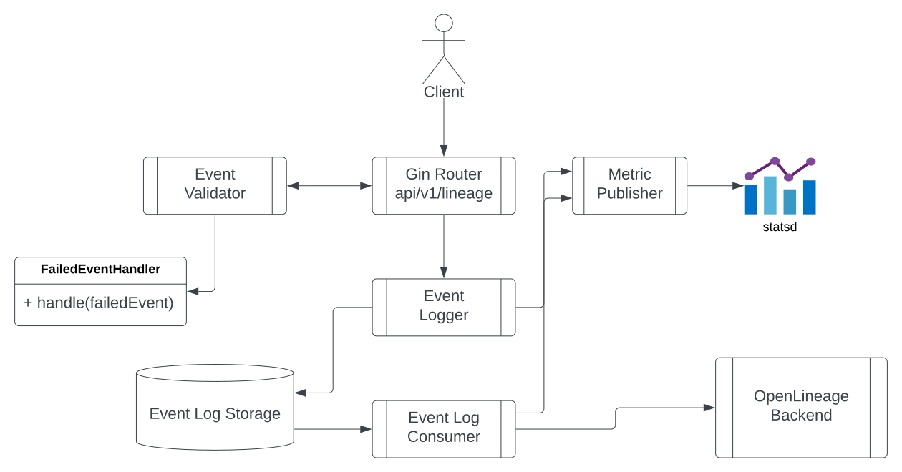
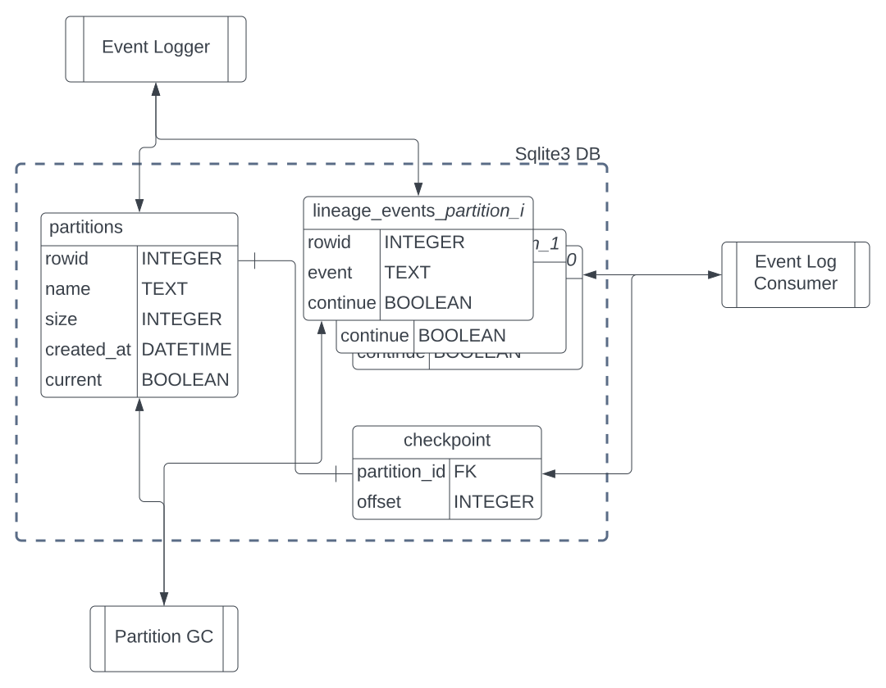

# Problem Statements
Currently, OpenLineage integrations are directly sending events to the configured backend, which is not flexible enough for some situations such as
- Not responsive backend due to an outage or a network issue
- Long latency of the API that adds extra delay to the processing

The first scenario will likely cause the data loss which we would like to avoid as much as possible. The second one is less critical and could be mitigated by implementing asynchronous integrations, but it is very hard to do so for every single integrations.

# Proposal
In this proposal, I suggest implementing OpenLineage Proxy that is lightweight, fast, and can be run as a sidecar along with the processing engine. It helps reducing the latency for clients when the configured backend is in a different network, different a region or in a different cloud. Even when it is in the same network, this proxy will likely to provide a lower latency because it only performs the minimal work such as event validation against the spec, while the actual backend such as [Marquez](https://marquezproject.ai/) performs its own business logics. It also helps dealing with the backend outage, by keeping the lineage events inside its own local buffer until the backend is back available. This is of course not an ultimate solution for the problems above and there are a few other possible solutions available cloud based message broker that can act as a proxy, but it could provide an option to the users who want to deal with the problems with minimal additional resource usages while keeping the ability to handle invalid events.

# Requirements
- Proxy must implement the HTTP POST API which receives an OpenLineage JSON event according to the [OpenLineage spec](https://github.com/OpenLineage/OpenLineage/blob/main/spec/OpenLineage.yml).
- Proxy must be able to validate the OpenLineage events against the spec including standard facets.
    - Proxy must return 200 if the event is compliant to the spec regardless of the actual OpenLineage backend service availability.
    - Proxy must pass the event to configured *FailedEventHandler* if the event is non-compliant to the spec.
        - Proxy should return 400 for this.
- Proxy must buffer the OpenLineage events locally and send them to the backend when possible.
    - If the backend is available, the proxy should send the events as soon as possible
    - If the backend is unavailable for any reasons, proxy must keep events locally until it hits the buffer limit, and send them to the backend later when it’s available.
        - Buffer is limited by following parameters, whatever hits the limit first
            - T: hours to keep events to the buffer
            - B: bytes of the messages to keep events to the buffer
        - Buffer should be flushed when it hits the limit in order to keep the local storage available.
- Proxy must guarantee the order of the messages to be sent to the backend as the order it is received.

## Lightweight Proxy
This proposal will not mention how much lightweight it should be such as memory requirements or the latency, but the general idea is to be minimal enough to run as a sidecar of the processing engines.

# Proposed Design

## Language Options - Go
Among many programming language options, I propose using Go/Gin. Go is lightweight, verified in many productions, and has big community. Gin is a web framework for Go and has 64.5K stars in GitHub at the time of writing this. Go programs are compiled into single binary file, which is compact and no additional runtime is needed. There are many other languages with big community such as java, python, or node, but they require additional runtime environment in order to run the software, which is unlike lightweight proxy. Rust/Rocket is another option for lightweight, fast proxy implementation, however, considering the size of the community and the maturity of the project, I would like to propose Go/Gin.

## Design


### Router(api/v1/lineage)
This component is a Gin router that creates an API endpoint of `POST /api/v1/lineage`. This will get the actual OpenLineage events payload, validate it via EventValidator, and send it to the EventLogger for local buffering. This is responsible for returning proper response code based on the validation result.

### Event Validator
This validates that if the event payload is compliant to OpenLineage specification including standard facets. It will pass the invalid events to the FailedEventHandler, which will take care of  putting into the DLQ, logs, or either. In OpenLineage, we will provide a standard interface for it and users could implement their own handler. The implementation of validator could be as a middleware of Gin router, or a separate component. I will leave the choice to the one who actually implement this.

### Event Logger
*EventLogger* buffers the OpenLineage events to the temporal local storage. This is responsible for writing events to the log file, and rotating the log based on the configuration. The events must be written to the file by preserving the order of the events that the proxy received. At this point, the event is already validated.

### Event Log Consumer
This log consumer reads the log written by the *EventLogger*, and send them to the configured backend. It checkpoints the offset of the logs so that it can restart in case of proxy app restart. It is also responsible for retry in case of the backend outage. Backend might not respond to the requests for many possible reasons and this will retry until it succeeds. This will not skip an event and move on to the next in order to avoid data loss.

### Metric Publisher
*MetricPublisher* gets the data from Event Logger and Event Log Consumer, how many messages are being written to the local storage and how many are being sent to the backend, and it keeps track of the consumer lag metrics. This will use the the *statsd* client so that the metrics can be sent to any *statsd* implementation, and possibly in the future we may support *OpenMetrics* and make it configurable.

### Event Log Storage
Event Log Storage is a local storage that stores OpenLineage events. It has a configured limit by age and size and drops old events when it hits the limit. Event Log Consumer should be able to read events from the checkpoint when starting. Here I compare two options, file based log tailing and using sqlite3 for local database.

#### Option 1. File Based Log Tailing
With the help of a logging library, we can write OpenLineage events to the log files. A decent logging library support log rotation which closes and recreate a log file when it hits the configured limit. We can also get a help from tail library which tails the log entries from the file that recognizes the rotation of the log files. The pro of this approach is that decent libraries are already available and the implementation is simple and easy.

As described from the above diagram, the logging and tailing libraries take care of abstraction of the log rotation, and the Event Logger and the Event Consumer implementation don’t need to care of them. They simply open a file and read from it.

However, There is a clear limit of this approach. By nature of the logging library, rotation happens when it hits the configured limit. When rotated, the new file is created and the consumer keeps reading from the new file. The problem happens with a backend outage scenario. If the log is rotated during the outage, the tailor is still waiting for the backend to be available but the file gets rotated. Besides, If the proxy app restarts and the next message we have to send to the backend is in the rotated file, we should be able to track and read from it. When checkpointing, in order to solve this problem, we have to keep track of in which file the checkpoint exists, and read from the rotated file. This eliminates the abstraction provided by the logger an tailor library, which makes the implementation complicated but loses the benefit of using library.

#### Option 2. Local database with Sqlite3 - proposed

As a second option, in order to avoid the problems happen with option 1, we can implement custom event log rotation and checkpoint mechanism. We no longer leverage file based logging library, and using a sqlite3 database is a great alternative because it allows us explicit schema management and transactional operations.

With this approach, *Event Logger* is responsible for partition rotation as well as putting events to the event table. Partition rotation can be done with the smaller partition limit, like rotate hourly when the configured limit is given to 24 hours.

Following pseudo codes describe the logic of each component.

##### Event Logger:
```
channel = channel for lineage events

current_partition = `SELECT * FROM partitions WHERE current=TRUE`

IF current_partition DOES NOT EXIST:
    current_partition = CREATE PARTITION
    CREATE CHECKPOINT FOR current_partition WITH OFFSET 0

FOR lineage_event IN channel:
    event_size = len(lineage_event)
    cont = current_partition.size + event_size < PARTITION LIMIT
            && current_partition.created_at > NOW() - PARTITION_LIMIT_HOUR
    
    IF not cont:
        IN TRANSACTION:
            // Partition rotation
            next_partition = CREATE PARTITION
            current_partition.current = FALSE
            next_partition.current = TRUE
            INSERT INTO current_partition (event, continue) VALUES ("", FALSE)
            current_partition = next_partition

    IN TRANSACTION:
        INSERT INTO current_partition (event, continue) VALUES (lineage_event, TRUE)
        current_partition.size += len(lineage_event)

```

##### Event Consumer
```
partition, offset = `SELECT name AS partition, offset FROM checkpoint c INNER JOIN partitions p ON c.partition_id=p.rowid`
lineage_event, cont = read(partition, offset)
offset += 1

WHILE TRUE:
    IF cont == FALSE:
        partition = GET NEXT PARTITION
        offset = 0
    lineage_event, cont = read(partition, offset)
    SEND lineage_event TO BACKEND
    checkpoint(partition, offset)
    offset += 1

/**
 * Blocking read which wait until the event is available.
 * It might be implemented with retry and sleep.
 */
FUNC read(partition, offset):
    return `SELECT event, continue FROM partition WHERE rowid=offset`
```

##### Partition GC: runs periocally
```
/* Delete partitions that are already processed */
checkpointed_partition_id = `SELECT partition_id FROM checkpoint`
deletion_candidates = `SELECT * FROM partitions WHERE rowid < checkpointed_partition_id`
delete_partitions(deletion_candidates)

/* Delete partitions that are older than limit hour */
deletion_candidates = `SELECT * FROM partitions WHERE created_at < NOW() - LIMIT HOURS`
delete_partitions(deletion_candidates)

/* Delete oldest partitions until the total size is smaller then limit size */
deletion_candidates = list()
current_total_size = `SELECT SUM(size) FROM partitions`
partition_records = `SELECT * FROM partitions ORDER BY rowid ASC`
FOR partition_record IN partition_records:
    if current_total_size < LIMIT SIZE:
        BREAK
    deletion_candidates.append(partition_record)
    current_total_size -= partition_record.size
delete_partitions(deletion_candidates)

FUNC delete_partitions(deletion_candidates):
    FOR partition IN deletion_candidates:
        DROP TABLE partition IF EXISTS
        DELETE FROM partitions WHERE rowid=partition.rowid
```

# Future Milestone
We might add Kafka transport for the consumer so that it can send to not only the lineage API backend but also the kafka topic. With this implemented, we are able to use this proxy as a replacement of the backend proxy. The major job of both of proxy is receiving and forwarding events, which is quite an overlap, and we could be able to replace the proxy backend with this, like just one proxy implementation that can be used as either a client proxy or server side reverse proxy. One missing piece of this design for that is ability to forward events to the multiple destination that the proxy backend can do. Having multiple destination will require the change of the design in order to deal with the outage of subset of backends which will complicate the design, and I will put this as a future work.

# Appendix
- [Gin](https://github.com/gin-gonic/gin) is a web framework written in Go
- [Lumberjack](https://github.com/natefinch/lumberjack) is a logging library that support rotation based on size and ages
- [Tail](https://github.com/hpcloud/tail) is a go library for log tailing that is designed to work with a log rotation
- [Sqlite](https://www.sqlite.org/) is a database engine that strives to provide local data storage for applications

# Side Note
As this proposes a client side proxy, which will make a confusion with existing backend(kafka) proxy, I would like to propose rename the Kafka proxy to the reversed proxy, as it sits in front of the backend. However, this is out of scope of this design and we may open a separate issue if we want to discuss about this.