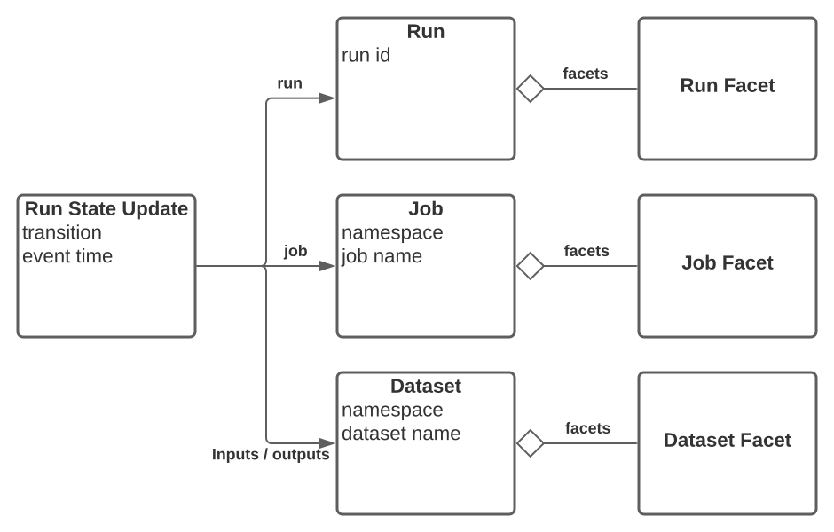

# OpenLineage Spec

## Specification

The specification for OpenLineage is formalized as a JsonSchema [OpenLineage.json](OpenLineage.json).
An OpenAPI spec is also provided for HTTP based implementations: [OpenLineage.yml](OpenLineage.yml)
The documentation is published at: https://openlineage.github.io/
It allows extensions to the spec using `Custom Facets` as described in this document.

## Core concepts

### Core Lineage Model



- **Run Event**: an event describing an observed state of a job run. It is required to at least send a START event and a COMPLETE/FAIL/ABORT event. Additional events are optional.

- **Job**: a process definition that consumes and produces datasets (defined as its inputs and outputs). It is [identified by a unique name within a namespace](Naming.md#Jobs) (which is assigned to the scheduler starting the jobs). The *Job* evolves over time and this change is captured when the job runs.

- **Dataset**: an abstract representation of data. It has a [unique name within the datasource namespace](Naming.md#Datasets) derived from its physical location (for example db.host.database.schema.table). Typically, a *Dataset* changes when a job writing to it completes. Similarly to the *Job* and *Run* distinction, metadata that is more static from run to run is captured in a DatasetFacet (for example, the schema that does not change every run), what changes every *Run* is captured as an *InputFacet* or an *OutputFacet* (for example, what subset of the data set was read or written, like a time partition).

- **Run**: An instance of a running job with a start and completion (or failure) time. A run is identified by a globally unique ID relative to its job definition. A run ID **must** be an [UUID](https://datatracker.ietf.org/doc/html/rfc4122).

- **Facet**: A piece of metadata attached to one of the entities defined above.

example:
Here is an example of a simple start run event not adding any facet information:
```
{
  "eventType": "START",
  "eventTime": "2020-12-09T23:37:31.081Z",
  "run": {
    "runId": "3b452093-782c-4ef2-9c0c-aafe2aa6f34d",
  },
  "job": {
    "namespace": "my-scheduler-namespace",
    "name": "myjob.mytask",
  },
  "inputs": [
    {
      "namespace": "my-datasource-namespace",
      "name": "instance.schema.table",
    }
  ],
  "outputs": [
    {
      "namespace": "my-datasource-namespace",
      "name": "instance.schema.output_table",
    }
  ],
  "producer": "https://github.com/OpenLineage/OpenLineage/blob/v1-0-0/client",
  "schemaURL": "https://openlineage.io/spec/1-0-0/OpenLineage.json#/definitions/RunEvent"
}
```

### Lifecycle

The OpenLineage API defines events to capture the lifecycle of a *Run* for a given *Job*.
When a *job* is being *run*, we capture metadata by sending run events when the state of the job transitions to a different state.
We might observe different aspects of the job run at different stages. This means that different metadata might be collected in each event during the lifecycle of a run.
All metadata is additive. for example, if more inputs or outputs are detected as the job is running we might send additional events specifically for those datasets without re-emitting previously observed inputs or outputs.
Example:
 - When the run starts, we collect the following Metadata:
    - Run Id
    - Job id
    - eventType: START
    - event time
    - source location and version (ex: git sha)
    - If known: Job inputs and outputs. (input schema, ...)
 - When the run completes:
    - Run Id
    - Job id
    - eventType: COMPLETE
    - event time
    - Output datasets schema (and other metadata).

### Facets

Facets are pieces of metadata that can be attached to the core entities:
- Run
- Job
- Dataset (Inputs or Outputs)

A facet is an atomic piece of metadata identified by its name. This means that emitting a new facet with the same name for the same entity replaces the previous facet instance for that entity entirely). It is defined as a JSON object that can be either part of the spec or custom facets defined in a different project.


Custom facets must use a distinct prefix named after the project defining them to avoid collision with standard facets defined in the [OpenLineage.json](OpenLineage.json) spec.
They have a \_schemaURL field pointing to the corresponding version of the facet schema (as a JSONPointer: [$ref URL location](https://swagger.io/docs/specification/using-ref/) ).

Example: https://raw.githubusercontent.com/OpenLineage/OpenLineage/main/spec/OpenLineage.json#/definitions/MyCustomJobFacet

The versioned URL must be an immutable pointer to the version of the facet schema. For example, it should include a tag of a git sha and not a branch name. This should also be a canonical URL. There should be only one URL used for a given version of a schema.

Custom facets can be promoted to the standard by including them in the spec.

#### Custom Facet Naming

Naming of custom facets should follow pattern `{prefix}{name}{entity}Facet` PascalCased.  
Prefix must be distinct identifier named after the project defining them to avoid colision with standard facets defined in the [OpenLineage.json](OpenLineage.json) spec.
Entity is the core entity for which the facet is attached.

When attached to core entity, the key should follow pattern `{prefix}_{name}`, where both prefix and name follow snakeCase pattern. 

Example of valid name is `BigQueryStatisticsJobFacet` and it's key `bigQuery_statistics`.

### Standard Facets

#### Run Facets

- **nominalTime**: Captures the time this run is scheduled for. This is a typical usage for time based scheduled job. The job has a nominal schedule time that will be different from the actual time it is running at.

- **parent**: Captures the parent job and Run when the run was spawn from a parent run. For example in the case of Airflow, there's a run for the DAG that then spawns runs for individual tasks that would refer to the parent run as the DAG run. Similarly when a SparkOperator starts a Spark job, this creates a separate run that refers to the task run as its parent.

#### Job Facets

- **sourceCodeLocation**: Captures the source code location and version (example: git sha) of the job.

- **sourceCode**: Captures language (ex. python) and actual source code of the job.

- **sql**: Capture the SQL query if this job is a SQL query.

#### Dataset Facets

- **schema**: Captures the schema of the dataset

- **dataSource**: Captures the Database instance containing this datasets (ex: Database schema. Object store bucket, ...)

- **lifecycleState**: Captures the lifecycle states of the dataset like: alter, create, drop, overwrite, rename, truncate.

- **version**: Captures the dataset version when versioning is defined by database (ex. Iceberg snapshot ID)

#### Input Dataset Facets

- **dataQualityMetrics**: Captures dataset level and column level data quality metrics when scanning a dataset whith a DataQuality library (row count, byte size, null count, distinct count, average, min, max, quantiles).

- **dataQualityAssertions**: Captures the result of running data tests on dataset or its columns.

#### Output Dataset Facets
- **outputStatistics**: Captures the size of the output written to a dataset (row count and byte size).

