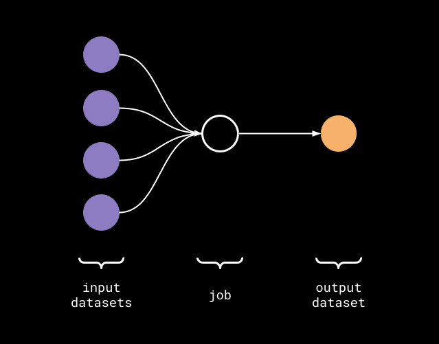
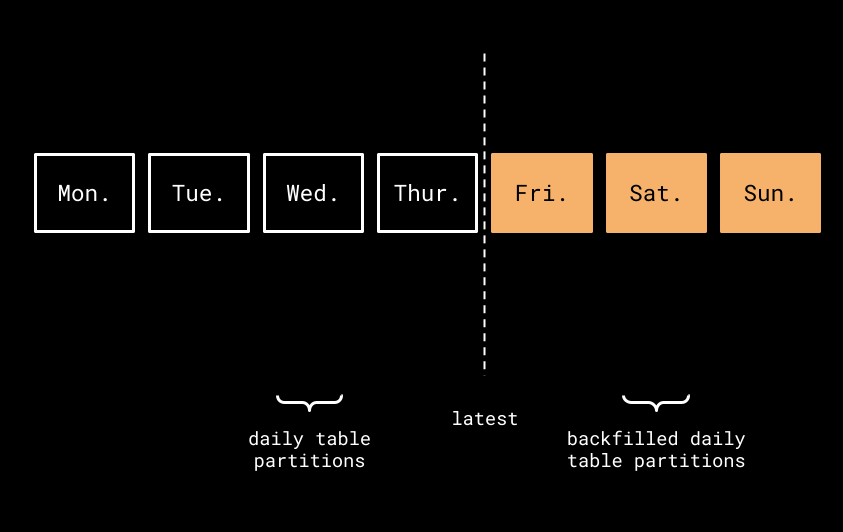
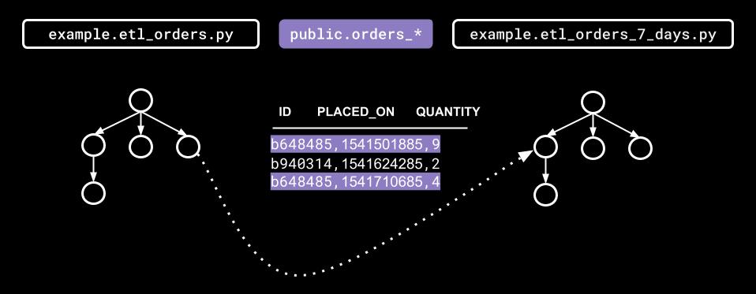

In this blog post, we'll discuss how lineage metadata can be used to automatically backfill DAGs with complex upstream and downstream dependencies.

<!--truncate-->

You've just deployed an Airflow [DAG](https://airflow.apache.org/docs/apache-airflow/stable/concepts/dags.html#dags) that calculates the total sum of weekly food orders. You were able to identify what input tables to query, the frequency in which your DAG would run, and made sure analysts knew the resulting output table to use in their weekly food order trends report. The DAG only needs to run once a week, and with the DAG managed and scheduled via [Airflow](https://airflow.apache.org), you feel confident that the aggregated food order data will be available every Sunday morning for the weekly report.

As a developer, you're monitoring your DAG for errors and after only a few DAG runs, you're alerted that your DAG suddenly started to fail! Before you begin troubleshooting the root cause of the DAG failure, you notify the analytics team that the food order data will be incorrect for the week. After viewing the DAG error logs and a few email exchanges, you eventually discover that an upstream DAG had failed to write food order data for certain daily table partitions. Now, backfilling the missing data can be a manual and tedious task. As you sip your morning coffee, you think to yourself, _there must be a better way_. Yes, there is and collecting DAG lineage metadata would be a great start.

In this blog post, we'll briefly introduce you to how backfills are handled in Airflow, then discuss how lineage metadata can be used to backfill DAGs with more complex upstream and downstream dependencies.

## 1. Brief Intro to Backfilling Airflow DAGs

Airflow supports [backfilling](https://airflow.apache.org/docs/apache-airflow/stable/dag-run.html#backfill) DAG runs for a historical time window given a _start_ and _end_ date. Let's say our `example.etl_orders_7_days` DAG started failing on `2021-06-06`, and we wanted to reprocess the daily table partitions for that week (assuming all partitions have been backfilled upstream). In order to run the backfill for `example.etl_orders_7_days`, using the Airflow [CLI](https://airflow.apache.org/docs/apache-airflow/stable/cli-and-env-variables-ref.html), you open up a terminal and execute the following `backfill` [command](https://airflow.apache.org/docs/apache-airflow/stable/cli-and-env-variables-ref.html#backfill):

```
# Backfill weekly food orders
$ airflow dags backfill \
    --start-date 2021-06-06 \
    --end-date 2021-06-06 \
    example.etl_orders_7_days
```

Now, the backfill was fairly straightforward but they're not always trivial. That is, we still have the following open questions: 

* How quickly can data quality issues be identified and explored?
* What alerting rules should be in place to notify downstream DAGs of possible upstream processing issues or failures?
* What effects (if any) would upstream DAGs have on downstream DAGs if dataset consumption was delayed?

Next, we'll demonstrate how lineage metadata managed with [Marquez](https://marquezproject.ai) can help answer some of these questions (and more!) by maintaining inter-DAG dependencies and cataloging historical runs of DAGs.

## 2. Exploring Lineage Metadata using Marquez

> **Note:** To seed the Marquez HTTP API server with the sample lineage metadata used in this blog post, see the [Write Sample Lineage Metadata to Marquez](https://marquezproject.github.io/marquez/quickstart.html#write-sample-lineage-metadata-to-marquez) section in Marquez's [quickstart](https://marquezproject.github.io/marquez/quickstart.html) guide.

#### 2.1 COLLECT DAG LINEAGE METADATA



> **Figure 1:** DAG lineage metadata.

[Marquez](https://marquezproject.ai) is an open source metadata service for the collection, aggregation, and visualization of a data ecosystem’s metadata. Marquez has integration support for Airflow with minimal configuration. Using the [`marquez-airflow`](https://github.com/MarquezProject/marquez/tree/main/integrations/airflow) library, DAG lineage metadata will be collected automatically during DAG execution using the [OpenLineage](https://openlineage.io) standard, then stored in Marquez’s centralized data model. To learn more about how lineage metadata is stored and versioned in Marquez, see the [Data Model](https://marquezproject.github.io/marquez/quickstart.html#marquez-data-model) section in Marquez's [quickstart](https://marquezproject.github.io/marquez/quickstart.html) guide.

The Airflow integration gives us two important benefits:

* **DAG Metadata:** Each DAG has a code version, inputs and outputs, run args, and run state transitions. Keeping a global historical log of DAG runs linked to code will quickly highlight upstream dependencies errors and minimize downstream impact.
* **Lineage Metadata:** Each DAG may have one or more upstream dependency. Keeping track of inter-DAG dependencies will allow for teams within an organization to safely depend on one another’s datasets, while also understanding which DAGs will be impacted downstream of a DAG failure.

In this blog, we won't go into how to enable lineage metadata collection for Airflow DAGs. But, we encourage you to take a look at Marquez's Airflow [example](https://github.com/MarquezProject/marquez/tree/main/examples/airflow) to learn how to troubleshoot DAG failures using Marquez.

#### 2.2 GET LINEAGE METADATA VIA REST API

In Marquez, each dataset and job has its own globally unique node ID that can be used to query the lineage graph. The [LineageAPI](https://marquezproject.github.io/marquez/openapi.html#tag/Lineage/paths/~1lineage/get) returns a set of **nodes** consisting of **edges**. An edge is **directed** and has a defined **origin** and **destination**. A lineage graph may contain the following node types: `dataset:<namespace>:<dataset>`, `job:<namespace>:<job>`.

So, let's start by querying the lineage graph for our `example.etl_orders_7_days` DAG using the node ID `job:food_delivery:example.etl_orders_7_days`. You'll notice in the returned lineage graph that the DAG _input_ datasets are `public.categories`, `public.orders`, and `public.menus` with `public.orders_7_days` as the _output_ dataset:

##### REQUEST

```
$ curl -X GET "http://localhost:5000/api/v1-beta/lineage?nodeId=job:food_delivery:example.etl_orders_7_days"
```

##### RESPONSE

`200 OK`

```
{
  "graph": [{
    "id": "job:food_delivery:example.etl_orders_7_days",
    "type": "JOB",
    "data": {
      "type": "BATCH",
      "id": {
        "namespace": "food_delivery",
        "name": "example.etl_orders_7_days"
      },
      "name": "example.etl_orders_7_days",
      "createdAt": "2021-06-06T14:50:13.931946Z",
      "updatedAt": "2021-06-06T14:57:54.037399Z",
      "namespace": "food_delivery",
      "inputs": [
        {"namespace": "food_delivery", "name": "public.categories"},
        {"namespace": "food_delivery", "name": "public.menu_items"},
        {"namespace": "food_delivery", "name": "public.orders"},
        {"namespace": "food_delivery", "name": "public.menus"}
      ],
      "outputs": [
        {"namespace": "food_delivery", "name": "public.orders_7_days"}
      ],
      "location": "https://github.com/example/jobs/blob/2294bc15eb49071f38425dc927e48655530a2f2e/etl_orders_7_days.py",
        "context": {
          "sql": "INSERT INTO orders_7_days (order_id, placed_on, discount_id, menu_id, restaurant_id, menu_item_id, category_id)\n  SELECT o.id AS order_id, o.placed_on, o.discount_id, m.id AS menu_id, m.restaurant_id, mi.id AS menu_item_id, c.id AS category_id\n    FROM orders AS o\n   INNER JOIN menu_items AS mi\n      ON menu_items.id = o.menu_item_id\n   INNER JOIN categories AS c\n      ON c.id = mi.category_id\n   INNER JOIN menu AS m\n      ON m.id = c.menu_id\n   WHERE o.placed_on >= NOW() - interval '7 days';"
        },
        "description": "Loads newly placed orders weekly.",
        "latestRun": {
          "id": "5c7f0dc4-d3c1-4f16-9ac3-dc86c5da37cc",
          "createdAt": "2021-06-06T14:50:36.853459Z",
          "updatedAt": "2021-06-06T14:57:54.037399Z",
          "nominalStartTime": "2021-06-06T14:54:00Z",
          "nominalEndTime": "2021-06-06T14:57:00Z",
          "state": "FAILED",
          "startedAt": "2021-06-06T14:54:14.037399Z",
          "endedAt": "2021-06-06T14:57:54.037399Z",
          "durationMs": 220000,
          "args": {},
          "location": "https://github.com/example/jobs/blob/2294bc15eb49071f38425dc927e48655530a2f2e/etl_orders_7_days.py",
          "context": {
            "sql": "INSERT INTO orders_7_days (order_id, placed_on, discount_id, menu_id, restaurant_id, menu_item_id, category_id)\n  SELECT o.id AS order_id, o.placed_on, o.discount_id, m.id AS menu_id, m.restaurant_id, mi.id AS menu_item_id, c.id AS category_id\n    FROM orders AS o\n   INNER JOIN menu_items AS mi\n      ON menu_items.id = o.menu_item_id\n   INNER JOIN categories AS c\n      ON c.id = mi.category_id\n   INNER JOIN menu AS m\n      ON m.id = c.menu_id\n   WHERE o.placed_on >= NOW() - interval '7 days';"
          },
          "facets": {}
        }
      },
      "inEdges": [
        {"origin": "dataset:food_delivery:public.categories", "destination": "job:food_delivery:example.etl_orders_7_days"}, "destination": "job:food_delivery:example.etl_orders_7_days"},
        {"origin": "dataset:food_delivery:public.orders", "destination": "job:food_delivery:example.etl_orders_7_days"},
        {"origin": "dataset:food_delivery:public.menus", "destination": "job:food_delivery:example.etl_orders_7_days"}
      ],
      "outEdges": [
        {"origin": "job:food_delivery:example.etl_orders_7_days", "destination": "dataset:food_delivery:public.orders_7_days"}
      ]
    }
  }, ...]
}
```

## 3. Using Lineage Metadata to Backfill Airflow DAGs

#### 3.1 BACKFILLING



> **Figure 2:** Backfilled daily table partitions.

To run a backfill for `example.etl_orders_7_days` using the DAG lineage metadata stored in Marquez, we'll need to query the lineage graph for the upstream DAG where the error originated. Now, let's assume the `example.etl_orders` DAG upstream of `example.etl_orders_7_days` failed to write some of the daily table partitions needed for the weekly food order trends report (see **Figure 2**). To fix the weekly trends report, we'll first need to backfill the missing daily table partitions `public.orders_2021_06_04`, `public.orders_2021_06_05`, and `public.orders_2021_06_06`:

```
# Backfill daily food orders
$ airflow dags backfill \
    --start-date 2021-06-04 \
    --end-date 2021-06-06 \
    example.etl_orders
```



> **Figure 3:** Airflow inter-DAG dependencies.

Then, using the script `backfill.sh` defined below, we can easily backfill all DAGs downstream of `example.etl_orders`:

##### `backfill.sh`

> **Note:** Make sure you have [`jq`](https://stedolan.github.io/jq/download) installed before running `backfill.sh`. 

```bash
#!/bin/bash
#
# Backfill DAGs automatically using lineage metadata stored in Marquez.
#
# Usage: $ ./backfill.sh <start-date> <end-date> <dag-id>

set -e

# Backfills DAGs downstream of the given node ID, recursively.
backfill_downstream_of() {
  node_id="${1}"
  # Get out edges for node ID
  out_edges=($(echo $lineage_graph \
    | jq -r --arg NODE_ID "${node_id}" '.graph[] | select(.id==$NODE_ID) | .outEdges[].destination'))
  for out_edge in "${out_edges[@]}"; do
    # Run backfill if out edge is a job node (i.e. <dataset> => <job>)
    if [[ "${out_edge}" = job:* ]]; then
      dag_id="${out_edge##*:}"
      echo "backfilling ${dag_id}..."
      airflow backfill --start_date "${start_date}" --end_date "${start_date}" "${dag_id}"
    fi
    # Follow out edges downstream, recursively
    backfill_downstream_of "${out_edge}"
  done
}

start_date="${1}"
end_date="${2}"
dag_id="${3}"

# (1) Build job node ID (format: 'job:<namespace>:<job>')
node_id="job:food_delivery:${dag_id}"

# (2) Get lineage graph
lineage_graph=$(curl -s -X GET "http://localhost:5000/api/v1-beta/lineage?nodeId=${node_id}")

# (3) Run backfill
backfill_downstream_of "${node_id}"
```

When you run the script `backfill.sh`, it will output all backfilled DAGs to the console:

```
$ ./backfill.sh 2021-06-06 2021-06-06 example.etl_orders
backfilling example.etl_orders_7_days...
backfilling example.etl_delivery_7_days...
backfilling example.delivery_times_7_days...
```

## 4. Conclusion

In this blog post, we showed how easy it can be to automate backfilling DAGs downstream of a data quality issue using lineage metadata stored in Marquez. With only two steps, we were able to backfill missing daily table partitions, then automatically re-run failed DAGs downstream of the upstream DAG where the error originated. But, what measures can we put in place to detect low-quality data issues faster, therefore avoiding backfills altogether? Since Marquez collects DAG run metadata that can be viewed using the [Runs API](https://marquezproject.github.io/marquez/openapi.html#tag/Jobs/paths/~1jobs~1runs~1{id}/get), building automated processes that periodically check DAG run states and quickly notifying teams of upstream data quality issue (or missed SLAs) in a timely fashion is just one possible preventive measure.

We encourge you to explore Marquez's opinionated [Metadata API](https://marquezproject.github.io/marquez/openapi.html) and define your own automated process(es) for analyzing lineage metadata! If you need help or have any questions, you can always join our [Slack](http://bit.ly/MarquezSlack) channel or reach out to us on [Twitter](https://twitter.com/MarquezProject).
