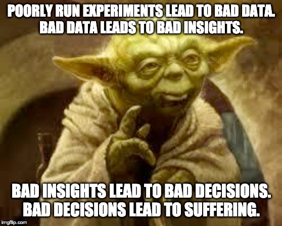
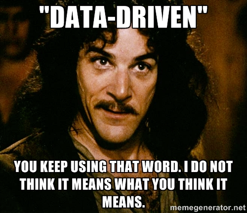
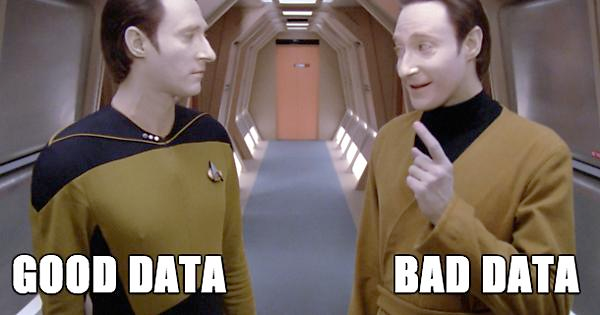

Good data is paramount to making good decisions- but how can you trust the quality of your data and its dependencies?

<!--truncate-->

## The Parable of Bad Data

Several years ago, I worked as a developer on the experimentation team at Amazon, which owned the code libraries and
data processing systems that supported experimentation on the amazon.com website (among other systems). Developers used
our libraries and a microservice we maintained to “trigger” an experiment for a customer- that is, the customer was
randomized into either control or treatment and the resulting assignment was recorded in the logs, which my team
consumed in the analysis of the data later on. One of the interesting parts of my job was helping our users diagnose
problems with their experiment results.

A classic example was a Kindle developer who was prototyping a new feature for book pages that would make the site more
engaging for Kindle owners- perhaps a “look inside” feature, or maybe some better recommendations. A customer would come
to the website and the developer’s code would determine if the customer belonged in _Control_ or _Treatment_. If _Control_,
the assignment was logged and no feature was shown- the site looked to the customer as it always had. But if the
assignment was _Treatment_, the code would check the customer’s account to determine if they owned a Kindle device and,
if yes, the assignment was logged and the customer saw the fancy new feature on the books page. 

The experiment showed the developer’s feature would be wildly successful- an increase of over $10 in Kindle book
purchases per customer on average over the course of the 2 weeks the experiment ran- projected to be tens of billions of
dollars in annual revenue due to this one feature!

With data in hand, the developer requested tons of resources to build the feature up to production standards. After
three months and two dozen people’s labor, the feature was ready to ship. The developers deployed their new service and
the incredible feature was unleashed. For days afterward, everyone watched the metrics dashboards waiting for that
hockey stick uptick in the revenue graphs 📈. But it never materialized! The graph was flat. No change at all! Weeks
went by. Nothing. How could the experiment results be so far from reality?

Of course, if you’ve ever run A/B tests, you probably already recognized the developer’s mistake. In their randomization
logic, customers who were assigned control were logged and forgotten, while customers who were assigned treatment were
logged only after validating that they owned a Kindle device. It turned out the total number of customers who came to
amazon.com was far greater than the number of customers who owned a Kindle device. And if you divide the total sum of
Kindle book sales by all of the amazon.com customers, regardless of whether they own a Kindle device, that average
will come out quite a lot lower than if you calculate the average Kindle book revenue from only customers who own Kindles.



In reality, this story never happened. Why? Because we knew the adage- Bad Data is Worse than No Data. In the story,
people took data of poor quality and used it to justify bad decisions. In our system, we checked the quality of the data
and, if we detected assignment imbalances, we simply invalidated the experiment and hid the results. Over the years, I
can’t count the number of times our users asked us to just give them partial results or just exclude certain segments or
to let them know if things were “trending” the right way. Our policy was firm- if we couldn’t trust the quality of the
data, the results were meaningless and we would not surface them in our system.

## Data-Driven Depends On Data-Quality

Today, most businesses consider themselves data-driven. The stereotype of the maverick CEO leading with his or her gut
is mostly antiquated, with a handful of exceptions. And yet, even though people know intellectually that data is only
useful if it is correct, we tend to stop digging once we find some data that confirms our pre-existing assumptions. We
justify bad decisions by claiming that they are “data-based” without ever validating the quality of our sources. Where
did that data come from? How old is it? Is the logic that generated it correct? Is it derived from some other dataset?
What is the quality of that dataset?


Thankfully, data quality validation is becoming more and more common in data engineering organizations. In part, this is
due to the prevalence of new tools and their integration with common workflow engines which we already use to schedule
the jobs that generate and process our data. One such tool that has been gaining in popularity is called [_Great
Expectations_](https://docs.greatexpectations.io), a Python-based framework for defining assertions about data sets
which easily integrates with existing workflow tools, such as Airflow. 

In software development, testing the behavior of our code with unit and integration tests has been common practice for
years. Similarly, using Great Expectations, a data engineer can assert that a dataset has a row count that falls within
an expected range, that column values are not null, or that values match a specified regular expression. One can even
create custom expectations, such as validating that the number of records in treatment is roughly the same as the number
of records in control (this post is not intended to be an in-depth tutorial on setting up Great Expectations; if you
want to read more on its capabilities and to get started, I recommend the going through
the [Quick Start tutorial](https://docs.greatexpectations.io/en/latest/guides/tutorials/quick_start.html)).

### A Sample Assertion Suite

As a simple example, imagine a table of new customers that you need to import into your Data Warehouse. Before
importing, we want to check the data quality of this new batch of customers. One example suite of assertions we could
test is below:

```json
{
  "data_asset_type": "Dataset",
  "expectation_suite_name": "customers_suite",
  "expectations": [
    {
      "expectation_type": "expect_table_row_count_to_be_between",
      "kwargs": {
        "max_value": 1000,
        "min_value": 100
      },
      "meta": {}
    },
    {
      "expectation_type": "expect_table_column_count_to_equal",
      "kwargs": {
        "value": 8
      },
      "meta": {}
    },
    {
      "expectation_type": "expect_table_columns_to_match_ordered_list",
      "kwargs": {
        "column_list": [
          "id",
          "created_at",
          "updated_at",
          "name",
          "email",
          "address",
          "phone",
          "city_id"
        ]
      },
      "meta": {}
    },
    {
      "expectation_type": "expect_column_values_to_be_unique",
      "kwargs": {
        "column": "email"
      },
      "meta": {}
    }
  ],
  "meta": {
    // ...
  }
}

```

This sample suite contains 4 data quality assertions- that the dataset contains between 100 and 1000 rows, that the
table contains exactly 8 columns, that they match the explicit list of column names we expect, and that the `email` column
contains only distinct values.

### Adding Data Quality Checks to an Airflow pipeline

With a suite of assertions in hand, we can update our Airflow DAG to only import data into our Data Warehouse if it
matches our expectations. A simple DAG might look like this

```python
from airflow import DAG
from airflow.contrib.operators.bigquery_operator import BigQueryOperator
from airflow.utils.dates import days_ago
from great_expectations_provider.operators.great_expectations import GreatExpectationsOperator

dag = DAG(
    'etl_customers',
    schedule_interval='@daily',
    catchup=False,
    default_args=default_args,
    description='Loads newly registered customers daily.'
)

t1 = BigQueryOperator(
    task_id='if_not_exists',
    sql='''
  CREATE TABLE IF NOT EXISTS food_delivery.customers (
  id         INT64,
  created_at TIME,
  updated_at TIME,
  name       STRING,
  email      STRING,
  address    STRING,
  phone      STRING,
  city_id    INT64
  )
  ''',
    use_legacy_sql=False,
    dag=dag
)

t2 = GreatExpectationsOperator(
    expectation_suite_name='customers_suite',
    batch_kwargs={
      'table': 'tmp_customers',
      'datasource': 'food_delivery_db'
    },
    dag=dag
    task_id='customers_expectation',
)

t3 = BigQueryOperator(
    task_id='etl',
    sql='''
    SELECT id, created_at, updated_at, name, email, address, phone, city_id
    FROM food_delivery.tmp_customers
  ''',
    destination_dataset_table='airflow_marquez.food_delivery.customers',
    use_legacy_sql=False,
    dag=dag
)

t1 >> t2 >> t3
```

This is great! Our DAG creates our target table in BigQuery (if it doesn’t already exist), checks the quality of the
`tmp_customers` table by running the `customers_suite` defined earlier, then imports _only if all_ of the data quality
checks pass.

And thus ended all data quality problems forever.

Just kidding.

Because reality is never so straightforward. In reality, the recommendations team wanted to start generating
recommendations for new customers without waiting until the next day, so they built a data pipeline to start consuming
from the `tmp_customers` table directly. And the supply chain folks wanted to start detecting what recipes are gaining
popularity so they can predict what supplies will need to be restocked sooner, so they started reading from the both
`tmp_orders` table and the `tmp_customers` table before they’re available in the DW. Oh, and the scheduling team needs
an idea of the geography of the various customers that are ordering and what the distances are between restaurants and
customers so they can get the right number of drivers in the right neighborhoods and of course the marketing team wants
to use all of this data to make predictions about how much to spend on the right search engine and social media ads and
they absolutely cannot wait until tomorrow at 8AM to update their models.


## Tracing Data Quality With OpenLineage Facets

Users are never satisfied with the way things are supposed to work. There’s always a reason to work around gatekeepers-
oftentimes, very good reasons that have real business impact- and data engineering is full of creative and resourceful
people who absolutely will find a way to get at that data. Even at Amazon, the experiment data was available in the
click stream logs, so resourceful users could (and sometimes did) calculate their own experiment results if they really
wanted to. So it’s important not just to have data quality checks, but to trace the impact of that data throughout an
organization.

The OpenLineage standard uses [Facets](https://openlineage.io/blog/extending-with-facets/) to augment the core data
model with useful information about the jobs, runs, and datasets reported on. One interesting detail about facets is
that they can be attached to an entity after the fact. In the Marquez reference implementation, a dataset version is
created every time a job run writes to or otherwise modifies a dataset. _Output_ facets, such as the new record count or
the number of bytes written, are attached directly to the dataset version when the job run completes. But consuming
jobs can also attach facets to the version of the dataset that exists at the start time of the job’s execution.

In the OpenLineage Airflow integration, Great Expectations tasks, such as the one in our example DAG above, are
evaluated after they run and the expectation results (as well as some other data quality metrics) are collected
into a
[DataQuality Metrics Input Dataset Facet](https://github.com/OpenLineage/OpenLineage/blob/main/spec/OpenLineage.json#L446-L499)
, which is reported to the server along with the rest of the lineage metadata. In Marquez, we recognize the version of
the dataset that was read by the job run and the data quality metadata is permanently associated with that dataset
version. The impact of this is that any job that reads that data, whether it happens before or after the dataset quality
assertion, can be linked to the data quality facet recorded (provided that the dataset version doesn’t change between
the data quality check and the read job).

This integration is extremely straightforward to get working. If you already have the Marquez Airflow DAG running in
your Airflow workflows, there’s nothing to do! Great Expectations tasks are already being detected and the metrics and
assertion statuses are already being reported to your configured instance of Marquez.

If you’ve never integrated Marquez with your Airflow setup, add a couple
of [environment variables](https://github.com/OpenLineage/OpenLineage/tree/main/integration/airflow#configuration)
and [change one line of code](https://github.com/OpenLineage/OpenLineage/tree/main/integration/airflow#usage):

```diff
- from airflow import DAG
+ from marquez_airflow import DAG
from airflow.contrib.operators.bigquery_operator import BigQueryOperator
from airflow.utils.dates import days_ago
from great_expectations_provider.operators.great_expectations import GreatExpectationsOperator
```

I’ve previously written
about [how to determine the version of the dataset that was read by a particular job run](https://openlineage.io/blog/explore-lineage-api/)
. With Great Expectations now integrated into my Airflow DAG, I want to see what the data quality metrics are for the
latest version of the `customers` dataset that was processed by my ETL job. I’ll hit my datakin demo instance:

```bash
$ curl "https://demo.datakin.com/api/v1/namespaces/food_delivery/jobs/etl.etl_delivery_7_days" | jq | less
{
  "id": {
    "namespace": "food_delivery",
    "name": "etl.etl_delivery_7_days"
  },
  "type": "BATCH",
  "name": "etl.etl_delivery_7_days",
  "createdAt": "2021-07-23T19:32:03.401782Z",
  "updatedAt": "2021-08-06T05:11:03.604573Z",
  "namespace": "food_delivery",
  "inputs": [
    {
      "namespace": "food_delivery",
      "name": "public.customers"
    },
    //...
  ],
  "latestRun": {
    "id": "1043e596-ccb8-4bfb-8fc2-7ee066253248",
    "jobVersion": {
      "namespace": "food_delivery",
      "name": "etl.etl_delivery_7_days",
      "version": "bc6c294b-b0eb-3160-a06d-1ff9ba3a4e1c"
    },
    "inputVersions": [
      {
        "namespace": "food_delivery",
        "name": "public.customers",
        "version": "4c33f292-40a9-304d-b43f-c7ffb2256e7f"
      },
      // ...
    ],
    // ...
  }
}
```

With the input version of the `public.customers` dataset, I can query Marquez for all the metadata we have about that
specific version of the dataset.

```bash
$ curl "https://demo.datakin.com/api/v1/namespaces/food_delivery/datasets/public.customers/versions/4c33f292-40a9-304d-b43f-c7ffb2256e7f" | jq | less
{
  "id": {
    "namespace": "food_delivery",
    "name": "public.customers"
  },
  "type": "DB_TABLE",
  "name": "public.customers",
  "physicalName": "public.customers",
  "createdAt": "2021-08-06T05:02:59.189118Z",
  "version": "4c33f292-40a9-304d-b43f-c7ffb2256e7f",
  "namespace": "food_delivery",
  "sourceName": "analytics_db",
  "fields": [
    {
      "name": "id",
      "type": "INTEGER",
      "tags": [],
      "description": "The unique ID of the customer."
    },
    // ...
  ],
  "facets": {
    "stats": {
      "size": 53362712,
      "rowCount": 4969
    },
    "dataSource": {
      "uri": "jdbc:postgresql://localhost:3306/deliveries",
      "name": "analytics_db"
    },
    "description": "A table for customers.",
    "dataQuality": {
      "bytes": 53362712,
      "rowCount": 4969,
      "columnMetrics": {
        "id": {
          "nullCount": 0,
          "distinctCount": 4969
        },
        "name": {
          "nullCount": 0,
          "distinctCount": 4969
        },
        "email": {
          "nullCount": 0,
          "distinctCount": 4969
        }
      }
    },
    "greatExpectations_assertions": {
      "assertions": [
        {
          "success": true,
          "expectationType": "expect_table_row_count_to_be_between"
        },
        {
          "success": true,
          "expectationType": "expect_column_to_exist"
        },
        {
          "success": true,
          "columnId": "id",
          "expectationType": "expect_column_values_to_be_unique"
        },
        {
          "success": true,
          "columnId": "id",
          "expectationType": "expect_column_values_to_not_be_null"
        },
        {
          "success": true,
          "columnId": "created_at",
          "expectationType": "expect_column_values_to_not_be_null"
        },
        //....
      ]
    }
  }
}
```

Note the `facets` field contains several properties- `stats`, `dataSource`, `description`, `dataQuality`
and `greatExpectations_assertions`. Each of those describes some attribute about the dataset version. Some of the facets
are attached at write-time, some are attached later- when the dataset is read.

In our [Datakin demo](https://demo.datakin.com), we have a lot more assertions than what I included in the sample suite
above and that can be seen in this response. In addition to counting rows and columns, we also validate that id columns
are unique and non-null, timestamps fall within specified ranges (did you know that if you accidentally write a
timestamp too far in the future, certain JDBC drivers will overflow the Calendar instance they use for converting
timezones?), and emails match expected regular expressions.

With the ability to attach data quality facets to dataset versions and the ability to trace the specific versions of
datasets read by and written to by specific job runs, I can trust whether the data I’m looking at is good data or bad
data. And if my data quality checks fail, I can find out whether I need to contact somebody over in marketing or
recommendations to [backfill their pipelines](https://openlineage.io/blog/backfilling-airflow-dags-using-marquez/) once
the issue has been corrected.



Whether your business is an e-commerce shop that wants to improve its customer experience or a music streaming service
that wants to make better listening recommendations or an autonomous vehicle company trying to improve the car’s ability
to detect double parked vehicles, the quality of your data is paramount to making good decisions. Quality testing tools
are out there and, chances are, they already work with the pipeline workflow tool you’re using today. And with
OpenLineage support, you can be confident in the quality of the data at every stage in your pipeline.
