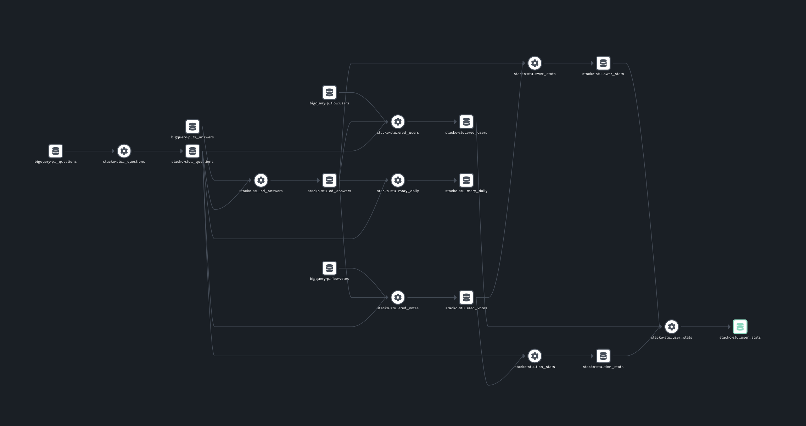

Each time dbt runs, it generates a trove of metadata about datasets and the work it performs with them. In this post, I’d like to show you how to harvest this metadata and put it to good use.

<!--truncate-->

The first time I built a data warehouse was in a completely different era, even though it wasn’t all that long ago. It was a few dozen tables + a collection of loader scripts and an ETL tool. If I’m honest, calling the whole thing a “data warehouse” is a bit grandiose, but it worked.

At the time, my defining question was “how can I make all of my most important data available for study without spending more than it’s worth?” Because my database capacity wasn’t infinite, I couldn’t keep all of my data forever. The jobs I wrote would pull data from operational data stores, perform a bunch of slicing and aggregation, and load summary data into the warehouse. They shoveled bits every night from one server to another, performing calculations in between - and that meant they had to run on a beefy server with close proximity to my data.

Skip forward to the current day and here I am, building and running models from a cafe over pretty shaky wifi. **My, how things have changed.**

Cloud data warehouses like [Google BigQuery](https://cloud.google.com/bigquery/), [Amazon Redshift](https://aws.amazon.com/redshift/), and [Snowflake](https://www.snowflake.com) have created a new economic and technological possibility: we can now pretty much just load everything - including our entire operational data stores - into a single warehouse. Once everything is in one place, data can be sliced up and analyzed much more quickly. This is where [dbt](https://www.getdbt.com) shines, at making transformations within a cloud data warehouse easy. And we all know what happens when you make something easy: it finds a way to happen a lot. People are doing more complex transformations than ever before, and the need for lineage context is becoming greater than ever.

Fortunately, each time dbt runs it generates a trove of metadata about datasets and the work it performs with them. In this post, I’d like to show you how to harvest this metadata and put it to good use.

## Our Example

For our example, let’s choose the kind of experiment that I might run in my day-to-day life. I’m the head of marketing at [Datakin](https://datakin.com), which means the metrics I’m most interested in are usually about some sort of human behavior.

I ask questions like:
* Does [x] technology space matter, and to whom? Is it waxing or waning?
* Are there adjacent ecosystems we should be collaborating with?
* Who are the influencers in this space? Who are the major contributors?
* What challenges are users facing? What does successful adoption look like?

There are a lot of ways to try to answer these questions. None of them are any more reliable than human behavior itself, and every resulting metric requires analysis and judgment. But there are still some pretty fun things to discover. And what better data source to mine to understand technical audiences than [Stack Overflow](https://www.stackoverflow.com)?

So let’s see what we can learn from the Stack Overflow [public data set in BigQuery](https://cloud.google.com/blog/topics/public-datasets/google-bigquery-public-datasets-now-include-stack-overflow-q-a). But not the whole thing; it is very large, so let’s study just a part of it. I created a [sample dbt project](http://github.com/rossturk/stackostudy/) that contains a handful of models to study all of the questions and answers we can find about the topic of ELT. These models:

* Create slices of the key Stack Overflow tables, pulling them into a separate BigQuery project. These slices only contain the rows that are related to questions tagged with “elt”. That way, we can query them tortuously all day long without scanning through gobs of partitions and running up our bill.
* Augment these slices by performing some helpful calculations - in this case, the number of upvotes/downvotes per question.
* Populate two summary tables for consumption by a BI system of some sort: a daily summary table that can be used to study trends and a user summary table that can be used to learn about the most influential contributors.

This is exactly the kind of experiment I have run multiple times over the years, across numerous stacks. It’s usually pretty messy. But this time, after running all of these models, we will be rewarded with a gorgeous [Marquez](https://marquezproject.ai/) lineage graph. We’ll be able to see how everything fits together.

## Setting Everything Up

First, if you haven’t already, run through the excellent [dbt tutorial](https://docs.getdbt.com/tutorial/setting-up). It will show you how to create a BigQuery project, provision a service account, download a JSON key, and set up your local dbt environment. The rest of this example assumes that you have created a BigQuery project where our models can be run, and you know how to properly configure dbt to connect to it.

Next, let’s start a local Marquez instance to store our lineage metadata. Make sure you have Docker running, and then:

```bash
git clone https://github.com/MarquezProject/marquez.git && cd marquez
./docker/up.sh
```

Check to make sure Marquez is up by visiting [http://localhost:3000](http://localhost:3000). You should see an empty Marquez instance with a message saying there isn’t any data. Also, you should be able to see the server output from your requests in the terminal window where Marquez is running. Keep this window open until we’re done.

Now, let’s open a new terminal window/pane and clone the GitHub project containing our models:

```bash
git clone https://github.com/rossturk/stackostudy.git && cd stackostudy
```

Next we need to install dbt and its integration with OpenLineage. I like to do this in a Python virtual environment because I make mistakes - as we all do - and I enjoy knowing that I can burn everything down and start over quickly if I need to. Virtual environments make this easy. To create one and install everything we need, run the following commands:

```bash
python -m venv virtualenv
source virtualenv/bin/activate
pip install dbt dbt-openlineage
```

dbt learns how to connect to your BigQuery project by looking for a matching profile in `~/.dbt/profiles.yml`. Create or edit this file so it contains a section with your BigQuery connection details. You will need to point to the location of a file containing the JSON key for your service account. If you aren’t sure, you can follow [this section](https://docs.getdbt.com/tutorial/create-a-project-dbt-cli#connect-to-bigquery) in the dbt documentation. My `profiles.yml` looked like this when I was done:

```yaml
stackostudy:
  target: dev
  outputs:
    dev:
      type: bigquery
      method: service-account
      keyfile: /Users/rturk/.dbt/dbt-example.json
      project: dbt-example
      dataset: stackostudy
      threads: 1
      timeout_seconds: 300
      location: US
      priority: interactive
```

Run `dbt debug` to make sure that you have everything configured correctly.

```bash
% dbt debug
Running with dbt=0.20.1
dbt version: 0.20.1
python version: 3.8.12
python path: /opt/homebrew/Cellar/dbt/0.20.1_1/libexec/bin/python3
os info: macOS-11.5.2-arm64-arm-64bit
Using profiles.yml file at /Users/rturk/.dbt/profiles.yml
Using dbt_project.yml file at /Users/rturk/projects/stackostudy/dbt_project.yml

Configuration:
  profiles.yml file [OK found and valid]
  dbt_project.yml file [OK found and valid]

Required dependencies:
 - git [OK found]

Connection:
  method: service-account
  database: stacko-study
  schema: stackostudy
  location: US
  priority: interactive
  timeout_seconds: 300
  maximum_bytes_billed: None
  Connection test: OK connection ok
```

## A Few Important Details

There are a couple of considerations to make when designing dbt models for use with OpenLineage. By following these conventions, you can help OpenLineage collect the most complete metadata possible.

First, when working with datasets outside of your dbt project, define them in a schema YAML file inside the `models/` directory:

```yaml
version: 2

sources:
  - name: stackoverflow
    database: bigquery-public-data
    schema: stackoverflow
    tables:
      - name: posts_questions
      - name: posts_answers
      - name: users
      - name: votes
```

This contains the name of the external dataset - in this case, `bigquery-public-datasets`, and lists the tables that are used by the models in this project. It doesn’t matter what the file is named, as long as it ends with `.yml` and is inside the `models/` directory, so I called mine `schema.yml` 🤷‍♂️ If you hardcode dataset and table names into your queries instead, dbt will likely run successfully but dataset metadata will be incompletely collected.

When writing queries, be sure to use the `{{ ref() }}` and `{{ source() }}` jinja functions when referring to data sources. The `{{ ref() }}` function can be used to refer to tables within the same model, and the `{{ source() }}` function refers to tables we have defined in `schema.yml`. That way, dbt will properly keep track of the relationships between datasets. For example, to select from both an external dataset and one in this model:

```sql
select * from {{ source('stackoverflow', 'posts_answers') }}
where parent_id in (select id from {{ ref('filtered_questions') }} )
```

## Performing a Run

Okay! We are ready to perform a run. Before we do, though, there’s one last step we need to take.

Run `dbt docs generate`. This will cause dbt to create a `target/catalog.json` file containing the schemas of each dataset referred to in the models. This file will be parsed by the dbt OpenLineage integration and sent to our Marquez server. If it doesn’t exist, a lineage graph will still be generated but schema details won’t be available in Marquez.

```bash
dbt docs generate
Running with dbt=0.20.1
Found 8 models, 0 tests, 0 snapshots, 0 analyses, 164 macros, 0 operations, 0 seed files, 4 sources, 0 exposures

12:15:10 | Concurrency: 1 threads (target='dev')
12:15:10 |
12:15:10 | Done.
12:15:10 | Building catalog
12:15:26 | Catalog written to /Users/rturk/projects/stackostudy/target/catalog.json
```

The OpenLineage integration for dbt is implemented as a wrapper, `dbt-ol`. This wrapper runs dbt and, after it completes, analyzes the `target/catalog.json`, `target/run_results.json` and `target/manifest.json` files. It sends corresponding OpenLineage events to the endpoint specified in the `OPENLINEAGE_URL` environment variable.

To run the models: 

```bash
% OPENLINEAGE_URL=http://localhost:5000 dbt-ol run
Running with dbt=0.20.1
Found 8 models, 0 tests, 0 snapshots, 0 analyses, 164 macros, 0 operations, 0 seed files, 4 sources, 0 exposures

12:35:41 | Concurrency: 1 threads (target='dev')
12:35:41 |
12:35:41 | 1 of 8 START incremental model stackostudy.filtered_questions........ [RUN]
12:35:46 | 1 of 8 OK created incremental model stackostudy.filtered_questions... [MERGE (0.0 rows, 34.6 GB processed) in 4.52s]
12:35:46 | 2 of 8 START incremental model stackostudy.filtered_answers.......... [RUN]
12:35:51 | 2 of 8 OK created incremental model stackostudy.filtered_answers..... [MERGE (0.0 rows, 26.8 GB processed) in 5.22s]
12:35:51 | 3 of 8 START incremental model stackostudy.filtered_votes............ [RUN]
12:36:05 | 3 of 8 OK created incremental model stackostudy.filtered_votes....... [MERGE (0.0 rows, 6.5 GB processed) in 14.58s]
12:36:05 | 4 of 8 START incremental model stackostudy.filtered_users............ [RUN]
12:36:21 | 4 of 8 OK created incremental model stackostudy.filtered_users....... [MERGE (0.0 rows, 2.5 GB processed) in 16.09s]
12:36:21 | 5 of 8 START view model stackostudy.summary_daily.................... [RUN]
12:36:23 | 5 of 8 OK created view model stackostudy.summary_daily............... [OK in 1.01s]
12:36:23 | 6 of 8 START view model stackostudy.answer_stats..................... [RUN]
12:36:23 | 6 of 8 OK created view model stackostudy.answer_stats................ [OK in 0.96s]
12:36:23 | 7 of 8 START view model stackostudy.question_stats................... [RUN]
12:36:24 | 7 of 8 OK created view model stackostudy.question_stats.............. [OK in 0.88s]
12:36:24 | 8 of 8 START view model stackostudy.user_stats....................... [RUN]
12:36:26 | 8 of 8 OK created view model stackostudy.user_stats.................. [OK in 1.21s]
12:36:26 |
12:36:26 | Finished running 4 incremental models, 4 view models in 45.39s.

Completed successfully

Done. PASS=8 WARN=0 ERROR=0 SKIP=0 TOTAL=8
Emitted 16 openlineage events
```

Note the output showing the number of OpenLineage events emitted to Marquez.

## Reviewing the Output

If everything ran successfully you should be able to see a list of jobs when you navigate to http://localhost:3000. Upon clicking a job, you will see a lineage graph that looks similar to this:



Our set of models, previously represented by SQL inside text files, has become more easily digestible. The dependencies between datasets are now completely obvious. Data engineers can throw away their remaining whiteboards, hooray!

There’s something satisfying about seeing models represented in two-dimensional space. But more importantly, this integration allows us to capture the state of a dbt pipeline as it runs. Using a long-running instance of Marquez (or another OpenLineage-compatible metadata repository) this information can be studied as it changes over time.

To see how the OpenLineage dbt integration works, visit its [GitHub repository](https://github.com/OpenLineage/OpenLineage/tree/main/integration/dbt).
