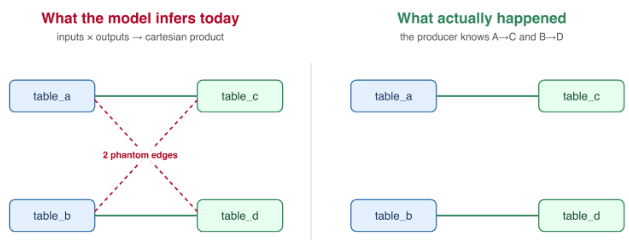
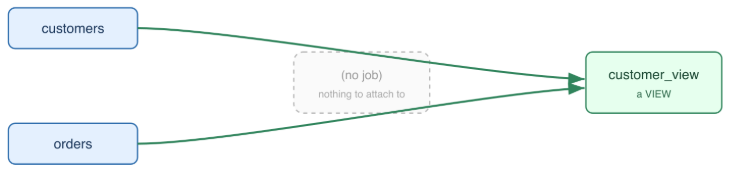
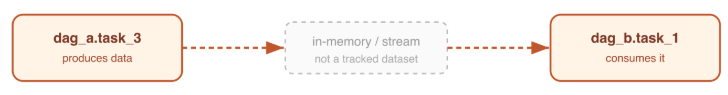
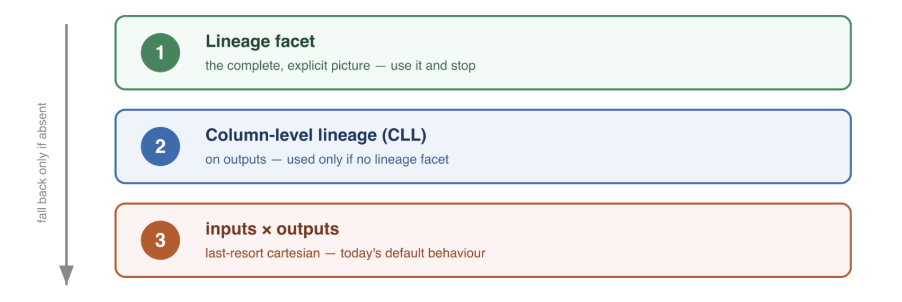

OpenLineage has always been built on a simple, powerful idea: capture what a job read, what it wrote, and when it ran. That model has served the community well for the majority of real-world pipelines. But as adoption has grown and producers have pushed the standard into more complex environments, a structural gap has become clear. Today, we are sharing a proposal to close it.

<!--truncate-->

## The problem with implicit edges

OpenLineage expresses lineage through `inputs` and `outputs` arrays on run and job events. The implicit rule is straightforward: everything in `inputs` feeds everything in `outputs`. For the common case - one job, one input, one output - this works perfectly. For most Spark jobs, most dbt models, and most Airflow tasks, the rule is correct and produces an accurate lineage graph.

The problem surfaces when a single job handles multiple independent data flows simultaneously. Imagine a bulk ETL job that reads tables A and B and writes tables C and D, where the real edges are A → C and B → D. OpenLineage today infers four edges: A → C, A → D, B → C, and B → D. Two of those are wrong. The graph is technically complete but logically imprecise, and that imprecision compounds as pipelines grow.



Column-Level Lineage (CLL) via `ColumnLineageDatasetFacet` can resolve this at column granularity, but many integrations know the dataset-level truth without knowing the column-level detail. And CLL is all-or-nothing per output: there is no way to say "I know the dataset-level mapping precisely but not the column mapping" for part of a job.

Beyond the cartesian product problem, the current model has several gaps that producers encounter in practice:

- **Dataset-to-dataset derivation** - views, aliases, and manually documented lineage require an intermediate job entity even when no job exists. A database view is a derivation relationship, not a transformation job.
- **Job-to-job data flow** - Airflow XCom, in-memory DataFrame handoffs, stored procedures calling functions, non-materialized views consumed by downstream jobs. These are real data flows with no intermediate tracked dataset, and OpenLineage currently has no way to express them.
- **Mixed granularity** - a pipeline that knows precise column-level mappings for some outputs and only dataset-level flow for others cannot express that distinction today.
- **Transformation detail at the boundaries** - a generator job that produces a dataset from an external API, or a sink job that consumes data without writing to any tracked dataset, can carry no transformation detail beyond the plain edge. There is no home for "this column was derived by a SUM aggregation over the API response."

These are not edge cases. They are patterns that producers in the community have raised repeatedly, and patterns that prevent OpenLineage from expressing the full richness of real enterprise data flows.

## Explicit lineage facets: the proposal

The proposal introduces two new facets - `LineageJobFacet` and `LineageDatasetFacet` - that let producers express lineage explicitly rather than letting consumers infer it. The core idea is simple: instead of leaving consumers to draw edges between all inputs and outputs, producers state the edges directly. And the new facets allow doing that on any granularity, and describe any data lineage relationship, not only the ones that fit the input-job-output conceptualization.

:::note
The full proposal, schema definitions, and examples are available in the [OpenLineage repository](https://github.com/OpenLineage/OpenLineage/tree/main/proposals/explicit_lineage_facet) under `proposals/explicit_lineage_facet/`. This is an experimental proposal actively seeking feedback from the community.
:::

`LineageJobFacet` sits on the job and contains an `entries` array. Each entry describes one target entity - a dataset or a job - and lists what flows into it. `LineageDatasetFacet` sits on a dataset in a `DatasetEvent` and describes what feeds that dataset directly, with no intermediate job needed.

## What this enables

The new model covers the full range of lineage patterns in a single, unified structure. Consider a few examples that are impossible or imprecise today.

**Precise dataset-level edges in a multi-output job.** Instead of the cartesian product, a bulk ETL job can now state exactly which inputs feed which outputs:

```json
"lineage": {
  "entries": [
    { "namespace": "postgresql://warehouse:5432", "name": "table_c", "type": "DATASET",
      "inputs": [{ "namespace": "postgresql://warehouse:5432", "name": "table_a", "type": "DATASET" }] },
    { "namespace": "postgresql://warehouse:5432", "name": "table_d", "type": "DATASET",
      "inputs": [{ "namespace": "postgresql://warehouse:5432", "name": "table_b", "type": "DATASET" }] }
  ]
}
```

The `inputs` and `outputs` arrays remain populated for backward compatibility and for dataset facet attachments. But when a lineage facet is present, consumers derive edges from it - not from the cartesian product.

**Dataset-to-dataset derivation, no job required.** A database view derives from base tables. There is no job executing here - just a structural relationship.



A `DatasetEvent` with `LineageDatasetFacet` can capture this directly:

```json
{
  "dataset": {
    "namespace": "postgresql://warehouse:5432",
    "name": "public.customer_view",
    "facets": {
      "lineage": {
        "inputs": [
          { "namespace": "postgresql://warehouse:5432", "name": "public.customers", "type": "DATASET" },
          { "namespace": "postgresql://warehouse:5432", "name": "public.orders", "type": "DATASET" }
        ]
      }
    }
  }
}
```

**Job-to-job data flow.** An Airflow task receives data from an upstream task via XCom. No dataset materializes between them.



This chain can now be expressed directly in a `LineageJobEntry`:

```json
"entries": [
  { "namespace": "airflow://prod", "name": "dag_b.task_1", "type": "JOB",
    "inputs": [
      { "namespace": "airflow://prod", "name": "dag_a.task_3", "type": "JOB" }
    ]
  }
]
```

The same pattern covers Spark DataFrame handoffs, stored procedure chains, streaming handoffs, and any other in-memory or non-materialized data flow between jobs.

**Mixed granularity.** A job knows precise column-level mappings for one output and only dataset-level flow for another. The same `LineageJobFacet` can carry both - column-level detail in a `fields` map where it is known, and entity-level `inputs` where it is not.

**Transformation detail at the boundaries.** A generator job that derives a column via `sum()` over an external API response - with no tracked upstream dataset - can attach that transformation detail to the output field using an identity-less job input that resolves to the event's own job:

```json
"fields": {
  "total": {
    "inputs": [
      { "type": "JOB", "transformations": [{ "type": "DIRECT", "subtype": "AGGREGATION", "description": "sum()" }] }
    ]
  }
}
```

## One unified structure

A deliberate goal of this proposal is to handle all lineage patterns in one model rather than proliferating facets. Every granularity combination - dataset-to-dataset, column-to-column, job-to-job, mixed - is expressed through the same `entries` / `inputs` / `fields` structure.

The proposal also supersedes `ColumnLineageDatasetFacet` (CLL). Everything CLL can express, the new facets can express - and more. The two representations will coexist during a transition period, with clear precedence rules: if a lineage facet is present, it is the authoritative picture. CLL on the same event is honored only as a fallback.



## A migration path designed not to break anything

New facets are optional. Existing producers continue working exactly as they do today - no changes required. This is the standard extensibility mechanism in OpenLineage: new facets can be added without modifying or invalidating existing events.

Sunsetting of ColumnLineage facet by the new facets will be gradual. To enable teams to migrate at their own pace, the proposal includes automatic bidirectional translation in the OpenLineage client libraries, controlled by a configuration option:

| Mode | Producer emits | Client generates | Use case |
|------|---------------|-----------------|----------|
| `legacy` | Lineage facets | `inputs`/`outputs`/CLL | New producer, older consumers |
| `modern` | `inputs`/`outputs`/CLL | Lineage facets | Existing producer, newer consumers |
| `both` | Either or both | Whichever is missing | Default during transition - everything works |

With `compatibility = both` as the default, neither producers nor consumers need to coordinate their migration timing. A producer can start emitting explicit lineage facets immediately and old consumers continue to receive the representation they already understand. A consumer can start reading lineage facets and existing producers - unchanged - continue to work through automatic translation. The transition period is intended to be generous, measured in years.

## What are the implications

### For producers

If you maintain an OpenLineage integration, this proposal gives you a path to express what you actually know about your data flows, not just what fits the current model. The new facets let you express the truth: precise dataset-level edges where that is what you know, column-level detail where you have it, and nothing where you don't - all in the same event.

### For consumers

If you consume OpenLineage events, the explicit lineage facets give you a richer and more precise signal.

The recommended consumer strategy is straightforward: check for lineage facets first, fall back to CLL, then fall back to the cartesian product of inputs × outputs. That precedence order means consumers can adopt support incrementally: handle the facet where it is present, and continue with existing logic where it is not. Client-side translation on the producer side means that, over time, consumers will find the representation they need already present - without requiring all producers to have migrated.

### For the OpenLineage ecosystem

OpenLineage has already proven its value as a shared vocabulary for enterprise data governance. Explicit lineage facets extend that foundation to the patterns that have remained out of reach. This matters to organisations operating under compliance frameworks because regulatory audits demand complete, detailed lineage.

With explicit lineage facets, that complete picture can now be expressed in one open standard, in the same lineage graph that already captures the rest of the data ecosystem.

## An invitation to the community

This proposal is experimental. It represents a significant change to how OpenLineage models lineage, and we are actively seeking feedback before the design is finalized.

The working group has covered a wide range of patterns, but real-world data ecosystems always surface new scenarios. If you have a use case the proposal does not cover, an objection to a design decision, or a suggestion for how the model could be cleaner, we want to hear it.

The discussion is open on [GitHub issue #4359](https://github.com/OpenLineage/OpenLineage/issues/4359). The full proposal, schema, and examples are in the repository under `proposals/explicit_lineage_facet/`. Reading through the examples is the fastest way to understand the model - they cover twelve concrete scenarios from dataset-level ETL to cross-namespace job-to-job chains.

**Get involved:**

- **Read the proposal** - [`proposals/explicit_lineage_facet/ExplicitLineageProposal.md`](https://github.com/OpenLineage/OpenLineage/blob/main/proposals/explicit_lineage_facet/ExplicitLineageProposal.md)
- **Review the schema** - [`proposals/explicit_lineage_facet/ExplicitLineageSchema.md`](https://github.com/OpenLineage/OpenLineage/blob/main/proposals/explicit_lineage_facet/ExplicitLineageSchema.md)
- **Explore examples** - [`proposals/explicit_lineage_facet/ExplicitLineageExamples.md`](https://github.com/OpenLineage/OpenLineage/blob/main/proposals/explicit_lineage_facet/ExplicitLineageExamples.md)
- **Join the discussion** - [GitHub issue #4359](https://github.com/OpenLineage/OpenLineage/issues/4359)
- **Try it out** - the proposal is designed to be non-breaking; producers can start experimenting immediately with a configuration flag

OpenLineage succeeds because producers and consumers build on a shared specification. The explicit lineage proposal extends that specification to cover the patterns that the community has needed but could not express. If you are building on OpenLineage today, or are planning to, your feedback shapes what the specification becomes next.

---

*The Explicit Lineage Facet is an experimental proposal under active review. Feedback is welcome via the GitHub issue. The proposal may be changed or updated based on community input.*
