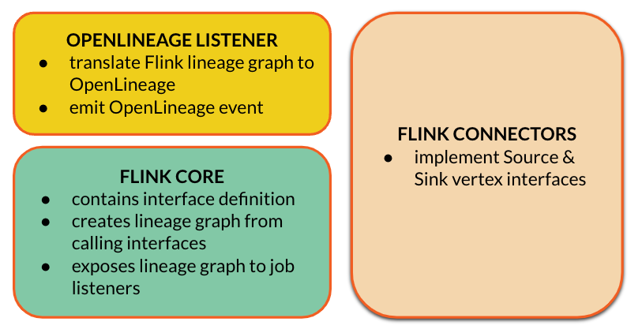

Apache Flink is a powerful stream processing engine widely adopted in the industry.
Flink jobs have been capable of emitting OpenLineage events for already two years.
However, it is a recent joint effort of Flink and OpenLineage communities that will bring this integration into the new era.

<!--truncate-->

### Existing OpenLineage Flink integration

As of November 2024, [OpenLineage Flink integration](https://github.com/OpenLineage/OpenLineage/tree/main/integration/flink) supports Flink versions `1.15` to `1.18` and emits OpenLineage events complying with the dataset naming model.
It supports Kafka sources and sinks with data serialized in Avro and Protobuf. It also supports other connectors like JDBC, Cassandra and  Hybrid sources.
Overall, these features can aid organisations greatly in collecting consistent cross-platform lineage graphs.

The integration has been implemented with no changes to the Flink codebase which allowed OpenLineage community to boost its implementation in the early phase and recognize some pain points to be solved later.

First, it is based on reflection mechanisms in Java and oftentimes extracts `private` and `protected` class members.
This makes the package difficult to maintain, causing classloading issues from time to time.

The other functional limitations are: not supporting Flink SQL and requiring a job's code change to initialize the OpenLineage listener.
Although only a tiny code modification is required, it may be a blocker for turning OpenLineage on immediately to enable OpenLineage on all Flink jobs within the organisation.

### Flip Pi 3.1415… to the rescue

[Flip-314](https://cwiki.apache.org/confluence/display/FLINK/FLIP-314%3A+Support+Customized+Job+Lineage+Listener) is Flink’s community proposal to let Flink jobs expose lineage metadata via official interfaces.
The overall idea is to let Flink’s sources and sinks classes expose metadata about consumed and produced datasets.
A metadata can be standardized as well as enriched with freestyle facets similar to an approach taken by OpenLineage.
The proposal defines a generic data model for all the Flink’s connectors.
Based on the sources' and sinks' metadata, Flink creates a lineage graph which also works well for Flink SQL that was not supported so far.

The lineage graph is exposed via a brand new job status change listener that can be implemented by third parties.

As a result, communities like OpenLineage can prepare their listener implementation and consume lineage metadata exposed natively through developers API.
Inspired or not, Flink lineage interfaces look pretty similar to OpenLineage data model which makes the translation straightforward.

### Towards native lineage support in Flink

The major complexity of implementing this is that it requires writing code in separate repositories with different release cadence.

The first step taken was to create lineage interfaces’ definitions in the Flink core repository, which was released in Flink 1.19.
Flink core has also been extended with a mechanism to create lineage graphs out of the sinks’ and sources’ lineage interfaces as well as expose the graph through the job listener.
This has already been merged to Flink’s main branch and will be released in Flink 2.0.

Next step is to implement lineage for the sources and sinks which are oftentimes in separate repositories.
This has been already done for [flink-connector-kafka](https://github.com/apache/flink-connector-kafka) within this [PR](https://github.com/apache/flink-connector-kafka/pull/130/files)
as a reference implementation which serves also as a proof-of-concept for lineage listeners and end to end test verifying all the components put together produce the expected outcome.

At the same time, OpenLineage community was working on the job listener (see this [PR](https://github.com/OpenLineage/OpenLineage/pull/3099)).
Although the PR is not merged at the moment of writing this post, it already answered some important questions.

Is Flink lineage data model convertible to OpenLineage model? Yes it is, although the answer to this is not straightforward given Flink jobs can read Kafka topics based on regex patterns, while OpenLineage expects each topic being identified as a separate dataset.

Does the approach allow extracting lineage from Flink SQL?
Yes, we were able to run an end-to-end test which executes SQL query on Kafka topics and verify the listener produces proper OpenLineage events for this scenario.

This is where we are now. The next implementation steps are:

 * Implement lineage interfaces for other Flink connectors.
 * Release new OpenLineage listener.
 * Wait for the Flink community to release Flink 2.0.
 * Design and implement column level lineage for Flink SQL.

### Summary

The Flink community is going to have one of the best lineage support across the industry.
As a native implementation, it guarantees there is no mismatch between data processing code and lineage extraction logic,
as they both belong to the same codebase.
Sources' and sinks' classes define input and output datasets for the data processing job,
which makes them perfect places for exposing the lineage metadata.

This would not have been possible without a tremendous input from the incredible: [FangYongs](https://github.com/FangYongs),
[X-czh](https://github.com/X-czh), [HuangZhenQiu](https://github.com/HuangZhenQiu),
[mobuchowski](https://github.com/mobuchowski) and [AHeise](https://github.com/AHeise).

