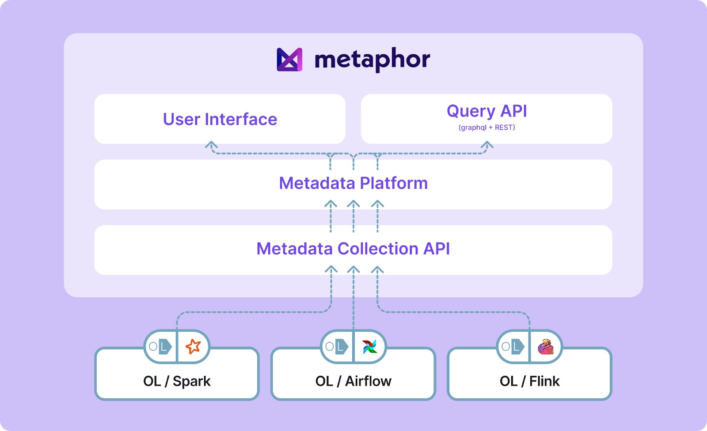

In the ever-evolving landscape of data management and governance, organizations constantly seek innovative solutions to streamline their processes, foster collaboration, and maximize the value of their data assets. [Metaphor](https://metaphor.io/), born out of the minds behind LinkedIn's DataHub, has emerged as a modern data catalog and social platform for data. We take a unique approach by combining technical metadata with social collaboration, making data governance accessible and engaging for everyone in the organization. In this blog post, we explain the motivation behind Metaphor’s adoption of OpenLineage, delve into the integration methodology, and discuss its current status and benefits.

<!--truncate-->

## Embracing OpenLineage
[Metaphor](https://metaphor.io/)’s journey towards data governance excellence led to the adoption of OpenLineage, a standardized metadata model that enables seamless integration with various data systems. The motivation behind this decision is threefold:
1. **Streamlined Metadata Collection**: OpenLineage provides a standardized framework for collecting and managing metadata, simplifying the process of gathering lineage information from diverse data processing systems.
2. **Interoperability**: OpenLineage boasts a range of clients for popular data processing frameworks like Apache Spark and Apache Airflow. By adopting OpenLineage, we gain the ability to seamlessly integrate with these systems, ensuring data lineage tracking across the entire data ecosystem.
3. **Enhanced Data Understanding**: Integration with OpenLineage enhances Metaphor's core mission of making data understandable and actionable. It empowers users to gain deeper insights into data assets by tracking their lineage, from source to consumption.  

The Metaphor team recognized the immense potential of OpenLineage and quickly decided to adopt OpenLineage as a crucial component of their platform.

## Integration with OpenLineage

To integrate with OpenLineage, we developed our own OpenLineage-compatible REST endpoint. This endpoint allows Metaphor to consume metadata events emitted by OpenLineage clients, including the ones for Apache Spark and Airflow. The integration process involves transforming this metadata into Metaphor’s own data models, which are then associated with the corresponding data assets within the platform, creating a cohesive global knowledge graph.

The user interface of Metaphor plays a pivotal role in making this integration accessible. Users can easily drill down into data jobs and data lineages, facilitating their work and enriching their understanding of data assets.

## Realizing the Benefits

We have rolled out the OpenLineage integration to production environments. Early adopters have already begun to reap the benefits of Spark and Airflow lineage graphs, especially the column-level lineage. Users can now gain deeper insights into their data assets, making it easier to make informed decisions, optimize data usage, and maximize ROI.

In conclusion, the integration of OpenLineage with Metaphor represents a significant step forward in the world of data management and governance. It combines the power of standardized metadata with an intuitive social platform, offering organizations a comprehensive solution for their data needs. As more organizations embrace this integration, we can expect to see even greater advancements in data governance and collaboration, unlocking the full potential of their data assets.

## Additional Resources
- Metaphor Data: https://metaphor.io/
- Try Metaphor: https://metaphor.io/try 
- Metaphor Documentation: https://docs.metaphor.io/docs
- Metaphor OSS Connectors: https://github.com/MetaphorData/connectors

