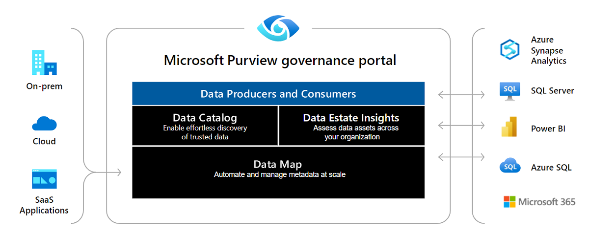
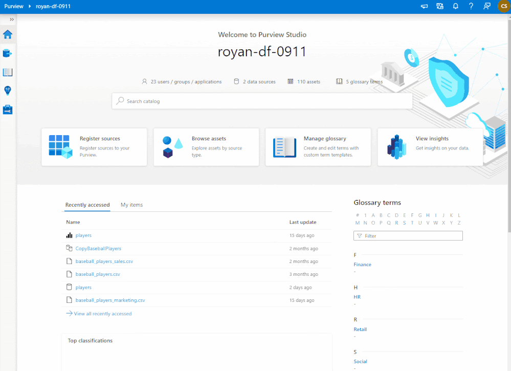
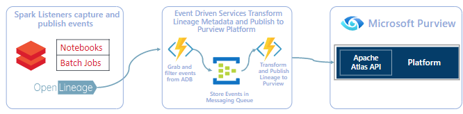

A new collaboration between Microsoft and OpenLineage is making lineage extraction possible for Azure Databricks and Microsoft Purview users.

<!--truncate-->

A new collaboration between Microsoft and OpenLineage is making lineage extraction possible for Azure Databricks and Microsoft Purview users. Thanks to a robust OpenLineage Spark integration, users can both extract and visualize lineage from their Databricks notebooks and jobs inside Microsoft Purview. This blog post shares the history and future of this exciting open-source project, describes the solution, and shows you how to get started. 

### Summary

- [Microsoft Purview](https://azure.microsoft.com/en-us/services/purview/) provides a comprehensive platform to populate native and custom data lineage metadata from on-prem, OSS, SaaS, and multi-cloud data systems. 
- The [Azure Databricks to Microsoft Purview Solution Accelerator](https://github.com/microsoft/Purview-ADB-Lineage-Solution-Accelerator) takes advantage of the robust Spark integration inside [OpenLineage](https://github.com/OpenLineage/OpenLineage) and translates OpenLineage events into Microsoft Purview native assets supporting:
    - Azure Data Lake Gen 2
    -  Azure Blob Storage
    - Azure SQL
    - Azure Synapse SQL Pools
- Customers of Azure Databricks and Microsoft Purview can [try the solution today](https://github.com/microsoft/Purview-ADB-Lineage-Solution-Accelerator) by following the [demo instructions](https://github.com/microsoft/Purview-ADB-Lineage-Solution-Accelerator/blob/main/deploy-demo.md) or [connector only instructions](https://github.com/microsoft/Purview-ADB-Lineage-Solution-Accelerator/blob/main/deploy-base.md).

### What is Microsoft Purview?

[Microsoft Purview](https://docs.microsoft.com/en-us/azure/purview/overview) provides an ambient data governance solution that helps you unify and manage your data wherever it exists – on-premises, in the cloud, or on a software-as-a-service (SaaS) platform. With Microsoft Purview, you can:
- create a holistic, up-to-date map of your data landscape with automated data discovery, sensitive data classification, and end-to-end data lineage.
- enable data curators to manage and secure your data estate.
- empower data consumers to find valuable, trustworthy data.

Figure 1. Microsoft Purview is an ambient data governance platform for an enterprise.

Microsoft Purview automates data discovery by providing data scanning and classification as a service for assets across your data estate. Microsoft Purview integrates metadata and descriptions of discovered data assets into a holistic map of your data ecosystem. Layered on this map are purpose-built apps that create environments for data discovery, policy management, and insights into your data landscape.

### Data Lineage in Microsoft Purview

Organizations need data to conduct business, and they need trustworthy data to perform analysis and make key decisions. Data lineage and provenance provide insights into data pedigree, which relates to operational information, runtime analysis, historical lineage, and ownership information. Users rely on pedigree when taking insights from data. Critical scenarios involving root cause analysis, impact analysis, quality control, compliance, and audit tracing are served by data lineage and provenance.

[Data Lineage](https://docs.microsoft.com/en-us/azure/purview/catalog-lineage-user-guide) in Microsoft Purview is a core platform capability that populates the Microsoft Purview Data Map with data movement and transformations across systems. With the backing of [Apache Atlas 2.2](https://atlas.apache.org/#/), lineage is captured as it flows in the enterprise and stitched without gaps irrespective of its source. Data lineage in Microsoft Purview enables data analysts and data stewards to conduct root cause analysis, troubleshoot, and perform impact analysis of data moving upstream and downstream in data estates. With a combined platform and interactive lineage visualization tool, data investigations related to quality, trust, and compliance can be self-served in a few clicks rather than requested from a third party.

Microsoft Purview has native data lineage support for [20+ sources](https://docs.microsoft.com/en-us/azure/purview/catalog-lineage-user-guide#lineage-collection), many of which are integrated at engine runtimes. For example, data lineage is pushed from Azure Data Factory when pipelines are run. This deep integration allows Microsoft Purview to capture operational metadata such as job start/end times, the number of rows impacted, job run status and more. In addition to native support, the [open APIs](https://docs.microsoft.com/en-us/rest/api/purview/catalogdataplane/lineage) can be used to integrate with enterprise systems to support custom lineage.

Figure 2. Native data lineage visualization in Microsoft Purview.

### OpenLineage + Microsoft

This integration came about because Microsoft Purview sought a lineage solution for Azure Databricks users, ideally one that would support all Azure data repository types, from Azure Blob Storage to Azure SQL. The team that took on this challenge was the Early Access Engineering (EAE) team, a group of data experts at Microsoft who forge competitive differentiation and value by using groundbreaking technology and features before they become available to the general enterprise landscape. 

#### A History of Contributions to OpenLineage

The EAE team at Microsoft has a long history of contributions to open source projects in general and to OpenLineage in particular. In December of 2021, Will Johnson contributed a [PR](https://github.com/OpenLineage/OpenLineage/pull/425) to OpenLineage to add support for arbitrary parameters in the OpenLineage URL. This change supported key-based authentication via URL and eased the process of sending metadata from OpenLineage to repositories other than [Marquez](https://github.com/MarquezProject), OpenLineage’s sister project. This in turn supported additional integrations and collaboration and has helped to increase adoption of the OpenLineage standard.

Over the course of seven months, the Microsoft team contributed eight pull requests to enable:
- better support for the Azure Blob File System (Azure Data Lake Gen 2).
- use of an Azure Function as the lineage endpoint.
- lineage extraction for [Azure Synapse](https://docs.microsoft.com/en-us/azure/databricks/data/data-sources/azure/synapse-analytics) as a data source.
- extraction of Databricks environment properties such as notebook paths and job ids.

Contributing open source integrations to OpenLineage benefits not only Microsoft Purview but also the data landscape as a whole. Collaborations like this one help increase adoption of the OpenLineage standard across the industry, which gets us closer to the single standard we need for consistently powerful and reliable lineage across the wide diversity of tooling in today’s data pipelines.  

At Microsoft, this kind of work is not unique to the EAE team. Across the company, cross-functional, community-driven teams foster innovation through open source collaboration.

### Why Contribute to OpenLineage?

Most enterprise data environments are convoluted, with data systems spread across on-prem, multi-cloud, SaaS, and open-source platforms. The data moves between a variety of storage, processing, analytical, and SaaS data systems. Azure Databricks is one such data system in an enterprise with a lakehouse platform in the cloud that combines data warehouses and data lakes to offer an open and unified platform for data and AI. Microsoft Purview customers have long asked for the ability to populate and govern Azure Databricks assets in the Microsoft Purview DataMap. With OpenLineage, we are bringing runtime Data Lineage capture from Azure Databricks Spark workloads to Microsoft Purview. 

In addition, by contributing to OpenLineage, Microsoft can offer users of OpenLineage on other platforms the ability to represent metadata models of Microsoft data sources accurately in their lineage graphs. For example, users of Spark on any other platform can represent the metadata models of Microsoft data sources more accurately.

Lastly, OpenLineage benefits from Microsoft’s contributions as they will add hundreds if not thousands of new users to the OpenLineage standard. This will spur more  contributions by the OpenLineage community as more users request that new implementations and features be added to the specification.

### About the Solution

Figure 3. The flow of metadata from Azure Databricks to Microsoft Purview using OpenLineage.

1. An Azure administrator deploys an Azure Function (serverless C# application) and an Event Hub (to store OpenLineage events) by running a deployment script.
2. An administrator configures a Databricks cluster as per the [OpenLineage install instructions](https://github.com/OpenLineage/OpenLineage/tree/main/integration/spark/databricks) along with the Azure Function key and OpenLineage host pointing to the Azure Function.
3. The OpenLineage Spark jar extracts the necessary inputs and outputs and emits them to the Azure Function.
4. The Azure Functions transform the OpenLineage payload and push lineage to Microsoft Purview through the Apache Atlas REST APIs.
5. Databricks Lineage is then visible inside Microsoft Purview!

## Getting Started with Microsoft Purview

Quickly and easily create a <a href="https://azure.microsoft.com/en-us/services/purview/#get-started">Microsoft Purview</a> account to explore the new features.

Try out the [Azure Databricks to Microsoft Purview Solution Accelerator](https://github.com/microsoft/Purview-ADB-Lineage-Solution-Accelerator).

Learn how to [deploy the solution](https://www.youtube.com/watch?v=pLF0iykhruY&feature=youtu.be).

### What the Future Holds

Microsoft plans to continue contributing to OpenLineage to ensure that users can extract lineage from additional Azure data sources such as [Azure Data Explorer (Kusto)](https://docs.microsoft.com/en-us/azure/data-explorer/spark-connector), [Azure Cosmos DB](https://docs.microsoft.com/en-us/azure/cosmos-db/sql/create-sql-api-spark), and [Azure Event Hubs](https://docs.microsoft.com/en-us/azure/databricks/spark/latest/structured-streaming/streaming-event-hubs), and that OpenLineage continues to perform well on Azure Databricks.

In addition, Microsoft plans to keep up-to-date with advancements made by the OpenLineage community, such as the exciting recent contribution of [column-level lineage](https://github.com/OpenLineage/OpenLineage/pull/698) to the project.

### Acknowledging the Contributors

The OpenLineage Spark integration is the product of hard work by teams inside and outside Microsoft.

Contributors from the Microsoft Early Access Engineering team include:
- Mark Taylor, Principal Technical Specialist ([@marktayl1](https://github.com/Marktayl1))
- Will Johnson, Global Black Belt - Big Data, Analytics, and ML Specialist ([@wjohnson](https://github.com/wjohnson))
- Rodrigo Monteiro, Global Black Belt - Big Data, Analytics ([@rodrigomonteiro-gbb](https://github.com/rodrigomonteiro-gbb))
- Travis Hilbert, Technical Specialist ([@travishilbert](https://github.com/TravisHilbert))
- Matt Savarino, Sr. Technical Specialist ([@mattsavarino](https://github.com/mattsavarino))

Outside Microsoft, contributors to the OpenLineage Spark integration are based at a range of internationally distributed companies and organizations. Additional contributors to the integration include:
- Michael Collado, Staff Software Engineer, Astronomer ([@collado-mike](https://github.com/collado-mike))
- Oleksandr Dvornik, Senior Java Developer, UBS ([@OleksandrDvornik](https://github.com/OleksandrDvornik))
- Paweł Leszczyński, Data Engineer, GetInData ([@pawel-big-lebowski](https://github.com/pawel-big-lebowski))
- Tomasz Nazarewicz, Data Engineer, GetInData ([@tnazarew](https://github.com/tnazarew))
- Maciej Obuchowski, Software Engineer, GetInData ([@mobuchowski](https://github.com/mobuchowski)) 
- Kengo Seki, PMC Member and Committer, Apache Software Foundation ([@sekikn](https://github.com/sekikn))
- Ziyoiddin Yusupov, Senior Software Engineer, UBS ([@mr-yusupov](https://github.com/mr-yusupov))

Try the [Azure Databricks to Microsoft Purview Solution Accelerator](https://github.com/microsoft/Purview-ADB-Lineage-Solution-Accelerator) today!
