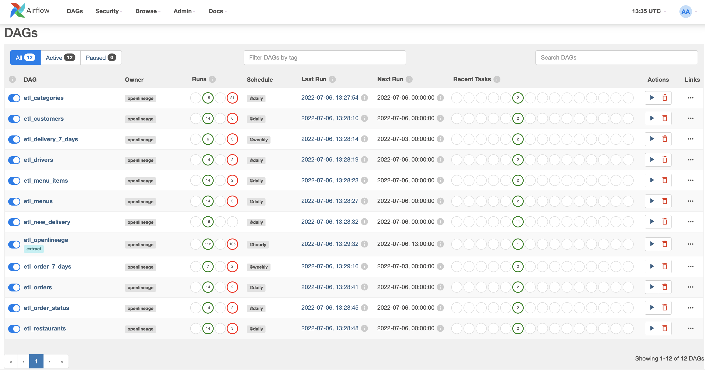
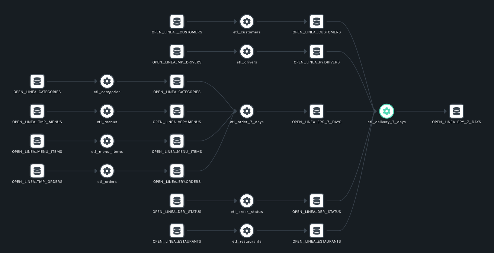

The OpenLineage Adapter offers Snowflake's enterprise users a powerful tool for analyzing their pipelines.

<!--truncate-->

## Introduction

We are excited to reveal a new way to gather lineage metadata directly from Snowflake: the OpenLineage Adapter. This integration offers Snowflake’s enterprise users a powerful tool for analyzing and diagnosing issues with their data pipelines.

This new integration will add new diagnostic capability to one of the world’s largest data platforms. Snowflake’s Data Cloud currently empowers more than 5,900 companies, including 241 of the Fortune 500 as of January 2022, to unite siloed data, securely share data, and execute diverse analytic workloads across their organizations. Legacy platforms struggled to provide a single, secure, and universally accessible platform for organizations to warehouse and analyze their data, but Snowflake’s Data Cloud provides a global ecosystem where customers, providers, and partners can finally break down data silos and derive value from rapidly growing data sets in secure, compliant, and governed ways.

## Background

An open source [LF AI & Data Foundation](https://lfaidata.foundation/projects/openlineage) sandbox project, OpenLineage provides an open standard for metadata and lineage collection that instruments jobs as they are running. OpenLineage not only automates the process of generating lineage and metadata about datasets, jobs, and runs in a data flow, but also does this in real time behind the scenes. With OpenLineage’s open standard and extensible backend, users can easily identify the root causes of slow or failing jobs and issues with data quality in their ecosystems without parsing queries. The magic of OpenLineage is its standard API for capturing lineage events. Any number of tools – from schedulers to SQL engines – can send metadata from this endpoint to a compatible tool such as [Marquez](https://github.com/MarquezProject/marquez) for visualization and further analysis of a pipeline.

Historically, the process of producing lineage and collecting metadata has been laborious and error-prone. Extracting data from query logs via parsing, for example, required one to reimplement database parsing logic, which added complexity and introduced opportunities for user error. In addition, the lineage collected was incomplete. One could learn about the view that was queried but not about the underlying tables in the pipeline, much less about the upstream and downstream dependencies of the datasets. OpenLineage, by contrast, exploits what the database already knows and does to maintain an up-to-date, end-to-end graph of a pipeline – and makes the graph available via an API.     

OpenLineage and Snowflake play nicely because the latter is unusual among cloud data platforms for offering lineage information out of the box in a view ([ACCESS_HISTORY](https://docs.snowflake.com/en/sql-reference/account-usage/access_history.html)). The integration of OpenLineage builds on this foundation to offer automated generation of lineage and metadata.

The value proposition of Snowflake + OpenLineage lies in the combination of an open standard tool, which supports multiple data systems to provide lineage in a single format, to Snowflake’s existing production of lineage information on an enterprise scale. The integration gives customers the ability to consume enterprise-wide table lineage and process lineage together in a consolidated OpenLineage format. 

## Approach

The process of integrating OpenLineage benefited from an existing query logging tool already available to Snowflake enterprise customers: the `ACCESS_HISTORY` view. As its name suggests, this feature, designed initially for governance use cases, offers users a detailed view of read operations conducted on Snowflake objects (e.g., tables, views, and columns) on an on-demand basis in response to SQL queries. (Write operations are viewable as a preview feature.)

As developed primarily by former Snowflake intern Aly Hirani with support from Datakin Senior Engineer Minkyu Park, the OpenLineage integration makes Access History the basis of automated production of lineage and metadata. But rather than produce a view for querying, OpenLineage produces a holistic lineage graph. To create the graph, the integration takes the data used to populate the Access History view and sends it to the OpenLineage backend as a standard OpenLineage event. Events in OpenLineage are JSON objects that employ a consistent naming strategy for database entities and enrich those entities with facets:

```
{
    "eventType": "COMPLETE",
    "eventTime": "2020-12-28T20:52:00.001+10:00",
    "run": {
        "runId": "d46e465b-d358-4d32-83d4-df660ff614dd"
    },
    "job": {
        "namespace": "my-namespace",
        "name": "my-job"
    },
    "outputs": [{
        "namespace": "my-namespace",
        "name": "my-output",
        "facets": {
        "schema": {
            "_producer": "https://github.com/OpenLineage/OpenLineage/blob/v1-0-0/client",
            "_schemaURL": "https://github.com/OpenLineage/OpenLineage/blob/v1-0-0/spec/OpenLineage.json#/definitions/SchemaDatasetFacet",
            "fields": [
            { "name": "a", "type": "VARCHAR"},
            { "name": "b", "type": "VARCHAR"}
            ]
        }
        }
    }],    
    "producer": "https://github.com/OpenLineage/OpenLineage/blob/v1-0-0/client"
}
```

## A DAG-based Solution

Automating lineage production from the Access History view required a two-DAG solution. Minkyu had initially planned to use one DAG to scan the view and produce the lineage graph, but the timing of the logs used for the view precluded the production of lineage data with a single DAG. The solution Minkyu found was a separate DAG with a schedule for scanning the Access History view on a regular interval.

```
def send_ol_events():
   client = OpenLineageClient.from_environment()

   with connect(user=SNOWFLAKE_USER,
                password=SNOWFLAKE_PASSWORD,
                account=SNOWFLAKE_ACCOUNT,
                database='OPENLINEAGE',
                schema='PUBLIC') as conn:
       with conn.cursor() as cursor:
           ol_view = 'OPENLINEAGE_ACCESS_HISTORY'
           ol_event_time_tag = 'OL_LATEST_EVENT_TIME'

           var_query = f'''
               set current_organization='{SNOWFLAKE_ACCOUNT}';
           '''

           cursor.execute(var_query)

           ol_query = f'''
               SELECT * FROM {ol_view}
               WHERE EVENT:eventTime > system$get_tag('{ol_event_time_tag}', '{ol_view}', 'table')
               ORDER BY EVENT:eventTime ASC;
           '''

           cursor.execute(ol_query)
           ol_events = [json.loads(ol_event[0]) for ol_event in cursor.fetchall()]

           for ol_event in ol_events:
               client.emit(ol_event)

           if len(ol_events) > 0:
               latest_event_time = ol_events[-1]['eventTime']
               cursor.execute(f'''
                   ALTER VIEW {ol_view} SET TAG {ol_event_time_tag} = '{latest_event_time}';
               ''')

default_args = {
   'owner': 'openlineage',
   'depends_on_past': False,
   'start_date': days_ago(1),
   'email_on_failure': False,
   'email_on_retry': False,
   'email': ['demo@openlineage.io'],
   'snowflake_conn_id': 'openlineage_snowflake'
}

with DAG('etl_openlineage',
    schedule_interval='@hourly',
    catchup=False,
    default_args=default_args,
    description='Send OL events every minutes',
    tags=["extract"]) as dag:
        t1 = PythonOperator(task_id='ol_event', python_callable=send_ol_events)
```

## Getting Started with an Example

This example uses Airflow to run a collection of Snowflake queries for a fictional food delivery service. Lineage data for these queries will be recorded within Snowflake `ACCESS_HISTORY` and, using the OpenLineage Access History View, emitted to an OpenLineage backend.
 
This is done using a series of DAGs in `dags/etl` that each use SnowflakeOperator to run queries, along with a DAG in `dags/lineage` that uses PythonOperator to send generated OpenLineage events to the configured backend.

### Prerequisites

#### Installing Marquez

First, checkout the Marquez repository:

```bash
% git clone https://github.com/MarquezProject/marquez.git
% cd marquez
```

Then, run Marquez in detached mode:

```bash
% docker/up.sh -d
%
```

#### Preparing Snowflake

First, check out the OpenLineage Access History View repository:

```bash
% git clone https://github.com/Snowflake-Labs/OpenLineage-AccessHistory-Setup.git
% cd OpenLineage-AccessHistory-Setup
```

The `OPENLINEAGE` database and `FOOD_DELIVERY` schema in Snowflake need to be created. This can be done using the SnowSQL command-line tool, or by pasting the queries into a new Snowflake Worksheet. This example uses SnowSQL.

```bash
% snowsql -u <snowflake-user> -a <snowflake-account>
SnowSQL> CREATE DATABASE OPENLINEAGE;
SnowSQL> CREATE SCHEMA OPENLINEAGE.FOOD_DELIVERY;
```

The view defined in `open_lineage_access_history.sql` also needs to be created. This view represents the entries in `ACCESS_HISTORY` as specially-constructed JSON objects containing RunEvents that can be emitted to an OpenLineage backend. To create it, use SnowSQL to set the current_organization session variable and execute the SQL file.

```
SnowSQL> SET current_organization='<snowflake-organization>';
SnowSQL> USE SCHEMA OPENLINEAGE.PUBLIC;
SnowSQL> !source open_lineage_access_history.sql
```

Finally, our lineage extraction DAG relies upon a tag on the view to keep track of which lineage events have been processed. This tag needs to be initialized:

```
SnowSQL> CREATE TAG OL_LATEST_EVENT_TIME;
SnowSQL> ALTER VIEW OPENLINEAGE.PUBLIC.OPENLINEAGE_ACCESS_HISTORY SET TAG OL_LATEST_EVENT_TIME = '1970-01-01T00:00:00.000';
SnowSQL> !quit
%
```

### Preparing the Environment

The following environment variables need to be set in order for the query DAGs to connect to Snowflake, and so that the extraction DAG can send lineage events to your OpenLineage backend:
- SNOWFLAKE_USER
- SNOWFLAKE_PASSWORD
- SNOWFLAKE_ACCOUNT
- OPENLINEAGE_URL
- AIRFLOW_CONN_OPENLINEAGE_SNOWFLAKE
 
To do this, copy the `.env-example` file to `.env`, and edit it to provide the appropriate values for your environment. The variables in this file will be set for each service in the Airflow deployment.

```bash
% cd examples/airflow
% cp .env-example .env
% vi .env
```

### Preparing Airflow

Once the environment is prepared, initialize Airflow with docker-compose:

```bash
% docker-compose up airflow-init
```

This will take several minutes. When it has finished, bring up the Airflow services:

```
% docker-compose up
```

This will also take several minutes. Eventually, the webserver will be up at [http://localhost:8080](http://localhost:8080). Log in using the default credentials (airflow/airflow) and navigate to the DAGs page. When you see 12 DAGs in the list, you can be confident that Airflow has completed its initialization of the example.

### Running the Example

Each of the DAGs is paused by default. Enable each one, skipping the `etl_openlineage` DAG for now. They may not all run successfully on the first try, since they have interdependencies that this example leaves unmanaged.
 


After each DAG has completed at least one successful run, enable `etl_openlineage`. Wait for it to complete its run.

### Result

Navigate to your Marquez deployment and view the resulting lineage graph:



## Potential Improvements

This new integration paves the way for an exciting set of potential future capabilities. These include support for `Object_Dependencies` and the addition of Granular Lineage (column-level lineage). We are interested in feedback from users, which will help the team at Snowflake and the members of the OpenLineage community prioritize future work.

## Conclusion

Snowflake’s integration of the OpenLineage standard promises to dramatically improve enterprise users’ ability to diagnose issues with quality and performance in their pipelines. This project is cause for optimism about future collaboration with OpenLineage. The fit between Snowflake’s enterprise product and OpenLineage is already fairly seamless. Further collaboration would likely yield additional features and, by extension, more value for Snowflake’s customers. Also, the fact that OpenLineage is an open standard offers opportunities for fruitful integrations with other partners. Supporters of OpenLineage already include Spark, Airflow, and dbt, and the list is growing. For more information or to contribute to OpenLineage, reach out on [twitter](https://twitter.com/OpenLineage/) or [Slack](https://join.slack.com/t/openlineage/shared_invite/zt-3arpql6lg-Nt~hicnDsnDY_GK_LEX06w), and check out the repositories on [Github](https://github.com/OpenLineage/).


