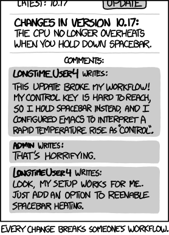
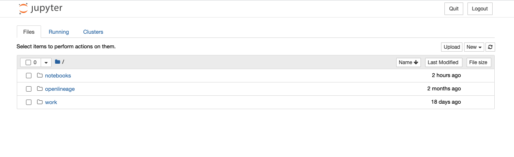
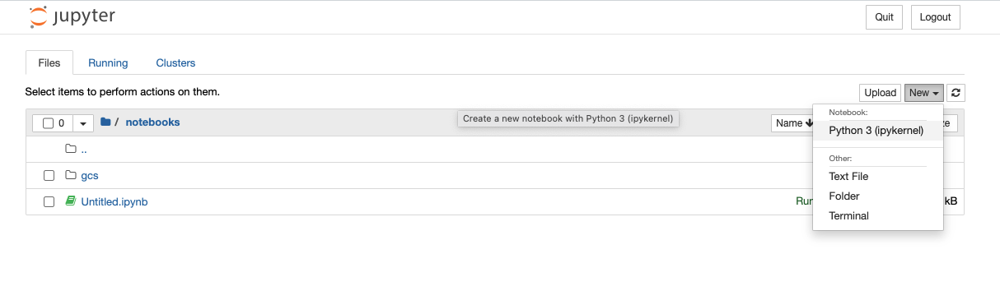
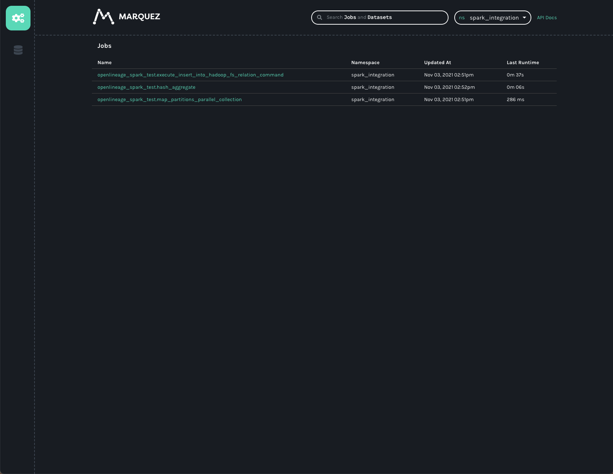
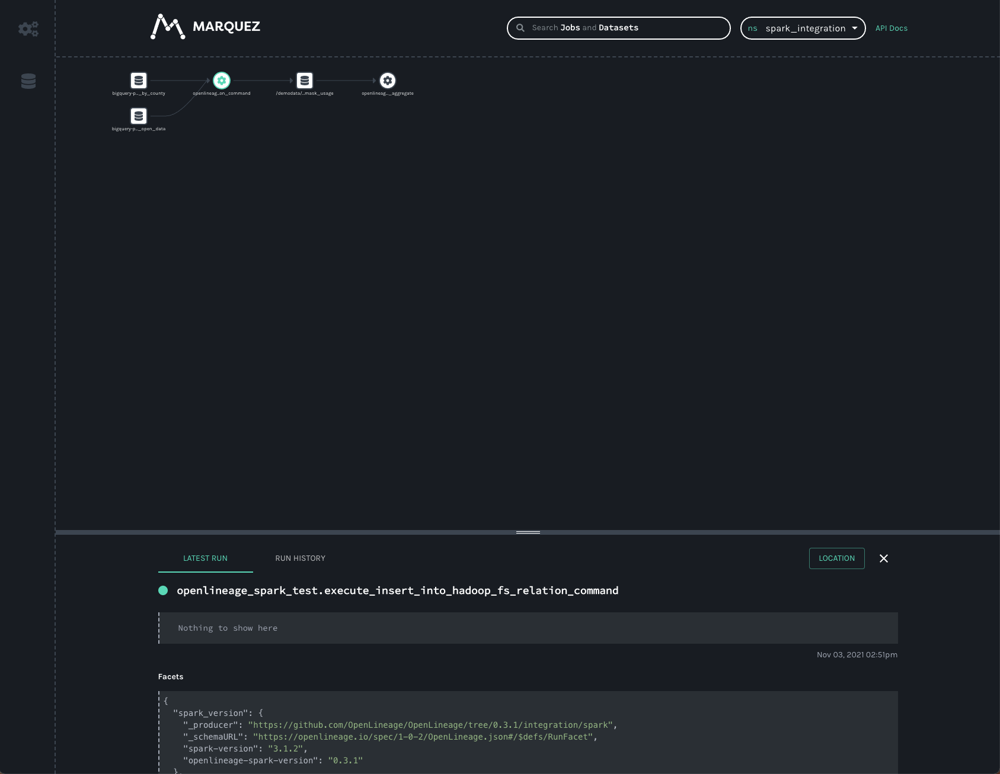
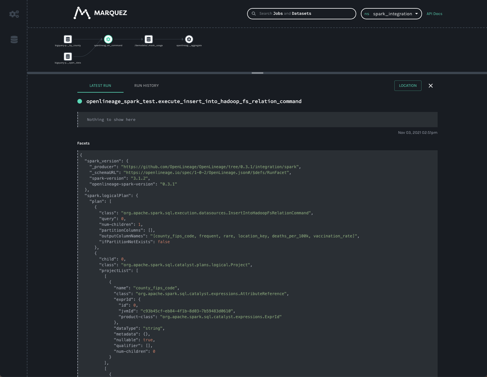
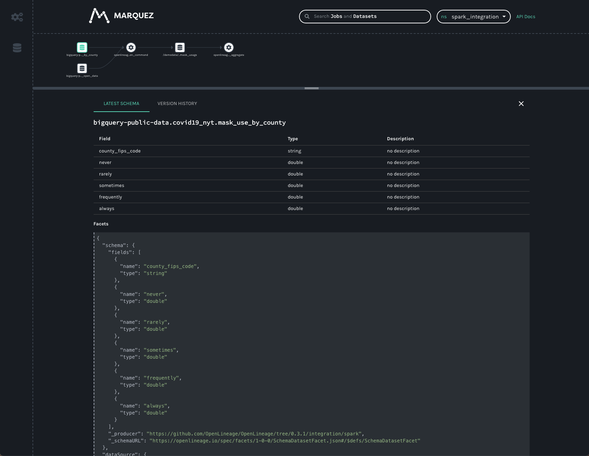
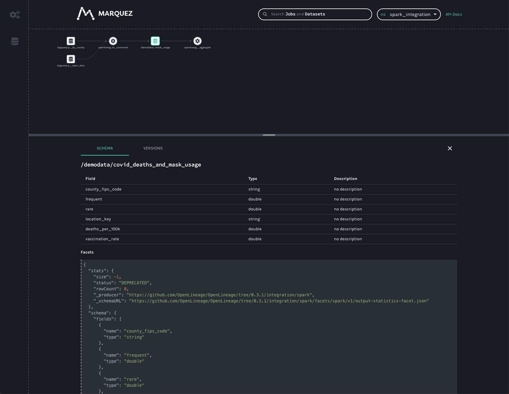
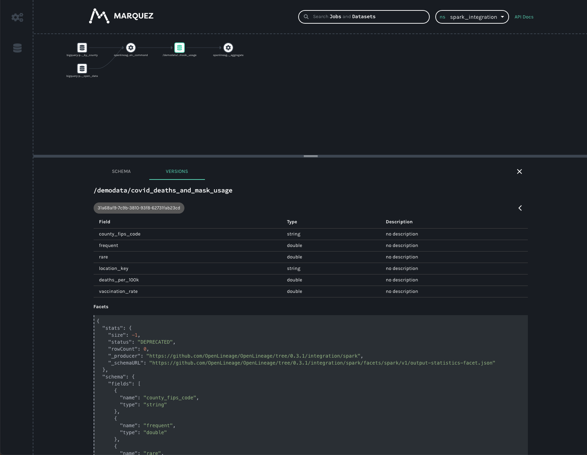
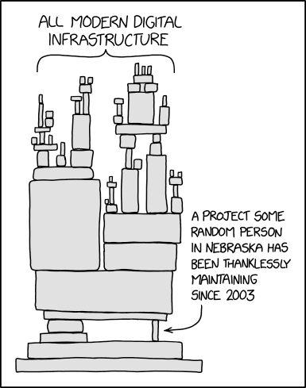

Spark ushered in a brand new age of data democratization... and left us with a mess of hidden dependencies, stale datasets, and failed jobs.

<!--truncate-->

### The Age of Data Democratization

In 2015, Apache Spark seemed to be taking over the world. Many of us had spent the prior few years moving our large
datasets out of the Data Warehouse into "Data Lakes"- repositories of structured and unstructured data in
distributed file systems or object stores, like HDFS or S3. This enabled us to build analytic systems that could
handle traditional, table-structured data alongside flexible, unstructured JSON blobs, giving us access to more data
and allowing us to move much faster than we’d previously been able to.

The problem was that taking the data out of Data Warehouses meant that the people who really needed access to the
data, analysts and statisticians, could no longer use the tools they were comfortable with in order to read that data.
Where previously, SQL and Python were all that was needed to start exploring and analyzing a dataset, now people needed
to write Java or use specialized scripting languages, like Pig, to get at the data. Systems that did support SQL, such
as Hive, were unbearably slow for any but the most basic operations. In many places, the statisticians were dependent on
software engineers to build custom tools for access, meaning the bottleneck had moved from the systems that
needed to store and process the data to the humans who were supposed to tell us what systems to build.

Then along came Apache Spark, which gave back to analysts the ability to use their beloved Python (and eventually SQL)
tools to process raw data in object stores without the dependency on software engineers. While others were
attracted to its ability to perform multiple operations on data without the I/O overhead of alternatives, like Pig or
Hive, data scientists were thrilled to start piping that data through their NumPy and Pandas scripts. 

### A Colossal Mess

Of course, the natural consequence of this data democratization is that it becomes difficult to keep track of who is
using the data and for what purpose. Hidden dependencies and Hyrum’s Law suddenly meant that changes to the data schema
would inadvertently break downstream processes or that stale, deprecated datasets were still being consumed, and that
corrupted datasets would leak into unknown processes making recovery difficult or even impossible.

[](https://xkcd.com/1172/)

The goal of OpenLineage is to reduce issues and speed up recovery by exposing those hidden dependencies and informing
both producers and consumers of data about the state of that data and the potential blast radius of changes and software
bugs. Naturally, support for Apache Spark seemed like a good idea and, while the Spark 2.4 branch has been supported for
some time, the recent OpenLineage 0.3 release has explicit support for Spark 3.1. 🎉 

### Getting Started

Our approach to integrating with Spark is not super novel nor is it complicated to integrate into your own system. Spark
has had a SparkListener interface since before the 1.x days. If you're a heavy Spark user, it's likely you're already
familiar with it and how it's used in Spark applications. OpenLineage integrates with Spark by implementing that
interface and collecting information about jobs that are executed inside a Spark application. To activate the
listener, add the following properties to your Spark configuration:
```
spark.jars.packages     io.openlineage:openlineage-spark:0.3.+
spark.extraListeners	io.openlineage.spark.agent.OpenLineageSparkListener
```
This can be added to your cluster’s `spark-defaults.conf` file, in which case it will record lineage for every job executed on the cluster, or added to specific jobs on submission via the `spark-submit` command. Once the listener is activated, it needs to know where to report lineage events, as well as the namespace of your jobs. Add the following additional configuration lines to your `spark-defaults.conf` file or your Spark submission script:
```
spark.openlineage.transport.url     {your.openlineage.url}
spark.openlineage.transport.type    'http'
spark.openlineage.namespace	        {your.openlineage.namespace}
```
### The Demo

Trying out the Spark integration is super easy if you already have Docker Desktop and git installed. To follow along
with this demo, you’ll also need a Google Cloud account and a Service Account JSON key file for an account that has
access to BigQuery and read/write access to your GCS bucket. I added mine to a file called bq-spark-demo.json.

Note: If you're on macOS Monterey (macOS 12) you'll have to release port 5000 before beginning by [disabling the AirPlay Receiver](https://developer.apple.com/forums/thread/682332).

Check out the OpenLineage project into your workspace with:
```bash
git clone https://github.com/OpenLineage/OpenLineage
```

Then cd into the integration/spark directory. Run `mkdir -p docker/notebooks/gcs` and copy your service account credentials
file into that directory. Then run:

```bash
docker-compose up
```

This launches a Jupyter notebook with Spark already installed as well as a Marquez API endpoint to report lineage. Once the notebook server is up and running, you should see something like the following text in the logs:
```
notebook_1  | [I 21:43:39.014 NotebookApp] Jupyter Notebook 6.4.4 is running at:
notebook_1  | [I 21:43:39.014 NotebookApp] http://082cb836f1ec:8888/?token=507af3cf9c22f627f6c5211d6861fe0804d9f7b19a93ca48
notebook_1  | [I 21:43:39.014 NotebookApp]  or http://127.0.0.1:8888/?token=507af3cf9c22f627f6c5211d6861fe0804d9f7b19a93ca48
notebook_1  | [I 21:43:39.015 NotebookApp] Use Control-C to stop this server and shut down all kernels (twice to skip confirmation).
```

Copy the URL with 127.0.0.1 as the hostname from your own log (the token will be different from mine) and paste it into
your browser window. You should have a blank Jupyter notebook environment ready to go.



Once your notebook environment is ready, click on the notebooks directory, then click on the New button to create a new
Python 3 notebook.



In the first cell in the window paste the following text. Update the GCP project and bucket names and the 
service account credentials file, then run the code:

```python
from pyspark.sql import SparkSession
import urllib.request

# download dependencies for BigQuery and GCS
gc_jars = ['https://repo1.maven.org/maven2/com/google/cloud/bigdataoss/gcs-connector/hadoop3-2.1.1/gcs-connector-hadoop3-2.1.1-shaded.jar',
          'https://repo1.maven.org/maven2/com/google/cloud/bigdataoss/bigquery-connector/hadoop3-1.2.0/bigquery-connector-hadoop3-1.2.0-shaded.jar',
          'https://repo1.maven.org/maven2/com/google/cloud/spark/spark-bigquery-with-dependencies_2.12/0.22.2/spark-bigquery-with-dependencies_2.12-0.22.2.jar']

files = [urllib.request.urlretrieve(url)[0] for url in gc_jars]


# Set these to your own project and bucket
project_id = 'bq-openlineage-spark-demo'
gcs_bucket = 'bq-openlineage-spark-demo-bucket'
credentials_file = '/home/jovyan/notebooks/gcs/bq-spark-demo.json'

spark = (SparkSession.builder.master('local').appName('openlineage_spark_test')
             .config('spark.jars', ",".join(files))
             
             # Install and set up the OpenLineage listener
             .config('spark.jars.packages', 'io.openlineage:openlineage-spark:0.3.+')
             .config('spark.extraListeners', 'io.openlineage.spark.agent.OpenLineageSparkListener')
             .config('spark.openlineage.transport.url', 'http://marquez-api:5000')
             .config('spark.openlineage.transport.type', 'http')
             .config('spark.openlineage.namespace', 'spark_integration')
             
             # Configure the Google credentials and project id
             .config('spark.executorEnv.GCS_PROJECT_ID', project_id)
             .config('spark.executorEnv.GOOGLE_APPLICATION_CREDENTIALS', '/home/jovyan/notebooks/gcs/bq-spark-demo.json')
             .config('spark.hadoop.google.cloud.auth.service.account.enable', 'true')
             .config('spark.hadoop.google.cloud.auth.service.account.json.keyfile', credentials_file)
             .config('spark.hadoop.fs.gs.impl', 'com.google.cloud.hadoop.fs.gcs.GoogleHadoopFileSystem')
             .config('spark.hadoop.fs.AbstractFileSystem.gs.impl', 'com.google.cloud.hadoop.fs.gcs.GoogleHadoopFS')
             .config("spark.hadoop.fs.gs.project.id", project_id)
             .getOrCreate())
```

Most of this is boilerplate- we need the BigQuery and GCS libraries installed in the notebook environment, then we need
to set the configuration parameters to tell the libraries what GCP project we want to use and how to authenticate with
Google. The parameters specific to OpenLineage are the four we already covered- `spark.jars.packages`,
`spark.extraListeners`, `spark.openlineage.host`, `spark.openlineage.namespace`. Here, we’ve configured the host to be
the marquez-api container started by Docker.

Google has a wealth of information available as public datasets in BigQuery. If you’re ever bored one Saturday night,
browse the datasets available- you’ll find census data, crime data, liquor sales, and even a black hole database. For
the demo, I thought I’d browse some of the Covid19 related datasets they have. Specifically, there’s a dataset that
reports the likelihood of people in a given county to wear masks (broken up into five categories: `always`, `frequently`,
`sometimes`, `rarely`, and `never`). There’s also a giant dataset called `covid19_open_data` that contains things like
vaccination rates, current totals of confirmed cases, hospitalizations, deaths, population breakdowns, and policies on
mask-wearing, contact tracing, and vaccination-mandates. Both datasets contain the county FIPS code for US counties,
meaning we can join the two datasets and start exploring.

Create a new cell in the notebook and paste the following code:

```python
from pyspark.sql.functions import expr, col

mask_use = spark.read.format('bigquery') \
    .option('parentProject', project_id) \
    .option('table', 'bigquery-public-data:covid19_nyt.mask_use_by_county') \
    .load() \
    .select(expr("always + frequently").alias("frequent"),
            expr("never + rarely").alias("rare"),
            "county_fips_code")

opendata = spark.read.format('bigquery') \
    .option('parentProject', project_id) \
    .option('table', 'bigquery-public-data.covid19_open_data.covid19_open_data') \
    .load() \
    .filter("country_name == 'United States of America'") \
    .filter("date == '2021-10-31'") \
    .select("location_key",
            expr('cumulative_deceased/(population/100000)').alias('deaths_per_100k'),
            expr('cumulative_persons_fully_vaccinated/(population - population_age_00_09)').alias('vaccination_rate'),
            col('subregion2_code').alias('county_fips_code'))
joined = mask_use.join(opendata, 'county_fips_code')

joined.write.mode('overwrite').parquet(f'gs://{gcs_bucket}/demodata/covid_deaths_and_mask_usage/')
```

Again, this is standard Spark DataFrame usage. The particulars are completely irrelevant to the OpenLineage data
collection- we don’t need to call any new APIs or change our code in any way. Here, I’ve filtered
the `covid19_open_data` table to include only U.S. data and to include the data for Halloween 2021. That dataset has a
large number of columns, but for my own purposes, I’m only interested in a few of them. I calculate `deaths_per_100k`
using the existing `cumulative_deceased` and `population` columns and I calculate the `vaccination_rate` using the total
population, subtracting the 0-9 year olds, since they weren’t eligible for vaccination at the time. For
the `mask_use_by_county` data, I don't really care about the difference between `rarely` and `never`, so I combine them
into a single number. I do the same for `frequently` and `always`. I join the few columns I want from the two datasets
and store the combined result in GCS.

Add one more cell to the notebook and paste the following:

```python
spark.read.parquet(f'gs://{gcs_bucket}/demodata/covid_deaths_and_mask_usage/').count()
```

The notebook will likely spit out a warning and a stacktrace (it should probably be a debug statement), then give you a
total of 3142 records.

So far, so good. Now what? If this was a data science blog, we might start generating some scatter plots or doing a 
linear regression to determine whether frequent mask usage was a predictor of high death rates or vaccination rates.
But since we're really focused on lineage collection, I'll leave the rest of the analysis up to those with the time and
inclination to dig further. Instead, let's switch to exploring the lineage records we just created.

The `docker-compose.yml` file that ships with the OpenLineage repo includes only the Jupyter notebook and the Marquez API.
For exploring visually, we’ll also want to start up the Marquez web project. Without terminating the existing docker
containers, run the following command in a new terminal:

```bash
docker run --network spark_default -p 3000:3000 -e MARQUEZ_HOST=marquez-api -e MARQUEZ_PORT=5000 -e WEB_PORT=3000 --link marquez-api:marquez-api marquezproject/marquez-web:0.19.1
```

Now open a new browser tab and navigate to `http://localhost:3000`. You should see a screen like the following:



Note the spark_integration namespace was found for us and automatically chosen, since there are no other namespaces
available. We can see three jobs listed on the jobs page of the UI. They all start with `openlineage_spark_test`, which
is the `appName` we passed to the SparkSession we were building in the first cell of the notebook. Each query execution
or RDD action is represented as a distinct job and the name of the action is appended to the application name to form
the name of the job. Clicking on the `openlineage_spark_test.execute_insert_into_hadoop_fs_relation_command` node, we
can see the lineage graph for our notebook:



The graph shows the `openlineage_spark_test.execute_insert_into_hadoop_fs_relation_command` job reads from two input
datasets, `bigquery-public-data.covid19_nyt.mask_use_by_county`
and `bigquery-public-data.covid19_open_data.covid19_open_data`, and writes to a third dataset,
`/demodata/covid_deaths_and_mask_usage`. The namespace is missing from that third dataset- the fully qualified name is
`gs://<your_bucket>/demodata/covid_deaths_and_mask_usage`.

Before clicking on the datasets, though, the bottom bar shows some really interesting data that was collected from the
Spark job. Dragging the bar up expands the view so we can get a better look at that data.



Two [facets](https://openlineage.io/blog/extending-with-facets/) that are always collected from Spark jobs are
the `spark_version` and the `spark.logicalPlan`. The first simply reports what version of Spark was executing, as well
as the version of the `openlineage-spark` library. This is helpful information to collect when trying to debug a job
run.

The second facet is the serialized optimized `LogicalPlan` Spark reports when the job runs. Spark’s query optimization
can have dramatic effects on the execution time and efficiency of the query job. Tracking how query plans change over
time can significantly aid in debugging slow queries or OutOfMemory errors in production.

Clicking on the first BigQuery dataset gives us information about the data we read:



Here, we can see the schema of the dataset as well as the datasource — namely BigQuery.

We can get similar information about the dataset written to in GCS:



As in the BigQuery dataset, we can see the output schema and the datasource — here, the `gs://` scheme and the name of
the bucket we wrote to. 

In addition to the schema, we also see a `stats` facet, reporting the number of output records and bytes as -1. A 
somewhat recent change to the OpenLineage schema resulted in output facets being recorded in a new field- one that 
Marquez is not yet reading from. The old, deprecated facet reports the output stats incorrectly. An upcoming bugfix 
should correct the stats view so that we can see the number of rows written as well as the number of output bytes (the
statistics are actually recorded correctly- the API simply needs to start returning the correct values).

You may have noticed the `VERSIONS` tab on the bottom bar. We can click it, but since the job has only ever run once,
we’ll only see one version. Clicking on the version, we’ll see the same schema and statistics facets, but specific
to the version we clicked.



In production, this dataset would have many versions, as each time the job runs a new version of the dataset is created.
This allows us to track changes to the statistics and schema over time, again aiding in debugging slow jobs (suddenly,
we started writing 50% more records!) or data quality issues (suddenly, we’re only writing half as many records as
normal!) and job failures (somebody changed the output schema and downstream jobs are failing!).

The final job in the UI is a HashAggregate job- this represents the `count()` method we called at the end to show the
number of records in the dataset. Rather than a `count()`, this could easily be a `toPandas()` call or some other job
that reads and processes that data- perhaps storing output back into GCS or updating a Postgres database or publishing a
new model, etc. Regardless of where the output gets stored, the OpenLineage integration allows you to see the entire
lineage graph, unifying datasets in object stores, relational databases, and more traditional data warehouses.

[](https://xkcd.com/2347/)

The Spark integration is still a work in progress, but users are already getting insights into their graphs of datasets
stored in object stores like S3, GCS, and Azure Blob Storage, as well as BigQuery and relational databases like
Postgres. Now with Spark 3.1 supported, we can gain visibility into more environments, like Databricks, EMR, and
Dataproc clusters.

Data lineage gives visibility to the (hopefully) high quality, (hopefully) regularly updated datasets that everyone
depends on, maybe without even realizing it. Spark helped usher in a welcome age of data democratization. Now data
observability can help ensure we’re making the best possible use of the data available.
