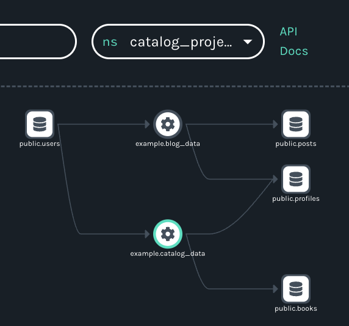

Namespaces enable powerful insights into distributed workflows.

<!--truncate-->

### Background

With all due respect to Shakespeare's [Juliet](https://shakespeare.folger.edu/shakespeares-works/romeo-and-juliet/act-2-scene-2/?search=rose/#line-2.2.41), in the [OpenLineage](https://github.com/OpenLineage/OpenLineage) spec at least, names in general -- and namespaces in particular -- are everything.

OK, that’s an exaggeration, but not by much. The function of namespaces is to provide unique IDs for everything in the lineage graph so that jobs and datasets can be rendered as nodes. This means namespaces make stitching input and output datasets together as pipelines possible – which is to say they effectively make lineage possible. In the broader context of the spec, namespaces reflect the importance of naming and naming conventions to the way OpenLineage constructs lineage. 


In creating pipelines organized according to data sources (in the case of datasets) or schedulers (in the case of jobs), namespaces enable focused insight into data flows, even when datasets and workflows are distributed across an organization. This focus enabled by namespaces is key to the production of useful lineage. If everything lived in a single namespace, every lineage graph would show everything that happened in an ecosystem – and be too cluttered to be useful. 

### Namespaces in the Spec 

A look at the spec provides additional detail about namespaces. In the spec, namespaces are at the top of the hierarchy, which means that they have priority over datasets, jobs, and the graphs that connect them. Namespaces contain graphs, in fact, along with just about everything else in a datasource or scheduler’s domain. Ultimately, this reflects the spec’s bias towards tracking dataset and job transformations. 

To wit: the same code applied to different input datasets results in different jobs (not different runs of the same job). If those jobs share a scheduler, they will also share a namespace – but not a graph, which makes tracking the transformations much easier. Similarly, if different input datasets share a datasource, they will also share a namespace (but not a graph). 

As you can see, the track switching can get a little complicated, but the namespace abstraction has some clear advantages.

### Namespaces in the Wild

Consider the common scenario in which multiple teams in an organization maintain pipelines that access the same datasets. Now, imagine trying to collect and display lineage from the organization’s ecosystem without having a way to distinguish between the different pipelines that use the same datasets. The ambiguous metadata would make any graph so cluttered as to be practically meaningless. 

Suffice it to say, without a strategy for naming at that macro level of the ecosystem, creating a meaningful graph and tracking transformations is much more difficult. Namespaces also ensure that lineage is meaningful irrespective of the various sources of a job’s metadata. A scope above the dataset and run makes heterogeneous, holistic lineage possible in the case of datasets and jobs.

```
We define the unique name strategy per resource to ensure it is followed uniformly independently from who is producing metadata and we can connect lineage from various sources.
```

In sum, namespaces make operational lineage possible – which is, while maybe not everything, close to it.  

### Consulting the Marquez API 

Thanks to the [Marquez API reference](https://marquezproject.github.io/marquez/openapi.html), we know that a namespaces endpoint is available that we can query for all namespaces.

If you use curl to do so, here’s what you’ll get after building Marquez from source with seed data (using `./docker/up.sh --build --seed`):

```
➜  marquez git:(main) ✗ curl -v http://localhost:5000/api/v1/namespaces | jq
{
  "namespaces": [
    {
      "name": "default",
      "createdAt": "2022-12-07T15:02:24.135154Z",
      "updatedAt": "2022-12-07T15:02:24.135154Z",
      "ownerName": "anonymous",
      "description": "The default global namespace for dataset, job, and run metadata not belonging to a user-specified namespace.",
      "isHidden": false
    },
    {
      "name": "food_delivery",
      "createdAt": "2020-02-22T22:42:42Z",
      "updatedAt": "2020-02-22T22:42:42Z",
      "ownerName": "anonymous",
      "description": null,
      "isHidden": false
    }
  ]
}
``` 

The namespaces endpoint returns all the available namespaces, which is helpful because, as we’ll see, so much of the information available from the API requires a namespace. For this reason alone, you might say the namespace is the “root” of the object model.

Say you want to retrieve one or more datasets from the API. First, you’ll need a namespace:

```
➜  marquez git:(main) ✗ curl -v http://localhost:5000/api/v1/namespaces/food_delivery/datasets/public.drivers | jq
{
  "id": {
    "namespace": "food_delivery",
    "name": "public.drivers"
  },
  "type": "DB_TABLE",
  "name": "public.drivers",
  "physicalName": "public.drivers",
  "createdAt": "2020-02-22T22:42:42Z",
  "updatedAt": "2020-02-22T22:42:42Z",
  "namespace": "food_delivery",
  "sourceName": "default",
  "fields": [
    {
      "name": "id",
      "type": "INTEGER",
      "tags": [],
      "description": "The unique ID of the driver."
    }, …
```
Say you want to retrieve a job. You’ll need a namespace:

```
➜  marquez git:(main) ✗ curl -v http://localhost:5000/api/v1/namespaces/food_delivery/jobs/etl_order_status | jq
{
  "id": {
    "namespace": "food_delivery",
    "name": "etl_order_status"
  },
  "type": "BATCH",
  "name": "etl_order_status",
  "simpleName": "etl_order_status",
  "parentJobName": null,
  "createdAt": "2020-02-22T22:42:42Z",
  "updatedAt": "2020-02-22T22:44:52Z",
  "namespace": "food_delivery",
  "inputs": [],
  "outputs": [
    {
      "namespace": "food_delivery",
      "name": "public.order_status"
    }
  ], …
```
Runs? You’ll need a namespace for those:

```
➜  marquez git:(main) ✗ curl -v http://localhost:5000/api/v1/namespaces/food_delivery/jobs/etl_order_status/runs | jq
{
  "runs": [
    {
      "id": "b7098939-87f0-4207-878f-dfd8e8804d8a",
      "createdAt": "2020-02-22T22:42:42Z",
      "updatedAt": "2020-02-22T22:44:52Z",
      "nominalStartTime": null,
      "nominalEndTime": null,
      "state": "COMPLETED",
      "startedAt": "2020-02-22T22:42:42Z",
      "endedAt": "2020-02-22T22:44:52Z",
      "durationMs": 130000,
      "args": {},
      "jobVersion": {
        "namespace": "food_delivery",
        "name": "etl_order_status",
        "version": "44ca508b-43cc-392f-bbd2-9ca77d501afa"
      },
      "inputVersions": [],
      "outputVersions": [
        {
          "namespace": "food_delivery",
          "name": "public.order_status",
          "version": "0c16298c-cbe2-3547-8429-309917290570"
        }
      ],
      "context": {
        "sql": "INSERT INTO order_status (id, transitioned_at, status, order_id, customer_id, restaurant_id, driver_id)\n SELECT id, transitioned_at, status, order_id, customer_id, restaurant_id, driver_id\n   FROM tmp_order_status;"
      },
      "facets": {}
    }
  ]
}
```
As the API reveals, namespaces really are key in the spec: they organize and unlock most of the insights OpenLineage has to offer.

### Dataset Namespaces

Having explored the thinking behind namespaces and their role in the spec, we can get into how they organize datasets and jobs. Let’s start with datasets, the simpler of the two cases due to the more straightforward way datasets’ namespaces are constructed.

In short, a dataset’s namespace is always tied to its datasource. As the spec says, `the namespace for a dataset is the unique name for its datasource.`  

Data sources vary, however, so the specific construction of dataset namespaces also varies across datasource types. (But they tend to map to databases.)

In the case of Postgres, Mysql, and Trino, for example, we derive the namespace of a dataset from a combination of the scheme, host, and port of the service instance:

```
* Namespace: postgres://{host}:{port} of the service instance.  
    * Scheme = postgres
    * Authority = {host}:{port}
* Namespace: mysql://{host}:{port} of the service instance.  
    * Scheme = mysql
    * Authority = {host}:{port}
* Namespace: trino://{host}:{port} of the service instance.  
    * Scheme = trino
    * Authority = {host}:{port}
```
Redshift requires a different strategy. It’s possible to interact with Redshift via SQL and an API, so a Redshift namespace is composed of a cluster identifier, region name and port – the only common unique ID available to both methods: 

```
* Namespace: redshift://{cluster_identifier}.{region_name}:{port} of the cluster instance.  
    * Scheme = redshift
    * Authority = {cluster_identifier}:{port}
```
Snowflake and Amazon’s serverless Athena warehouse service, which do not require a port, are even simpler:

```
* Namespace: awsathena://athena.{region_name}.amazonaws.com of the service instance.  
    * Scheme = awsathena
    * Authority = athena.{region_name}.amazonaws.com
* Namespace: snowflake://{account name}  
    * Scheme = snowflake
    * Authority = {account name}
```
And so on. As you can see, the provenance of dataset namespaces is pretty straightforward: it’s the data source.

That said, sometimes deriving the data source of a dataset is not a simple operation. Some datasets can be identified two different ways, for example. A Spark dataset can be written using a Hive metastore and table name but read using the physical location of the data. Before we added the [`SymlinksDatasetFacet`](https://github.com/OpenLineage/OpenLineage/blob/main/spec/facets/SymlinksDatasetFacet.json), this naming conflict could break the lineage graph. Symlinks both provide alternative dataset names as a workaround in such cases and contain extra information about the datasets.

### Job Namespaces 

We’ve seen that for datasets the namespace is determined by the data source. But jobs are a different animal, so their namespaces are also different. How is a job’s namespace derived? 

As in the case of datasets, the unique naming of jobs is essential, and a job’s unique name consists of a namespace and name. Unlike datasets, jobs descend from schedulers, not data sources. Also unlike datasets, jobs are reducible: a job is composed of executions, or runs (as you can see from the “Historial de Ejecuciones” tab – if you were to take the new language switcher for a spin and select Spanish, that is!).


Consulting [the spec](https://github.com/OpenLineage/OpenLineage/blob/main/spec/Naming.md), we find more detail about the naming of jobs:

```
Jobs have a name that is unique to them in their namespace by construction.
The Namespace is the root of the naming hierarchy. The job name is constructed to identify the job within that namespace.
Example:  
* Airflow:  
    * Namespace: the namespace is assigned to the airflow instance. Ex: airflow-staging, airflow-prod
    * Job: each task in a DAG is a job. name: {dag name}.{task name}
* Spark:  
    * Namespace: the namespace is provided as a configuration parameter as in airflow. If there's a parent job, we use the same namespace, otherwise it is provided by configuration.
    * Spark app job name: the spark.app.name
    * Spark action job name: {spark.app.name}.{node.name}
```
So, while for datasets it’s all about the datasource, for jobs it’s all about the scheduler. And the `ParentRun` facet makes tracking job namespaces possible.

```
{
  "run": {
    "runId": "run_uuid"
  },
  "job": {
    "namespace": "job_namespace",
    "name": "job_name"
  }
}
```
For all events, if a parent job exists, the facet’s `namespace` value is used to assign a namespace. Otherwise, one is provided by configuration.

### What's the Point? 

But why bother with dataset namespaces in the first place? One answer to this question gets to what is, for some users, a primary value proposition of OpenLineage. A common use case for lineage collection involves tracking dataset access and transformation across jobs and teams in an organization – for monitoring the use of PII, for example. Tags are supported by OpenLineage and can be used to meet this need, but, depending on how an organization’s ecosystem is constructed, namespaces can also help with this common governance use case.

Let’s explore a simple example constructed using the [Python client](https://openlineage.io/docs/client/python/). Imagine that a library’s website has two components, a catalog and a blog, and that both features access the same user and profile tables, both of which contain PII.


In the spec, a dataset is unique only within a namespace – not across multiple namespaces – so a number of different graphs are possible depending on how the datasets are produced and accessed across an organization. 

For example, if for some reason the `users` and `profiles` tables shared two *different* data sources, the tables would belong to two different namespaces (let’s call them `catalog_project` and `blog_project`). While not a typical scenario, this would result in two different, uncluttered graphs of the multiple flows making use of the shared datasets:


The reason for the simplicity? The `users` and `profiles` tables belong to *both* the `catalog_project` and `blog_project` namespaces.

A more typical scenario might involve single versions of the tables being produced by one data source, which would assign them to a single OpenLineage namespace. Ironically, a simpler approach like this results in a more complicated visualization. Notice that the graph remains the same regardless of the namespace selected:




One advantage of this architecture is that it results in graphs making clear that the datasets containing PII are shared by the two jobs. Depending on an organization’s needs, developers might also find it more convenient to be able to see both jobs and their shared datasets in the same graph.

A third scenario might involve the isolation of PII by the use of a dedicated database and, by extension, a dedicated namespace (e.g., `user_data`). In the resulting visualization, the job views above remain the same, but the shared datasets containing PII are now collected in the `user_data` namespace on the datasets page of the Marquez UI:


Namespaces offer organizations a range of insights into how their teams are accessing and transforming sensitive data.

### How to Learn More 

If you’re new to OpenLineage and want to check out namespaces in action, a good entry point is the [Getting Started guide](https://openlineage.io/docs/getting-started). There you can learn about the core model, collect run-level metadata using [Marquez](https://marquezproject.ai/) as the [HTTP backend](https://github.com/OpenLineage/OpenLineage#scope), and explore lineage in the Marquez UI.

Helpful resources for learning more about the namespaces include the [spec](https://github.com/OpenLineage/OpenLineage/tree/main/spec), where [Naming.md](https://github.com/OpenLineage/OpenLineage/blob/main/spec/Naming.md) is the Rosetta stone for namespace construction and naming conventions in the project.

We also welcome contributions to the project. One of the existing [integrations](https://github.com/OpenLineage/OpenLineage/tree/main/integration) might be a good place to start. Our growing list of partners includes Airflow, dbt, Dagster and Flink.

Sound fun? Check out the [new contributor guide](https://github.com/MarquezProject/marquez/blob/main/CONTRIBUTING.md) to get started. 

### Acknowledgments

Ross Turk ([@rossturk](https://github.com/rossturk)) and Paweł Leszczyński ([@pawel-big-lebowski](https://github.com/pawel-big-lebowski)) contributed valuable feedback and suggestions. Any faults are the author's own.
