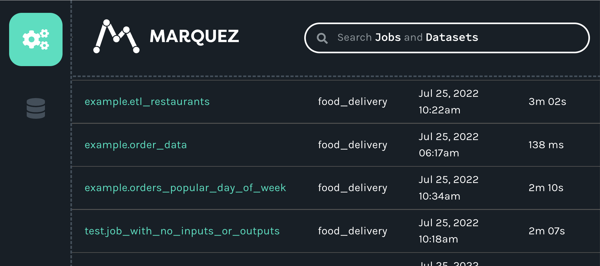
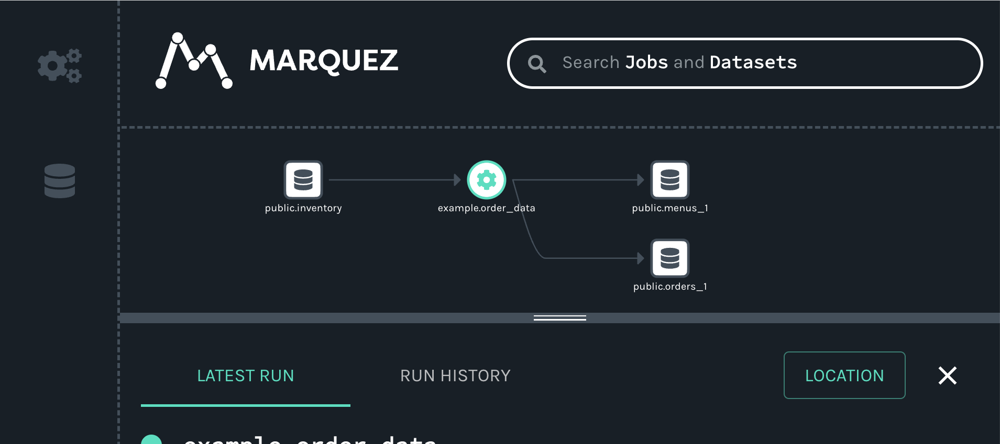
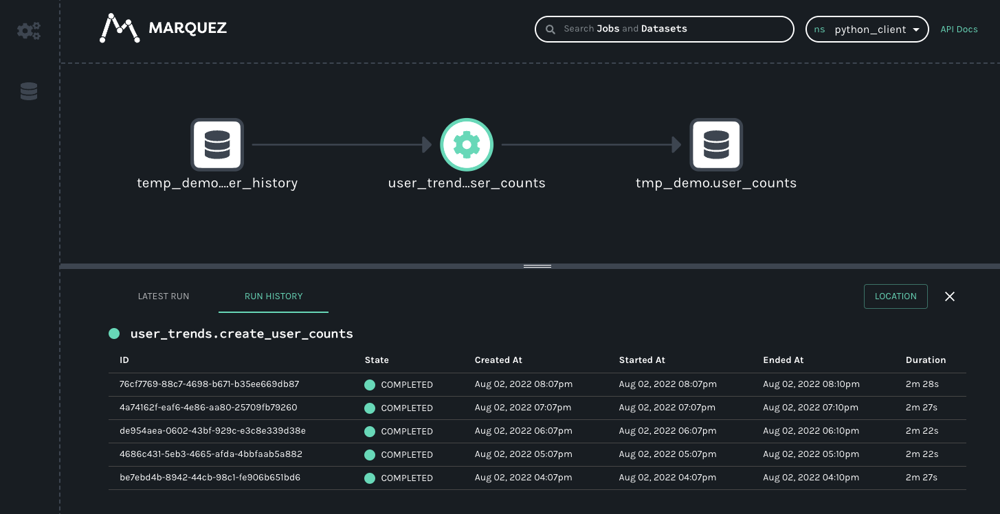

import Tabs from '@theme/Tabs';
import TabItem from '@theme/TabItem';

# Python

## Overview

The Python client is the basis of existing OpenLineage integrations such as Airflow and dbt.

The client enables the creation of lineage metadata events with Python code. 
The core data structures currently offered by the client are the `RunEvent`, `RunState`, `Run`, `Job`, `Dataset`, 
and `Transport` classes. These either configure or collect data for the emission of lineage events.

You can use the client to create your own custom integrations.

## Installation

Download the package using `pip` with 
```bash
pip install openlineage-python
```

To install the package from source, use
```bash
python -m pip install .
```

## Configuration

We recommend configuring the client with an `openlineage.yml` file that contains all the
details of how to connect to your OpenLineage backend.

You can make this file available to the client in three ways (the list also presents precedence of the configuration):

1. Set an `OPENLINEAGE_CONFIG` environment variable to a file path: `OPENLINEAGE_CONFIG=path/to/openlineage.yml`.
2. Place an `openlineage.yml` file in the current working directory (the absolute path of the directory where your script or process is currently running).
3. Place an `openlineage.yml` file under `.openlineage/` in the user's home directory (`~/.openlineage/openlineage.yml`).

In `openlineage.yml`, use a standard `Transport` interface to specify the transport type 
(`http`, `console`, `kafka`, `file`, or [custom](#custom-transport-type)) and authorization parameters.
See the [example config file](#built-in-transport-types) for each transport type. 

If there is no config file found, the OpenLineage client looks at environment variables for [HTTP transport](#http-transport-configuration-with-environment-variables).

At the end, if no configuration is found, ``ConsoleTransport`` is used, the events are printed in the console.

### Environment Variables

The following environment variables are available to use:  

| Name                       | Description                                                       | Example                 | Since  |
|----------------------------|-------------------------------------------------------------------|-------------------------|--------|
| OPENLINEAGE_CONFIG         | The path to the YAML configuration file                           | path/to/openlineage.yml |        |
| OPENLINEAGE_CLIENT_LOGGING | Logging level of OpenLineage client and its child modules         | DEBUG                   |        |
| OPENLINEAGE_DISABLED       | When `true`, OpenLineage will not emit events (default: false)    | false                   | 0.9.0  |
| OPENLINEAGE_URL            | The URL to send lineage events to (also see OPENLINEAGE_ENDPOINT) | https://myapp.com       |        |
| OPENLINEAGE_ENDPOINT       | Endpoint to which events are sent (default: api/v1/lineage)       | api/v2/events           |        |
| OPENLINEAGE_API_KEY        | Token included in the Authentication HTTP header as the Bearer    | secret_token_123        |        |

If you are using Airflow integration, there are additional [environment variables available](../integrations/airflow/usage.md#environment-variables).

#### Dynamic configuration with environment variables

You can also configure the client with dynamic environment variables.
Environment variables that configure the OpenLineage client follow a specific pattern. All variables that affect the client configuration start with the prefix `OPENLINEAGE__`, followed by nested keys separated by double underscores (`__`).

##### Key Features

1. Prefix Requirement: All environment variables must begin with `OPENLINEAGE__`.
2. Sections Separation: Configuration sections are separated using double underscores `__` to form the hierarchy.
3. Lowercase Conversion: Environment variable values are automatically converted to lowercase.
4. JSON String Support: You can pass a JSON string at any level of the configuration hierarchy, which will be merged into the final configuration structure.
5. Hyphen Restriction: Since environment variable names cannot contain `-` (hyphen), if a name strictly requires a hyphen, use a JSON string as the value of the environment variable.
6. Precedence Rules:
* Top-level keys have precedence and will not be overwritten by more nested entries.
* For example, `OPENLINEAGE__TRANSPORT='{..}'` will not have its keys overwritten by `OPENLINEAGE__TRANSPORT__AUTH__KEY='key'`.

##### Dynamic Alias for Transport Variables

To facilitate easier management of environment variables, aliases are dynamically created for certain variables like `OPENLINEAGE_URL`. If `OPENLINEAGE_URL` is set, it automatically translates into specific transport configurations
that can be used with Composite transport with `default_http` as the name of the HTTP transport.

Alias rules are following:
* If environment variable `OPENLINEAGE_URL`="http://example.com" is set, it would insert following environment variables:
```sh
OPENLINEAGE__TRANSPORT__TRANSPORTS__DEFAULT_HTTP__TYPE="http"
OPENLINEAGE__TRANSPORT__TRANSPORTS__DEFAULT_HTTP__URL="http://example.com"
```
* Similarly if environment variable `OPENLINEAGE_API_KEY`="random_key" is set, it will be translated to:
```sh
OPENLINEAGE__TRANSPORT__TRANSPORTS__DEFAULT_HTTP__AUTH='{"type": "api_key", "apiKey": "random_key"}'
```
qually with environment variable `OPENLINEAGE_ENDPOINT`="api/v1/lineage", that translates to:
```sh
OPENLINEAGE__TRANSPORT__TRANSPORTS__DEFAULT_HTTP__ENDPOINT="api/v1/lineage"
```
* If one does not want to use aliased HTTP transport in Composite Transport, they can set `OPENLINEAGE__TRANSPORT__TRANSPORTS__DEFAULT_HTTP` to `{}`.

#### Examples

<Tabs groupId="configs">
<TabItem value="basic" label="Basic Example">

Setting following environment variables:

```sh
OPENLINEAGE__TRANSPORT__TYPE=http
OPENLINEAGE__TRANSPORT__URL=http://localhost:5050
OPENLINEAGE__TRANSPORT__ENDPOINT=/api/v1/lineage
OPENLINEAGE__TRANSPORT__AUTH='{"type":"api_key", "apiKey":"random_token"}'
OPENLINEAGE__TRANSPORT__COMPRESSION=gzip
```

is equivalent to passing following YAML configuration:
```yaml
transport:
  type: http
  url: http://localhost:5050
  endpoint: api/v1/lineage
  auth:
    type: api_key
    apiKey: random_token
  compression: gzip
```
</TabItem>

<TabItem value="composite" label="Composite Example">

Setting following environment variables:

```sh
OPENLINEAGE__TRANSPORT__TYPE=composite
OPENLINEAGE__TRANSPORT__TRANSPORTS__FIRST__TYPE=http
OPENLINEAGE__TRANSPORT__TRANSPORTS__FIRST__URL=http://localhost:5050
OPENLINEAGE__TRANSPORT__TRANSPORTS__FIRST__ENDPOINT=/api/v1/lineage
OPENLINEAGE__TRANSPORT__TRANSPORTS__FIRST__AUTH='{"type":"api_key", "apiKey":"random_token"}'
OPENLINEAGE__TRANSPORT__TRANSPORTS__FIRST__COMPRESSION=gzip
OPENLINEAGE__TRANSPORT__TRANSPORTS__SECOND__TYPE=console
```

is equivalent to passing following YAML configuration:
```yaml
transport:
  type: composite
  transports:
    first:
      type: http
      url: http://localhost:5050
      endpoint: api/v1/lineage
      auth:
        type: api_key
        apiKey: random_token
      compression: gzip
    second:
      type: console
```
</TabItem>

<TabItem value="precedence" label="Precedence Example">

Setting following environment variables:

```sh
OPENLINEAGE__TRANSPORT='{"type":"console"}'
OPENLINEAGE__TRANSPORT__TYPE=http
```

is equivalent to passing following YAML configuration:
```yaml
transport:
  type: console
```
</TabItem>

<TabItem value="kafka" label="Kafka Transport Example">

Setting following environment variables:

```sh
OPENLINEAGE__TRANSPORT__TYPE=kafka
OPENLINEAGE__TRANSPORT__TOPIC=my_topic
OPENLINEAGE__TRANSPORT__CONFIG='{"bootstrap.servers": "localhost:9092,another.host:9092", "acks": "all", "retries": 3}'
OPENLINEAGE__TRANSPORT__FLUSH=true
OPENLINEAGE__TRANSPORT__MESSAGE_KEY=some-value
```

is equivalent to passing following YAML configuration:
```yaml
transport:
  type: kafka
  topic: my_topic
  config:
    bootstrap.servers: localhost:9092,another.host:9092
    acks: all
    retries: 3
  flush: true
  message_key: some-value # this has been aliased to messageKey
```
</TabItem>

</Tabs>

#### HTTP transport configuration with environment variables

For backwards compatibility, the simplest HTTP transport configuration, with only a subset of its config, can be done with environment variables
(all other transport types are only configurable with YAML file). This setup can be done with the following 
environment variables:

- `OPENLINEAGE_URL` (required)
- `OPENLINEAGE_ENDPOINT` (optional, default: `api/v1/lineage`)
- `OPENLINEAGE_API_KEY` (optional).

## Built-in Transport Types

### HTTP

Allows sending events to HTTP endpoint, using [requests](https://requests.readthedocs.io/).

#### Configuration

- `type` - string, must be `"http"`. Required.
- `url` - string, base url for HTTP requests. Required.
- `endpoint` - string specifying the endpoint to which events are sent, appended to `url`. Optional, default: `api/v1/lineage`.
- `timeout` - float specifying timeout (in seconds) value used while connecting to server. Optional, default: `5`.
- `verify` - boolean specifying whether the client should verify TLS certificates from the backend. Optional, default: `true`.
- `auth` - dictionary specifying authentication options. Optional, by default no authorization is used. If set, requires the `type` property.
  - `type` - string specifying the "api_key" or the fully qualified class name of your TokenProvider. Required if `auth` is provided.
  - `apiKey` - string setting the Authentication HTTP header as the Bearer. Required if `type` is `api_key`.
- `compression` - string, name of algorithm used by HTTP client to compress request body. Optional, default value `null`, allowed values: `gzip`. Added in v1.13.0.
- `custom_headers` - dictionary of additional headers to be sent with each request. Optional, default: `{}`.
- `retry` - dictionary of additional configuration options passed to [`urllib3.util.Retry`](https://urllib3.readthedocs.io/en/1.26.20/reference/urllib3.util.html) object. Added in v1.33.0. Defaults are below; those are non-exhaustive options, but the ones that are set by default. Look at  [`urllib3.util.Retry`](https://urllib3.readthedocs.io/en/1.26.20/reference/urllib3.util.html) options for full reference.
  - `total` - total number of retries to be attempted. Default is `5`.
  - `read` - number of retries to be attempted on read errors. Default is `5`.
  - `connect` - number of retries to be attempted on connection errors. Default is `5`.
  - `backoff_factor` - a backoff factor to apply between attempts after the second try, default is `0.3`.
  - `status_forcelist` - a set of integer HTTP status codes that we should force a retry on, default is `[500, 502, 503, 504]`.
  - `allowed_methods` - a set of HTTP methods that we should retry on, default is `["HEAD", "POST"]`.

#### Behavior

Events are serialized to JSON, and then are send as HTTP POST request with `Content-Type: application/json`.

#### Examples

<Tabs groupId="integrations">
<TabItem value="yaml" label="Yaml Config">

```yaml
transport:
  type: http
  url: https://backend:5000
  endpoint: api/v1/lineage
  timeout: 5
  verify: false
  auth:
    type: api_key
    apiKey: f048521b-dfe8-47cd-9c65-0cb07d57591e
  compression: gzip
  retry:
    total: 5
    read: 5
    connect: 5
    backoff_factor: 0.3
    status_forcelist: [500, 502, 503, 504]
    allowed_methods: ["HEAD", "POST"]
```

</TabItem>
<TabItem value="python" label="Python Code">

```python
from openlineage.client import OpenLineageClient
from openlineage.client.transport.http import ApiKeyTokenProvider, HttpConfig, HttpCompression, HttpTransport

http_config = HttpConfig(
  url="https://backend:5000",
  endpoint="api/v1/lineage",
  timeout=5,
  verify=False,
  auth=ApiKeyTokenProvider({"apiKey": "f048521b-dfe8-47cd-9c65-0cb07d57591e"}),
  compression=HttpCompression.GZIP,
)

client = OpenLineageClient(transport=HttpTransport(http_config))
```
</TabItem>

</Tabs>

### Console

This straightforward transport emits OpenLineage events directly to the console through a logger.
No additional configuration is required.

#### Configuration

- `type` - string, must be `"console"`. Required.

#### Behavior

Events are serialized to JSON. Then each event is logged with `INFO` level to logger with name `openlineage.client.transport.console`.

#### Notes

Be cautious when using the `DEBUG` log level, as it might result in double-logging due to the `OpenLineageClient` also logging.

#### Examples

<Tabs groupId="integrations">
<TabItem value="yaml" label="Yaml Config">

```yaml
transport:
  type: console
```

</TabItem>
<TabItem value="python" label="Python Code">

```python
from openlineage.client import OpenLineageClient
from openlineage.client.transport.console import ConsoleConfig, ConsoleTransport

console_config = ConsoleConfig()
client = OpenLineageClient(transport=ConsoleTransport(console_config))
```
</TabItem>

</Tabs>

### Kafka

Kafka transport requires `confluent-kafka` package to be additionally installed.
It can be installed also by specifying kafka client extension: `pip install openlineage-python[kafka]`

#### Configuration

- `type` - string, must be `"kafka"`. Required.
- `topic` - string specifying the topic on what events will be sent. Required.
- `config` - a dictionary containing a Kafka producer config as in [Kafka producer config](https://docs.confluent.io/platform/current/clients/confluent-kafka-python/html/index.html#kafka-client-configuration). Required.
- `flush` - boolean specifying whether Kafka should flush after each event. Optional, default: `true`.
- `messageKey` - string, key for all Kafka messages produced by transport. Optional, default value described below. Added in v1.13.0.

  Default values for `messageKey` are:
  - `run:{rootJob.namespace}/{rootJob.name}` - for RunEvent with parent facet containing link to `root` job
  - `run:{parentJob.namespace}/{parentJob.name}` - for RunEvent with parent facet
  - `run:{job.namespace}/{job.name}` - for RunEvent
  - `job:{job.namespace}/{job.name}` - for JobEvent
  - `dataset:{dataset.namespace}/{dataset.name}` - for DatasetEvent

#### Behavior

- Events are serialized to JSON, and then dispatched to the Kafka topic.
- If `flush` is `true`, messages will be flushed to the topic after each event being sent.

#### Notes

It is recommended to provide `messageKey` if Job hierarchy is used. It can be any string, but it should be the same for all jobs in
hierarchy, like `Airflow task -> Spark application -> Spark task runs`.

#### Using with Airflow integration

There's a caveat for using `KafkaTransport` with Airflow integration. In this integration, a Kafka producer needs to be created 
for each OpenLineage event.
It happens due to the Airflow execution and plugin model, which requires us to send messages from worker processes.
These are created dynamically for each task execution.

#### Examples

<Tabs groupId="integrations">
<TabItem value="yaml" label="Yaml Config">

```yaml
transport:
  type: kafka
  topic: my_topic
  config:
    bootstrap.servers: localhost:9092,another.host:9092
    acks: all
    retries: 3
  flush: true
  messageKey: some-value
```

</TabItem>
<TabItem value="python" label="Python Code">

```python
from openlineage.client import OpenLineageClient
from openlineage.client.transport.kafka import KafkaConfig, KafkaTransport

kafka_config = KafkaConfig(
  topic="my_topic",
  config={
    "bootstrap.servers": "localhost:9092,another.host:9092",
    "acks": "all",
    "retries": "3",
  },
  flush=True,
  messageKey="some",
)

client = OpenLineageClient(transport=KafkaTransport(kafka_config))
```
</TabItem>

</Tabs>

### File

Designed mainly for integration testing, the `FileTransport` emits OpenLineage events to a given file(s).

#### Configuration

- `type` - string, must be `"file"`. Required.
- `log_file_path` - string specifying the path of the file or file prefix (when `append` is true). Required.
- `append` - boolean, see *Behavior* section below. Optional, default: `false`.

#### Behavior

- If the target file is absent, it's created.
- If `append` is `true`, each event will be appended to a single file `log_file_path`, separated by newlines.
- If `append` is `false`, each event will be written to as separated file with name `{log_file_path}-{datetime}`.

#### Examples

<Tabs groupId="integrations">
<TabItem value="yaml" label="Yaml Config">

```yaml
transport:
  type: file
  log_file_path: /path/to/your/file
  append: false
```

</TabItem>
<TabItem value="python" label="Python Code">

```python
from openlineage.client import OpenLineageClient
from openlineage.client.transport.file import FileConfig, FileTransport

file_config = FileConfig(
  log_file_path="/path/to/your/file",
  append=False,
)

client = OpenLineageClient(transport=FileTransport(file_config))
```
</TabItem>

</Tabs>

### Composite

The `CompositeTransport` is designed to combine multiple transports, allowing event emission to several destinations. This is useful when events need to be sent to multiple targets, such as a logging system and an API endpoint. The events are delivered sequentially - one after another in a defined order.

#### Configuration

- `type` - string, must be "composite". Required.
- `transports` - a list or a map of transport configurations. Required.
- `continue_on_failure` - boolean flag, determines if the process should continue even when one of the transports fails. Default is `false`.

#### Behavior

- The configured transports will be initialized and used in sequence to emit OpenLineage events.
- If `continue_on_failure` is set to `false`, a failure in one transport will stop the event emission process, and an exception will be raised.
- If `continue_on_failure` is `true`, the failure will be logged, but the remaining transports will still attempt to send the event.

#### Notes for Multiple Transports
The composite transport can be used with any OpenLineage transport (e.g. `HttpTransport`, `KafkaTransport`, etc).

The `transports` configuration can be provided in two formats:

1. A list of transport configurations, where each transport may optionally include a `name` field.
2. A map of transport configurations, where the key acts as the name for each transport.
The map format is particularly useful for configurations set via environment variables.

##### Why are transport names used?
Transport names are not required for basic functionality. Their primary purpose is to enable configuration of composite transports via environment variables, which is only supported when names are defined.

#### Examples

<Tabs groupId="integrations">
<TabItem value="yaml-list" label="Yaml Config (List)">

```yaml
transport:
  type: composite
  continueOnFailure: true
  transports:
    - type: http
      url: http://example.com/api
      name: my_http
    - type: http
      url: http://localhost:5000
      endpoint: /api/v1/lineage
```

</TabItem>
<TabItem value="yaml-map" label="Yaml Config (Map)">

```yaml
transport:
  type: composite
  continueOnFailure: true
  transports:
    my_http:
      type: http
      url: http://example.com/api
    local_http:
      type: http
      url: http://localhost:5000
      endpoint: /api/v1/lineage
```

</TabItem>
<TabItem value="python" label="Python Code">

```python
from openlineage.client import OpenLineageClient
from openlineage.client.transport.composite import CompositeTransport, CompositeConfig

config = CompositeConfig.from_dict(
        {
            "type": "composite",
            "transports": [
                {
                    "type": "kafka",
                    "config": {"bootstrap.servers": "localhost:9092"},
                    "topic": "random-topic",
                    "messageKey": "key",
                    "flush": False,
                },
                {"type": "console"},
            ],
        },
    )
client = OpenLineageClient(transport=CompositeTransport(config))
```
</TabItem>
<TabItem value="env_vars" label="Environment Variables">

```python
import os
from openlineage.client import OpenLineageClient

os.environ["OPENLINEAGE__TRANSPORT__TYPE"] = "composite"
os.environ["OPENLINEAGE__TRANSPORT__CONTINUE_ON_FAILURE"] = "true"

# First transport - transform with http
os.environ["OPENLINEAGE__TRANSPORT__TRANSPORTS__MY_FIRST_TRANSPORT_NAME__TYPE"] = "transform"
os.environ["OPENLINEAGE__TRANSPORT__TRANSPORTS__MY_FIRST_TRANSPORT_NAME__TRANSFORMER_CLASS"] = "openlineage.client.transport.transform.JobNamespaceReplaceTransformer"
os.environ["OPENLINEAGE__TRANSPORT__TRANSPORTS__MY_FIRST_TRANSPORT_NAME__TRANSFORMER_PROPERTIES"] = '{"new_job_namespace": "new_namespace_value"}'
os.environ["OPENLINEAGE__TRANSPORT__TRANSPORTS__MY_FIRST_TRANSPORT_NAME__TRANSPORT__TYPE"] = "http"
os.environ["OPENLINEAGE__TRANSPORT__TRANSPORTS__MY_FIRST_TRANSPORT_NAME__TRANSPORT__URL"] = "http://backend:5000"
os.environ["OPENLINEAGE__TRANSPORT__TRANSPORTS__MY_FIRST_TRANSPORT_NAME__TRANSPORT__ENDPOINT"] = "api/v1/lineage"
os.environ["OPENLINEAGE__TRANSPORT__TRANSPORTS__MY_FIRST_TRANSPORT_NAME__TRANSPORT__AUTH__TYPE"] = "api_key"
os.environ["OPENLINEAGE__TRANSPORT__TRANSPORTS__MY_FIRST_TRANSPORT_NAME__TRANSPORT__AUTH__API_KEY"] = "1500100900"

# Second transport - http 
os.environ["OPENLINEAGE__TRANSPORT__TRANSPORTS__SECOND__TYPE"] = "http"
os.environ["OPENLINEAGE__TRANSPORT__TRANSPORTS__SECOND__URL"] = "http://another-backend:5000"
os.environ["OPENLINEAGE__TRANSPORT__TRANSPORTS__SECOND__ENDPOINT"] = "another/endpoint/v2"
os.environ["OPENLINEAGE__TRANSPORT__TRANSPORTS__SECOND__AUTH__TYPE"] = "api_key"
os.environ["OPENLINEAGE__TRANSPORT__TRANSPORTS__SECOND__AUTH__API_KEY"] = "bf6128d06dc2"

client = OpenLineageClient()
```
</TabItem>

</Tabs>

### Transform

The `TransformTransport` is designed to enable event manipulation before emitting the event. 
Together with `CompositeTransport`, it can be used to send different events into multiple backends.

#### Configuration

- `type` - string, must be "transform". Required.
- `transport` - Transport configuration to emit modified events. Required.
- `transformer_class` - class name of the event transformer. Class has to implement `openlineage.client.transports.transform.EventTransformer` interface and be a fully qualified class name that can be imported. Required.
- `transformer_properties` - Extra properties to be passed as `properties` kwarg into `transformer_class` constructor. Optional, default is `{}`.

#### Behavior

- The configured `transformer_class` will be used to alter events before the emission.
- Modified events will be passed into the configured `transport` for further processing.
- If transformation fails, event emission will be skipped.
- If modified event is None, event emission will be skipped.

#### `EventTransformer` interface

```python
from __future__ import annotations

from typing import Any
from openlineage.client.client import Event

class EventTransformer:
    def __init__(self, properties: dict[str, Any]) -> None:
        self.properties = properties

    def transform(self, event: Event) -> Event | None:
        raise NotImplementedError
```

#### Examples

<Tabs groupId="integrations">
<TabItem value="yaml" label="Yaml Config">

```yaml
transport:
  type: transform
  transformer_class: openlineage.client.transport.transform.JobNamespaceReplaceTransformer
  transformer_properties:
    new_job_namespace: new_value
  transport:
    type: http
    url: https://backend:5000
    endpoint: api/v1/lineage
    timeout: 5
    verify: false
    auth:
      type: api_key
      apiKey: f048521b-dfe8-47cd-9c65-0cb07d57591e
    compression: gzip
    retry:
      total: 5
      read: 5
      connect: 5
      backoff_factor: 0.3
      status_forcelist: [500, 502, 503, 504]
      allowed_methods: ["HEAD", "POST"]
```

</TabItem>
<TabItem value="python" label="Python Code">

```python
from openlineage.client import OpenLineageClient
from openlineage.client.transport.transform import TransformTransport, TransformConfig

transform_config = TransformConfig(
    transport={
        "type": "http",
        "url": "http://backend:5000",
        "endpoint": "api/v1/lineage",
        "verify": False,
        "auth": {
            "type": "api_key",
            "api_key": "1500100900",
        },
        "compression": "gzip",
        "retry": {
            "total": 7,
            "connect": 3,
            "read": 2,
            "status": 5,
            "other": 1,
            "allowed_methods": ["POST"],
            "status_forcelist": [500, 502, 503, 504],
            "backoff_factor": 0.5,
            "raise_on_redirect": False,
            "raise_on_status": False,
        },
    },
    transformer_class="openlineage.client.transport.transform.JobNamespaceReplaceTransformer",
    transformer_properties={"new_job_namespace": "new_namespace"}
)

client = OpenLineageClient(transport=TransformTransport(transform_config))
```
</TabItem>
<TabItem value="env_vars" label="Environment Variables">

```python
import os
from openlineage.client import OpenLineageClient

os.environ["OPENLINEAGE__TRANSPORT__TYPE"] = "transform"

# Transformer
os.environ["OPENLINEAGE__TRANSPORT__TRANSFORMER_CLASS"] = "openlineage.client.transport.transform.JobNamespaceReplaceTransformer"
os.environ["OPENLINEAGE__TRANSPORT__TRANSFORMER_PROPERTIES"] = '{"new_job_namespace": "new_namespace"}'

# Transport
os.environ["OPENLINEAGE__TRANSPORT__TRANSPORT__TYPE"] = "http"
os.environ["OPENLINEAGE__TRANSPORT__TRANSPORT__URL"] = "http://backend:5000"
os.environ["OPENLINEAGE__TRANSPORT__TRANSPORT__ENDPOINT"] = "api/v1/lineage"
os.environ["OPENLINEAGE__TRANSPORT__TRANSPORT__VERIFY"] = "false"

# Transport Auth
os.environ["OPENLINEAGE__TRANSPORT__TRANSPORT__AUTH__TYPE"] = "api_key"
os.environ["OPENLINEAGE__TRANSPORT__TRANSPORT__AUTH__API_KEY"] = "1500100900"

# Transport Compression
os.environ["OPENLINEAGE__TRANSPORT__TRANSPORT__COMPRESSION"] = "gzip"

# Transport Retry settings
os.environ["OPENLINEAGE__TRANSPORT__TRANSPORT__RETRY__TOTAL"] = "7"
os.environ["OPENLINEAGE__TRANSPORT__TRANSPORT__RETRY__CONNECT"] = "3"
os.environ["OPENLINEAGE__TRANSPORT__TRANSPORT__RETRY__READ"] = "2"
os.environ["OPENLINEAGE__TRANSPORT__TRANSPORT__RETRY__STATUS"] = "5"
os.environ["OPENLINEAGE__TRANSPORT__TRANSPORT__RETRY__OTHER"] = "1"
os.environ["OPENLINEAGE__TRANSPORT__TRANSPORT__RETRY__ALLOWED_METHODS"] = '["POST"]'
os.environ["OPENLINEAGE__TRANSPORT__TRANSPORT__RETRY__STATUS_FORCELIST"] = "[500, 502, 503, 504]"
os.environ["OPENLINEAGE__TRANSPORT__TRANSPORT__RETRY__BACKOFF_FACTOR"] = "0.5"
os.environ["OPENLINEAGE__TRANSPORT__TRANSPORT__RETRY__RAISE_ON_REDIRECT"] = "false"
os.environ["OPENLINEAGE__TRANSPORT__TRANSPORT__RETRY__RAISE_ON_STATUS"] = "false"

client = OpenLineageClient()
```
</TabItem>

</Tabs>

### Custom Transport Type

To implement a custom transport, follow the instructions in [`transport.py`](https://github.com/OpenLineage/OpenLineage/blob/main/client/python/openlineage/client/transport/transport.py).

The `type` property (required) must be a fully qualified class name that can be imported.

## Environment Variables Run Facet

To include specific environment variables in OpenLineage events, the `OpenLineageClient` can add them as a facet called `EnvironmentVariablesRunFacet`. This feature allows you to specify which environment variables should be collected and attached to each emitted event.

To enable this, configure the `environment_variables` option within the `facets` section of your `OpenLineageClient` configuration.

<Tabs groupId="env-vars-run-facet">
<TabItem value="yaml" label="Yaml Config">

```yaml
facets:
  environment_variables:
    - VAR1
    - VAR2
```

</TabItem>
<TabItem value="env-vars" label="Dynamic Environment Variables">

```sh
OPENLINEAGE__FACETS__ENVIRONMENT_VARIABLES='["VAR1", "VAR2"]'
```

</TabItem>
</Tabs>

## Getting Started

To try out the client, follow the steps below to install and explore OpenLineage, Marquez (the reference implementation of OpenLineage), and the client itself. Then, the instructions will show you how to use these tools to add a run event and datasets to an existing namespace.

### Prerequisites
- Docker 17.05+
- Docker Compose 1.29.1+
- Git (preinstalled on most versions of MacOS; verify your version with `git version`)
- 4 GB of available memory (the minimum for Docker — more is strongly recommended)

### Install OpenLineage and Marquez

Clone the Marquez Github repository:
```bash
git clone https://github.com/MarquezProject/marquez.git
```

### Install the Python client
```bash
pip install openlineage-python
```

### Start Docker and Marquez
Start Docker Desktop
Run Marquez with preloaded data:
```bash
cd marquez
./docker/up.sh --seed
```

Marquez should be up and running at `http://localhost:3000`.

Take a moment to explore Marquez to get a sense of how metadata is displayed in the UI. Namespaces – the global contexts for runs and datasets – can be found in the top right corner, and icons for jobs and runs can be found in a tray along the left side.

Next, configure OpenLineage and add a script to your project that will generate a new job and new datasets within an existing namespace (here we’re using the `food_delivery` namespace that got passed to Marquez with the `–seed` argument we used earlier).

Create a directory for your script:
```bash
..
mkdir python_scripts && cd python_scripts
```

In the python_scripts directory, create a Python script (we used the name `generate_events.py` for ours) and an `openlineage.yml` file.

In `openlineage.yml`, define a transport type and URL to tell OpenLineage where and how to send metadata:

```yaml
transport:
  type: http
  url: http://localhost:5000
```

In `generate_events.py`, import the Python client and the methods needed to create a job and datasets. Also required (to create a run): the `datetime` and `uuid` packages:

```python
from openlineage.client import OpenLineageClient
from openlineage.client.event_v2 import (
    Dataset,
    InputDataset,
    Job,
    OutputDataset,
    Run,
    RunEvent,
    RunState,
)
from openlineage.client.uuid import generate_new_uuid
from datetime import datetime
```

Then, in the same file, initialize the Python client:
```python
client = OpenLineageClient.from_environment()
```

It is also possible to specify parameters such as URL for client to connect to, without using environment variables or `openlineage.yaml` file, by directly setting it up when instantiating OpenLineageClient:

```python
client = OpenLineageClient(url="http://localhost:5000")
```

> For more details about options to setup OpenLineageClient such as API tokens or HTTP transport settings, please refer to the following [example](https://github.com/OpenLineage/OpenLineage/blob/main/client/python/tests/test_http.py)


Specify the producer of the new lineage metadata with a string:
```python
producer = "OpenLineage.io/website/blog"
```

Now you can create some basic dataset objects. These require a namespace and name:
```python
inventory = Dataset(namespace="food_delivery", name="public.inventory")
menus = Dataset(namespace="food_delivery", name="public.menus_1")
orders = Dataset(namespace="food_delivery", name="public.orders_1")
```

You can also create a job object (we’ve borrowed this one from the existing `food_delivery` namespace):
```python
job = Job(namespace="food_delivery", name="example.order_data")
```

To create a run object you’ll need to specify a unique ID:
```python
run = Run(runId=str(generate_new_uuid()))
```

a START run event:
```python
client.emit(
	RunEvent(
		eventType=RunState.START,
		eventTime=datetime.now().isoformat(),
		run=run, 
        job=job, 
        producer=producer,
	)
)
```

and, finally, a COMPLETE run event:
```python
client.emit(
	RunEvent(
		eventType=RunState.COMPLETE,
		eventTime=datetime.now().isoformat(),
		run=run, job=job, producer=producer,
		inputs=[inventory],
		outputs=[menus, orders],
	)
)
```

Now you have a complete script for creating datasets and a run event! Execute it in the terminal to send the metadata to Marquez:
```bash
python3 generate_scripts.py
```

Marquez will update itself automatically, so the new job and datasets should now be visible in the UI. Clicking on the jobs icon (the icon with the three interlocking gears), will make the `example.order_data` job appear in the list of jobs:



When you click on the job, you will see a new map displaying the job, input and outputs we created with our script:



## Full Example Source Code

```python
#!/usr/bin/env python3
from datetime import datetime, timedelta, timezone
from random import random

from openlineage.client.client import OpenLineageClient, OpenLineageClientOptions
from openlineage.client.event_v2 import (
    Dataset,
    InputDataset,
    Job,
    OutputDataset,
    Run,
    RunEvent,
    RunState,
)
from openlineage.client.facet_v2 import (
    nominal_time_run,
    schema_dataset,
    source_code_location_job,
    sql_job,
)
from openlineage.client.uuid import generate_new_uuid

PRODUCER = "https://github.com/openlineage-user"
namespace = "python_client"
dag_name = "user_trends"

# update to your host
url = "http://mymarquez.host:5000"
api_key = "1234567890ckcu028rzu5l"

client = OpenLineageClient(
    url=url,
    # optional api key in case marquez requires it. When running marquez in
    # your local environment, you usually do not need this.
    options=OpenLineageClientOptions(api_key=api_key),
)

# If you want to log to a file instead of Marquez
# from openlineage.client import OpenLineageClient
# from openlineage.client.transport.file import FileConfig, FileTransport
# 
# file_config = FileConfig(
#     log_file_path="ol.json",
#     append=True,
# )
# 
# client = OpenLineageClient(transport=FileTransport(file_config))


# generates job facet
def job(job_name, sql, location):
    facets = {"sql": sql_job.SQLJobFacet(query=sql)}
    if location != None:
        facets.update(
            {
                "sourceCodeLocation": source_code_location_job.SourceCodeLocationJobFacet(
                    "git", location
                )
            }
        )
    return Job(namespace=namespace, name=job_name, facets=facets)


# generates run racet
def run(run_id, hour):
    return Run(
        runId=run_id,
        facets={
            "nominalTime": nominal_time_run.NominalTimeRunFacet(
                nominalStartTime=f"2022-04-14T{twoDigits(hour)}:12:00Z",
                # nominalEndTime=None
            )
        },
    )


# generates dataset
def dataset(name, schema=None, ns=namespace):
    if schema == None:
        facets = {}
    else:
        facets = {"schema": schema}
    return Dataset(namespace=ns, name=name, facets=facets)


# generates output dataset
def outputDataset(dataset, stats):
    output_facets = {"stats": stats, "outputStatistics": stats}
    return OutputDataset(dataset.namespace,
                         dataset.name,
                         facets=dataset.facets,
                         outputFacets=output_facets)


# generates input dataset
def inputDataset(dataset, dq):
    input_facets = {
        "dataQuality": dq,
    }
    return InputDataset(dataset.namespace, dataset.name,
                        facets=dataset.facets,
                        inputFacets=input_facets)


def twoDigits(n):
    if n < 10:
        result = f"0{n}"
    elif n < 100:
        result = f"{n}"
    else:
        raise f"error: {n}"
    return result


now = datetime.now(timezone.utc)


# generates run Event
def runEvents(job_name, sql, inputs, outputs, hour, min, location, duration):
    run_id = str(generate_new_uuid())
    myjob = job(job_name, sql, location)
    myrun = run(run_id, hour)
    started_at = now + timedelta(hours=hour, minutes=min, seconds=20 + round(random() * 10))
    ended_at = started_at + timedelta(minutes=duration, seconds=20 + round(random() * 10))
    return (
        RunEvent(
            eventType=RunState.START,
            eventTime=started_at.isoformat(),
            run=myrun,
            job=myjob,
            producer=PRODUCER,
            inputs=inputs,
            outputs=outputs,
        ),
        RunEvent(
            eventType=RunState.COMPLETE,
            eventTime=ended_at.isoformat(),
            run=myrun,
            job=myjob,
            producer=PRODUCER,
            inputs=inputs,
            outputs=outputs,
        ),
    )


# add run event to the events list
def addRunEvents(events, job_name, sql, inputs, outputs, hour, minutes, location=None, duration=2):
    (start, complete) = runEvents(job_name, sql, inputs, outputs, hour, minutes, location, duration)
    events.append(start)
    events.append(complete)


events = []

# create dataset data
for i in range(0, 5):
    user_counts = dataset("tmp_demo.user_counts")
    user_history = dataset(
        "temp_demo.user_history",
        schema_dataset.SchemaDatasetFacet(
            fields=[
                schema_dataset.SchemaDatasetFacetFields(
                    name="id", type="BIGINT", description="the user id"
                ),
                schema_dataset.SchemaDatasetFacetFields(
                    name="email_domain", type="VARCHAR", description="the user id"
                ),
                schema_dataset.SchemaDatasetFacetFields(
                    name="status", type="BIGINT", description="the user id"
                ),
                schema_dataset.SchemaDatasetFacetFields(
                    name="created_at",
                    type="DATETIME",
                    description="date and time of creation of the user",
                ),
                schema_dataset.SchemaDatasetFacetFields(
                    name="updated_at",
                    type="DATETIME",
                    description="the last time this row was updated",
                ),
                schema_dataset.SchemaDatasetFacetFields(
                    name="fetch_time_utc",
                    type="DATETIME",
                    description="the time the data was fetched",
                ),
                schema_dataset.SchemaDatasetFacetFields(
                    name="load_filename",
                    type="VARCHAR",
                    description="the original file this data was ingested from",
                ),
                schema_dataset.SchemaDatasetFacetFields(
                    name="load_filerow",
                    type="INT",
                    description="the row number in the original file",
                ),
                schema_dataset.SchemaDatasetFacetFields(
                    name="load_timestamp",
                    type="DATETIME",
                    description="the time the data was ingested",
                ),
            ]
        ),
        "snowflake://",
    )

    create_user_counts_sql = """CREATE OR REPLACE TABLE TMP_DEMO.USER_COUNTS AS (
            SELECT DATE_TRUNC(DAY, created_at) date, COUNT(id) as user_count
            FROM TMP_DEMO.USER_HISTORY
            GROUP BY date
            )"""

    # location of the source code
    location = "https://github.com/some/airflow/dags/example/user_trends.py"

    # run simulating Airflow DAG with snowflake operator
    addRunEvents(
        events,
        dag_name + ".create_user_counts",
        create_user_counts_sql,
        [user_history],
        [user_counts],
        i,
        11,
        location,
    )


for event in events:
    from openlineage.client.serde import Serde

    print(event)
    print(Serde.to_json(event))
    # time.sleep(1)
    client.emit(event)

```
The resulting lineage events received by Marquez would look like this.




##### User-supplied Tags with Environment Variables 

Integrations can add [tag facets](https://github.com/OpenLineage/OpenLineage/blob/main/proposals/3169/tags_facet.md) to runs, jobs and datasets. To allow more control over tags, users can add to and override integration-supplied tags through environment variables supplied to the client. The following rules apply to user-supplied tags. 

* User-supplied tags follow the conventions of [dynamic configuration with environment variables.](#dynamic-configuration-with-environment-variables)
  * `OPENLINEAGE__TAGS__JOB__key=value`
  * `OPENLINEAGE__TAGS__RUN__key=value`
  * `OPENLINEAGE__TAGS='{"job": {"key": "value"}, "run": {"key": "value"}}'`
* User-supplied tag keys are always transformed to lowercase. 
* Key and value are both treated as strings 
* Source for a user-supplied tag is always set to "USER"
* If an integration-supplied tag has the same key as a user tag (case-insensitive), the tag value and source will be overridden.


###### Examples

Using this environment variable, an event with no tags facets will create a tag facet and add the following tag. 

```sh
OPENLINEAGE__TAGS__JOB__ENVIRONMENT="PRODUCTION"
```
or 

```sh
OPENLINEAGE__TAGS='{"job": {"ENVIRONMENT": "PRODUCTION"}}'
```

```json
"facets": {
  "tags": {
    "_producer": "https://github.com/OpenLineage/OpenLineage/tree/1.27.0/client/python",
    "_schemaURL": "https://openlineage.io/spec/facets/1-0-0/TagsJobFacet.json#/$defs/TagsJobFacet",
    "tags": [
      {
        "key": "environment",
        "value": "PRODUCTION",
        "source": "USER"
      }
    ]
  }
}
```

Consider this run event. It has one tag with key="ENVIRONMENT" for the job. Run has no tags facet.  

```json
{
  "eventTime": "2023-07-17T10:54:22.355067Z",
  "eventType": "COMPLETE",
  "inputs": [],
  "job": {
    "facets": {
      "tags": {
        "_producer": "https://github.com/OpenLineage/OpenLineage/tree/1.27.0/client/python",
        "_schemaURL": "https://openlineage.io/spec/facets/1-0-0/TagsJobFacet.json#/$defs/TagsJobFacet",
        "tags": [
          {
            "key": "PIPELINE",
            "value": "sales" 
            "source": "DBT_INTEGRATION"
          }
        ]
      } 
    },
    "name": "dbt",
    "namespace": "food_delivery"
  },
  "outputs": [],
  "producer": "https://github.com/OpenLineage/OpenLineage/tree/0.30.0/integration/airflow",
  "run": {
    "facets": {},
    "runId": "f69a6e9b-9bac-3c9a-9cf6-eacb70ecc9a9"
  },
  "dataset": { "namespace": "123", "name": "1" },
  "schemaURL": "https://openlineage.io/spec/1-0-5/OpenLineage.json#/definitions/RunEvent"
}
```

If we set the following environment variables, three things will happen.
* Job: Create a new tag for environment.
* Job: Update the pipeline tag value from "sales" to "sales_monthly". 
* Run: Create a new tag for adhoc. 

```sh
OPENLINEAGE__TAGS__JOB__ENVIRONMENT="PRODUCTION"
OPENLINEAGE__TAGS__JOB__PIPELINE="sales_monthly"
OPENLINEAGE__TAGS__RUN__adhoc="true"
```

or

```sh
OPENLINIAGE__TAGS='{"job": {"ENVIRONMENT": "PRODUCTION", "PIPELINE": "sales_monthly"}, "run": {"adhoc": "true"}}'
```

The event will now have these tag updates. 

```json
{
  "eventTime": "2023-07-17T10:54:22.355067Z",
  "eventType": "COMPLETE",
  "inputs": [],
  "job": {
    "facets": {
      "tags": {
        "_producer": "https://github.com/OpenLineage/OpenLineage/tree/1.27.0/client/python",
        "_schemaURL": "https://openlineage.io/spec/facets/1-0-0/TagsJobFacet.json#/$defs/TagsJobFacet",
        "tags": [
          {
            "key": "PIPELINE",
            "value": "sales_monthly" # Updated tag value
            "source": "DBT_INTEGRATION"
          },
          {
            "key": "environment", # New tag with lowercase key 
            "value": "PRODUCTION" 
            "source": "USER"
          }
        ]
      } 
    },
    "name": "dbt",
    "namespace": "food_delivery"
  },
  "outputs": [],
  "producer": "https://github.com/OpenLineage/OpenLineage/tree/0.30.0/integration/airflow",
  "run": {
    "facets": {
      "tags": { # New tags facet
        "_producer": "https://github.com/OpenLineage/OpenLineage/tree/1.27.0/client/python",
        "_schemaURL": "https://openlineage.io/spec/facets/1-0-0/TagsJobFacet.json#/$defs/TagsJobFacet",
        "tags": [
          {
            "key": "adhoc", # New tag
            "value": "true" 
            "source": "USER"
          }
        ]
      }
    },
    "runId": "f69a6e9b-9bac-3c9a-9cf6-eacb70ecc9a9"
  },
  "dataset": { "namespace": "123", "name": "1" },
  "schemaURL": "https://openlineage.io/spec/1-0-5/OpenLineage.json#/definitions/RunEvent"
}
```

## Generator CLI Tool

The Python client includes a CLI tool that allows you to generate Python classes from OpenLineage specification files. This is particularly useful if you want to:

- Create custom facets based on your own JSON schema definitions
- Generate client code that matches a specific version of the OpenLineage specification
- Extend the OpenLineage model with domain-specific classes

### Dependencies

The CLI tool requires `datamodel-code-generator`, a library that converts JSON Schema to Python data models. If you plan to use the generator, install it with:

```bash
pip install "openlineage-python[generator]"
```

### Usage

```bash
ol-generate-code [FACETS_SPEC_LOCATION] [--output-location OUTPUT_LOCATION]
```

#### Arguments

- `FACETS_SPEC_LOCATION`: Path to a JSON file or directory containing JSON files with OpenLineage facet specifications
- `--output-location`: (Optional) Directory where the generated Python classes will be saved. If not specified, output will be printed to stdout with proposed file names.

#### Examples

Generate Python classes from a single facet specification file:

```bash
ol-generate-code my_custom_facet.json --output-location ./generated_code
```

Generate Python classes from a directory containing multiple facet specification files:

```bash
ol-generate-code ./facets_dir --output-location ./generated_code
```

### How It Works

The CLI tool:

1. Retrieves the base OpenLineage specification from `https://openlineage.io/spec/2-0-2/OpenLineage.json`
2. Loads and parses your custom facet specifications
3. Uses the `datamodel-code-generator` library to generate Python classes that match the structure of the specifications
4. Formats the generated code using Ruff. The generator automatically converts camelCase names to snake_case for Python conventions
5. Outputs the files to the specified location
