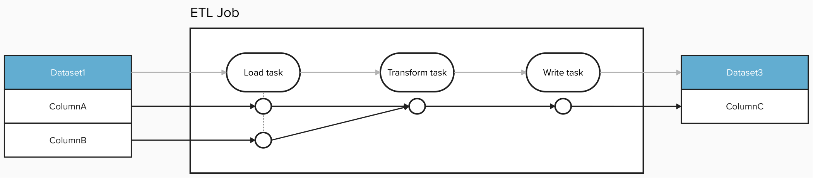

## Simple Examples

### START event with single input

This is a START event with a single PostgreSQL input dataset.

```json
{
  "eventType": "START",
  "eventTime": "2020-12-28T19:52:00.001+10:00",
  "run": {
    "runId": "d46e465b-d358-4d32-83d4-df660ff614dd"
  },
  "job": {
    "namespace": "workshop",
    "name": "process_taxes"
  },
  "inputs": [{
    "namespace": "postgres://workshop-db:None",
    "name": "workshop.public.taxes"
  }],  
  "producer": "https://github.com/OpenLineage/OpenLineage/blob/v1-0-0/client"
}
```

### COMPLETE event with single output

This is a COMPLETE event with a single PostgreSQL output dataset.

```json
{
  "eventType": "COMPLETE",
  "eventTime": "2020-12-28T20:52:00.001+10:00",
  "run": {
    "runId": "d46e465b-d358-4d32-83d4-df660ff614dd"
  },
  "job": {
    "namespace": "workshop",
    "name": "process_taxes"
  },
  "outputs": [{
    "namespace": "postgres://workshop-db:None",
    "name": "workshop.public.unpaid_taxes"
  }],
  "producer": "https://github.com/OpenLineage/OpenLineage/blob/v1-0-0/client"
}
```

## Complex Examples

### START event with Facets (run and job)

This is a START event with run and job facets of Apache Airflow.

```json
{
  "eventType": "START",
  "eventTime": "2020-12-28T19:52:00.001+10:00",
  "run": {
    "runId": "d46e465b-d358-4d32-83d4-df660ff614dd"
    "facets": {
      "airflow_runArgs": {
        "_producer": "https://github.com/OpenLineage/OpenLineage/tree/0.10.0/integration/airflow",
        "_schemaURL": "https://raw.githubusercontent.com/OpenLineage/OpenLineage/main/spec/OpenLineage.json#/definitions/BaseFacet",
        "externalTrigger": true
      },
      "nominalTime": {
        "_producer": "https://github.com/OpenLineage/OpenLineage/tree/0.10.0/integration/airflow",
        "_schemaURL": "https://raw.githubusercontent.com/OpenLineage/OpenLineage/main/spec/OpenLineage.json#/definitions/NominalTimeRunFacet",
        "nominalStartTime": "2022-07-29T14:14:31.458067Z"
      },
      "parentRun": {
        "_producer": "https://github.com/OpenLineage/OpenLineage/tree/0.10.0/integration/airflow",
        "_schemaURL": "https://raw.githubusercontent.com/OpenLineage/OpenLineage/main/spec/OpenLineage.json#/definitions/ParentRunFacet",
        "job": {
          "name": "etl_orders",
          "namespace": "cosmic_energy"
        },
        "run": {
          "runId": "1ba6fdaa-fb80-36ce-9c5b-295f544ec462"
        }
      }
    }
  },
  "job": {
    "namespace": "workshop",
    "name": "process_taxes",
    "facets": {
      "documentation": {
        "_producer": "https://github.com/OpenLineage/OpenLineage/tree/0.10.0/integration/airflow",
        "_schemaURL": "https://raw.githubusercontent.com/OpenLineage/OpenLineage/main/spec/OpenLineage.json#/definitions/DocumentationJobFacet",
        "description": "Process taxes."
      },
      "sql": {
        "_producer": "https://github.com/OpenLineage/OpenLineage/tree/0.10.0/integration/airflow",
        "_schemaURL": "https://raw.githubusercontent.com/OpenLineage/OpenLineage/main/spec/OpenLineage.json#/definitions/SqlJobFacet",
        "query": "INSERT into taxes values(1, 100, 1000, 4000);"
      }
    },
  },
  "inputs": [{
    "namespace": "postgres://workshop-db:None",
    "name": "workshop.public.taxes"
  }],  
  "producer": "https://github.com/OpenLineage/OpenLineage/blob/v1-0-0/client"
}
```

### COMPLETE event with Facets (dataset)

This is a COMPLETE event with dataset facet of Database table.

```json
{
  "eventType": "COMPLETE",
  "eventTime": "2020-12-28T20:52:00.001+10:00",
  "run": {
    "runId": "d46e465b-d358-4d32-83d4-df660ff614dd"
  },
  "job": {
    "namespace": "workshop",
    "name": "process_taxes"
  },
  "outputs": [{
    "namespace": "postgres://workshop-db:None",
    "name": "workshop.public.unpaid_taxes",
    "facets": {
        "dataSource": {
          "_producer": "https://github.com/OpenLineage/OpenLineage/tree/0.10.0/integration/airflow",
          "_schemaURL": "https://raw.githubusercontent.com/OpenLineage/OpenLineage/main/spec/OpenLineage.json#/definitions/DataSourceDatasetFacet",
          "name": "postgres://workshop-db:None",
          "uri": "workshop-db"
        },
        "schema": {
          "_producer": "https://github.com/OpenLineage/OpenLineage/tree/0.10.0/integration/airflow",
          "_schemaURL": "https://raw.githubusercontent.com/OpenLineage/OpenLineage/main/spec/OpenLineage.json#/definitions/SchemaDatasetFacet",
          "fields": [
            {
              "name": "id",
              "type": "SERIAL PRIMARY KEY"
            },
            {
              "name": "tax_dt",
              "type": "TIMESTAMP NOT NULL"
            },
            {
              "name": "tax_item_id",
              "type": "INTEGER REFERENCES tax_itemsid"
            },
            {
              "name": "amount",
              "type": "INTEGER NOT NULL"
            },
            {
              "name": "ref_id",
              "type": "INTEGER REFERENCES refid"
            },
            {
              "name": "comment",
              "type": "TEXT"
            }
          ]
        }
      }
  }],     
  "producer": "https://github.com/OpenLineage/OpenLineage/blob/v1-0-0/client"
}
```

### Job-to-Job lineage - ETL Job with several tasks

This example shows how to represent an ETL Job consisting of several tasks. This example combines couple of facets to document the data lineage: 
- using [Parent Run Facet](https://openlineage.io/docs/spec/facets/run-facets/parent_run) to document the relation between the ETL job and individual taks of the job (both the job and the individual tasks are documented by distinct OpenLineage events)
- using [Dataset Type Facet](https://openlineage.io/docs/spec/facets/dataset-facets/type) to indicate, that the intermediate datasets produced by individual tasks of the ETL job are temporary, and consumers of the OpenLineage event can choose not to represent them (and draw the lineage directly to the next task instead). 
- using [Column Level Lineage Facet](https://openlineage.io/docs/spec/facets/dataset-facets/column_lineage_facet) to document column-level lineage not only between the ETL job and the input/output datasets, but also the detailed transformations on the level of individual steps of the ETL job



The OpenLineage payloads are using the following best practices: 

- For [Dataset Type Facet](https://openlineage.io/docs/spec/facets/dataset-facets/type), the values `datasetType:= JOB_OUTPUT`, `subType:= TEMPORARY` are used to mark the temporary datasets. 
- The namespace of the temporary dataset should follow standard [naming conventions](https://openlineage.io/docs/spec/naming/) and reflect where is the temporary dataset stored. If it is in-memory only, `inmemory://` can be used. 
- The name of the temporary dataset can be constructed in various ways, below are couple of proposed approaches: 
   - If the temporary dataset is named/identifiable, it's name or ID should be used 
   - If the temporary dataset doesn't have any name or ID, the name can be constructuded as the Job name with an index or the name of the downstream non-temporary dataset as a suffix (to accommodate Jobs with multiple outputs).

COMPLETE event for `Load task`
```json
{
    "eventTime": "2025-10-24T15:08:00.001+10:00",
    "eventType": "COMPLETE",
    "producer": "https://github.com/OpenLineage/OpenLineage/blob/v1-0-0/client",
    "job": {
        "namespace": "<job_namespace>",
        "name": "<job_name>.Load task",
        "facets": {
            "jobType": {
                "processingType": "BATCH",
                "integration": "example",
                "jobType": "ingest_data",
                "_producer": "https://github.com/OpenLineage/OpenLineage/blob/v1-0-0/client",
                "_schemaURL": "https://openlineage.io/spec/facets/2-0-2/JobTypeJobFacet.json"
            },
            "documentation": {
                "_producer": "https://some.producer.com/version/1.0",
                "_schemaURL": "https://github.com/OpenLineage/OpenLineage/blob/main/spec/facets/DocumentationJobFacet.json",
                "description": "Ingest data from Data Source.",
                "contentType": "text/markdown"
            }
        }
    },
    "run": {
        "runId": "...",
        "facets": {
            "parent": {
                "job": {
                    "namespace": "<job_namespace>",
                    "name": "<job_name>"
                },
                "run": {
                    "runId": "<job_run_id>"
                }
            }
        }
    },
    "inputs": [
        {
            "namespace": "test://example1.com:443/myDir",
            "name": "Dataset1",
            "facets": {
                "schema": {
                    "_producer": "https://some.producer.com/version/1.0",
                    "_schemaURL": "https://openlineage.io/spec/facets/1-1-1/SchemaDatasetFacet.json",
                    "fields": [
                        {
                            "name": "ColumnA",
                            "type": "string"
                        },
                        {
                            "name": "ColumnB",
                            "type": "string"
                        }
                    ]
                }
            }
        }
    ],
    "outputs": [
        {
            "namespace": "inmemory://",
            "name": "Dataset3.Load task",
            "facets": {
                "datasetType": {
                    "_producer": "https://some.producer.com/version/1.0",
                    "_schemaURL": "https://openlineage.io/spec/facets/1-0-0/DatasetTypeDatasetFacet.json",
                    "datasetType": "JOB_OUTPUT",
                    "subType": "TEMPORARY"
                },
                "schema": {
                    "_producer": "https://some.producer.com/version/1.0",
                    "_schemaURL": "https://openlineage.io/spec/facets/1-1-1/SchemaDatasetFacet.json",
                    "fields": [
                        {
                            "name": "_0",
                            "type": "string"
                        },
                        {
                            "name": "_1",
                            "type": "string"
                        }
                    ]
                },
                "columnLineage": {
                    "_producer": "https://some.producer.com/version/1.0",
                    "_schemaURL": "https://openlineage.io/spec/facets/1-2-0/ColumnLineageDatasetFacet.json",
                    "fields": {
                        "_0": {
                            "inputFields": [
                                {
                                    "namespace": "test://example1.com:443/myDir",
                                    "name": "Dataset1",
                                    "field": "ColumnA",
                                    "transformations": [
                                        {
                                            "type": "DIRECT",
                                            "subtype": "IDENTITY",
                                            "description": "",
                                            "masking": false
                                        }
                                    ]
                                }
                            ]
                        },
                        "_1": {
                            "inputFields": [
                                {
                                    "namespace": "test://example1.com:443/myDir",
                                    "name": "Dataset1",
                                    "field": "ColumnB",
                                    "transformations": [
                                        {
                                            "type": "DIRECT",
                                            "subtype": "IDENTITY",
                                            "description": "",
                                            "masking": false
                                        }
                                    ]
                                }
                            ]
                        }
                    }
                }
            }
        }
    ]
}
```

COMPLETE event for `Transform task`
```json
{
    "eventTime": "2025-10-24T15:08:00.001+10:00",
    "eventType": "COMPLETE",
    "producer": "https://github.com/OpenLineage/OpenLineage/blob/v1-0-0/client",
    "job": {
        "namespace": "<job_namespace>",
        "name": "<job_name>.Transform task",
        "facets": {
            "jobType": {
                "processingType": "BATCH",
                "integration": "example",
                "jobType": "transform_task",
                "_producer": "https://github.com/OpenLineage/OpenLineage/blob/v1-0-0/client",
                "_schemaURL": "https://openlineage.io/spec/facets/2-0-2/JobTypeJobFacet.json"
            },
            "documentation": {
                "_producer": "https://some.producer.com/version/1.0",
                "_schemaURL": "https://github.com/OpenLineage/OpenLineage/blob/main/spec/facets/DocumentationJobFacet.json",
                "description": "Transforms input columns using defined business logic.",
                "contentType": "text/markdown"
            }
        }
    },
    "run": {
        "runId": "...",
        "facets": {
            "parent": {
                "job": {
                    "namespace": "<job_namespace>",
                    "name": "<job_name>"
                },
                "run": {
                    "runId": "<job_run_id>"
                }
            }
        }
    },
    "inputs": [
        {
            "namespace": "inmemory://",
            "name": "Dataset3.Load task",
            "facets": {
                "datasetType": {
                    "_producer": "https://some.producer.com/version/1.0",
                    "_schemaURL": "https://openlineage.io/spec/facets/1-0-0/DatasetTypeDatasetFacet.json",
                    "datasetType": "JOB_OUTPUT",
                    "subType": "TEMPORARY"
                },
                "schema": {
                    "_producer": "https://some.producer.com/version/1.0",
                    "_schemaURL": "https://openlineage.io/spec/facets/1-1-1/SchemaDatasetFacet.json",
                    "fields": [
                        {
                            "name": "_0",
                            "type": "string"
                        },
                        {
                            "name": "_1",
                            "type": "string"
                        }
                    ]
                }
            }
        }
    ],
    "outputs": [
        {
            "namespace": "inmemory://",
            "name": "Dataset3.Transform task",
            "facets": {
                "datasetType": {
                    "_producer": "https://some.producer.com/version/1.0",
                    "_schemaURL": "https://openlineage.io/spec/facets/1-0-0/DatasetTypeDatasetFacet.json",
                    "datasetType": "JOB_OUTPUT",
                    "subType": "TEMPORARY"
                },
                "schema": {
                    "_producer": "https://some.producer.com/version/1.0",
                    "_schemaURL": "https://openlineage.io/spec/facets/1-1-1/SchemaDatasetFacet.json",
                    "fields": [
                        {
                            "name": "_0",
                            "type": "string"
                        }
                    ]
                },
                "columnLineage": {
                    "_producer": "https://some.producer.com/version/1.0",
                    "_schemaURL": "https://openlineage.io/spec/facets/1-2-0/ColumnLineageDatasetFacet.json",
                    "fields": {
                        "_0": {
                            "inputFields": [
                                {
                                    "namespace": "<job_namespace>",
                                    "name": "<job_name>.Load task",
                                    "field": "_0",
                                    "transformations": [
                                        {
                                            "type": "DIRECT",
                                            "subtype": "IDENTITY",
                                            "description": "",
                                            "masking": false
                                        }
                                    ]
                                },
                                {
                                    "namespace": "<job_namespace>",
                                    "name": "<job_name>.Load task",
                                    "field": "_1",
                                    "transformations": [
                                        {
                                            "type": "DIRECT",
                                            "subtype": "IDENTITY",
                                            "description": "",
                                            "masking": false
                                        }
                                    ]
                                }
                            ]
                        }
                    }
                }
            }
        }
    ]
}
```

COMPLETE event for `Write task`
```json
{
    "eventTime": "2025-10-24T15:08:00.001+10:00",
    "eventType": "COMPLETE",
    "producer": "https://github.com/OpenLineage/OpenLineage/blob/v1-0-0/client",
    "job": {
        "namespace": "<job_namespace>",
        "name": "<job_name>.Write task",
        "facets": {
            "jobType": {
                "processingType": "BATCH",
                "integration": "example",
                "jobType": "write_task",
                "_producer": "https://github.com/OpenLineage/OpenLineage/blob/v1-0-0/client",
                "_schemaURL": "https://openlineage.io/spec/facets/2-0-2/JobTypeJobFacet.json"
            },
            "documentation": {
                "_producer": "https://some.producer.com/version/1.0",
                "_schemaURL": "https://github.com/OpenLineage/OpenLineage/blob/main/spec/facets/DocumentationJobFacet.json",
                "description": "Writes data into an output dataset.",
                "contentType": "text/markdown"
            }
        }
    },
    "run": {
        "runId": "...",
        "facets": {
            "parent": {
                "job": {
                    "namespace": "<job_namespace>",
                    "name": "<job_name>"
                },
                "run": {
                    "runId": "<job_run_id>"
                }
            }
        }
    },
    "inputs": [
        {
            "namespace": "inmemory://",
            "name": "Dataset3.Transform task",
            "facets": {
                "datasetType": {
                    "_producer": "https://some.producer.com/version/1.0",
                    "_schemaURL": "https://openlineage.io/spec/facets/1-0-0/DatasetTypeDatasetFacet.json",
                    "datasetType": "JOB_OUTPUT",
                    "subType": "TEMPORARY"
                },
                "schema": {
                    "_producer": "https://some.producer.com/version/1.0",
                    "_schemaURL": "https://openlineage.io/spec/facets/1-1-1/SchemaDatasetFacet.json",
                    "fields": [
                        {
                            "name": "_0",
                            "type": "string"
                        }
                    ]
                }
            }
        }
    ],
    "outputs": [
        {
            "namespace": "test://example3.com:443/myDir",
            "name": "Dataset3",
            "facets": {
                "schema": {
                    "_producer": "https://some.producer.com/version/1.0",
                    "_schemaURL": "https://openlineage.io/spec/facets/1-1-1/SchemaDatasetFacet.json",
                    "fields": [
                        {
                            "name": "_0",
                            "type": "string"
                        }
                    ]
                },
                "columnLineage": {
                    "_producer": "https://some.producer.com/version/1.0",
                    "_schemaURL": "https://openlineage.io/spec/facets/1-2-0/ColumnLineageDatasetFacet.json",
                    "fields": {
                        "ColumnC": {
                            "inputFields": [
                                {
                                    "namespace": "<job_namespace>",
                                    "name": "<job_name>.Write task",
                                    "field": "_0",
                                    "transformations": [
                                        {
                                            "type": "DIRECT",
                                            "subtype": "IDENTITY",
                                            "description": "",
                                            "masking": false
                                        }
                                    ]
                                }
                            ]
                        }
                    }
                }
            }
        }
    ]
}
```

COMPLETE event for the parent `ETL job`
```json
{
    "eventTime": "2025-10-24T15:08:00.001+10:00",
    "eventType": "COMPLETE",
    "producer": "https://github.com/OpenLineage/OpenLineage/blob/v1-0-0/client",
    "job": {
        "namespace": "<job_namespace>",
        "name": "<job_name>"
    },
    "run": {
        "runId": "<job_run_id>"
    },
    "inputs": [
        {
            "namespace": "test://example1.com:443/myDir",
            "name": "Dataset1",
            "facets": {
                "schema": {
                    "_producer": "https://some.producer.com/version/1.0",
                    "_schemaURL": "https://openlineage.io/spec/facets/1-1-1/SchemaDatasetFacet.json",
                    "fields": [
                        {
                            "name": "ColumnA",
                            "type": "string"
                        },
                        {
                            "name": "ColumnB",
                            "type": "string"
                        }
                    ]
                }
            }
        }
    ],
    "outputs": [
        {
            "namespace": "test://example3.com:443/myDir",
            "name": "Dataset3",
            "facets": {
                "schema": {
                    "_producer": "https://some.producer.com/version/1.0",
                    "_schemaURL": "https://openlineage.io/spec/facets/1-1-1/SchemaDatasetFacet.json",
                    "fields": [
                        {
                            "name": "ColumnC",
                            "type": "string"
                        }
                    ]
                },
                "columnLineage": {
                    "_producer": "https://some.producer.com/version/1.0",
                    "_schemaURL": "https://openlineage.io/spec/facets/1-2-0/ColumnLineageDatasetFacet.json",
                    "fields": {
                        "ColumnC": {
                            "inputFields": [
                                {
                                    "namespace": "test://example1.com:443/myDir",
                                    "name": "Dataset1",
                                    "field": "ColumnA",
                                    "transformations": [
                                        {
                                            "type": "DIRECT",
                                            "subtype": "IDENTITY",
                                            "description": "",
                                            "masking": false
                                        }
                                    ]
                                },
                                {
                                    "namespace": "test://example1.com:443/myDir",
                                    "name": "Dataset1",
                                    "field": "ColumnB",
                                    "transformations": [
                                        {
                                            "type": "DIRECT",
                                            "subtype": "IDENTITY",
                                            "description": "",
                                            "masking": false
                                        }
                                    ]
                                }
                            ]
                        }
                    }
                }
            }
        }
    ]
}
```