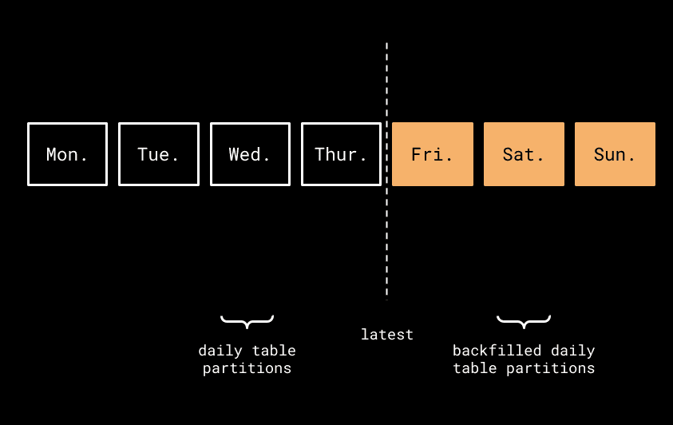
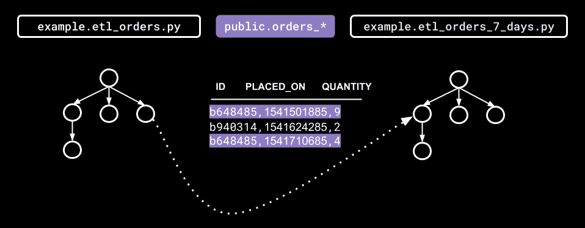

# Backfilling Airflow DAGs Using Marquez

#### Adapted from a [blog post](https://openlineage.io/blog/backfilling-airflow-dags-using-marquez/) by Willy Lulciuc

This tutorial covers the use of lineage metadata in Airflow to backfill DAGs. Thanks to data lineage, backfilling does not have to be a tedious chore.  

Airflow supports backfilling DAG runs for a historical time window with a given start and end date. If a DAG (`example.etl_orders_7_days`) started failing on 2021-06-06, for example, you might want to reprocess the daily table partitions for that week (assuming all partitions have been backfilled upstream). This is possible using the [Airflow CLI](https://openlineage.io/blog/backfilling-airflow-dags-using-marquez/). In order to run the backfill for `example.etl_orders_7_days` using Airflow, create an Airflow instance and execute the following backfill command in a terminal window:

```
# Backfill weekly food orders
$ airflow dags backfill \
    --start-date 2021-06-06 \
    --end-date 2021-06-06 \
    example.etl_orders_7_days
```

Unfortunately, backfills are rarely so straightforward. Some questions remain:

- How quickly can data quality issues be identified and explored?
- What alerting rules should be in place to notify downstream DAGs of possible upstream processing issues or failures?
- What effects (if any) would upstream DAGs have on downstream DAGs if dataset consumption were delayed?

Managing lineage metadata with Marquez clears up much of the ambiguity that has surrounded backfilling. The key is to maintain inter-DAG dependencies and catalog historical runs of DAGs.

## Exploring Lineage Metadata using Marquez

### Prerequisites

- Sample data (for the dataset used here, follow the instructions in the [Write Sample Lineage Metadata to Marquez](https://marquezproject.github.io/marquez/quickstart.html#write-sample-lineage-metadata-to-marquez) section of Marquez's [quickstart](https://marquezproject.github.io/marquez/quickstart.html) guide)
- Docker 17.05+
- Docker Desktop
- Docker Compose
- jq

:::info
If you are using macOS Monterey (macOS 12), port 5000 will have to be released by [disabling the AirPlay Receiver](https://developer.apple.com/forums/thread/682332). Also, port 3000 will need to be free if access to the Marquez web UI is desired.
:::

### Query the Lineage Graph

After running the seed command in the quickstart guide, check to make sure Marquez is up by visiting http://localhost:3000. The page should display an empty Marquez instance and a message saying there is no data. Also, it should be possible to see the server output from requests in the terminal window where Marquez is running. This window should remain open. As you progress through the tutorial, feel free to experiment with the web UI. Use truncated strings (e.g., "example.etl_orders_7_days" instead of "job:food_delivery:example.etl_orders_7_days") to find the datasets referenced below.

In Marquez, each dataset and job has its own globally unique node ID that can be used to query the lineage graph. The LineageAPI returns a set of nodes consisting of edges. An edge is directed and has a defined origin and destination. A lineage graph may contain the following node types: `dataset:<namespace>:<dataset>`, `job:<namespace>:<job>`.

Start by querying the lineage graph of the seed data via the CLI.  The `etl_orders_7_days` DAG has the node ID `job:food_delivery:example.etl_orders_7_days`. To see the graph, run the following in a new terminal window: 

```
$ curl -X GET "http://localhost:5000/api/v1-beta/lineage?nodeId=job:food_delivery:example.etl_orders_7_days"
```

Notice in the returned lineage graph that the DAG input datasets are `public.categories`, `public.orders`, and `public.menus`, while `public.orders_7_days` is the output dataset. The response should look something like this:

```
{
  "graph": [{
    "id": "job:food_delivery:example.etl_orders_7_days",
    "type": "JOB",
    "data": {
      "type": "BATCH",
      "id": {
        "namespace": "food_delivery",
        "name": "example.etl_orders_7_days"
      },
      "name": "example.etl_orders_7_days",
      "createdAt": "2021-06-06T14:50:13.931946Z",
      "updatedAt": "2021-06-06T14:57:54.037399Z",
      "namespace": "food_delivery",
      "inputs": [
        {"namespace": "food_delivery", "name": "public.categories"},
        {"namespace": "food_delivery", "name": "public.menu_items"},
        {"namespace": "food_delivery", "name": "public.orders"},
        {"namespace": "food_delivery", "name": "public.menus"}
      ],
      "outputs": [
        {"namespace": "food_delivery", "name": "public.orders_7_days"}
      ],
      "location": "https://github.com/example/jobs/blob/2294bc15eb49071f38425dc927e48655530a2f2e/etl_orders_7_days.py",
        "context": {
          "sql": "INSERT INTO orders_7_days (order_id, placed_on, discount_id, menu_id, restaurant_id, menu_item_id, category_id)\n  SELECT o.id AS order_id, o.placed_on, o.discount_id, m.id AS menu_id, m.restaurant_id, mi.id AS menu_item_id, c.id AS category_id\n    FROM orders AS o\n   INNER JOIN menu_items AS mi\n      ON menu_items.id = o.menu_item_id\n   INNER JOIN categories AS c\n      ON c.id = mi.category_id\n   INNER JOIN menu AS m\n      ON m.id = c.menu_id\n   WHERE o.placed_on >= NOW() - interval '7 days';"
        },
        "description": "Loads newly placed orders weekly.",
        "latestRun": {
          "id": "5c7f0dc4-d3c1-4f16-9ac3-dc86c5da37cc",
          "createdAt": "2021-06-06T14:50:36.853459Z",
          "updatedAt": "2021-06-06T14:57:54.037399Z",
          "nominalStartTime": "2021-06-06T14:54:00Z",
          "nominalEndTime": "2021-06-06T14:57:00Z",
          "state": "FAILED",
          "startedAt": "2021-06-06T14:54:14.037399Z",
          "endedAt": "2021-06-06T14:57:54.037399Z",
          "durationMs": 220000,
          "args": {},
          "location": "https://github.com/example/jobs/blob/2294bc15eb49071f38425dc927e48655530a2f2e/etl_orders_7_days.py",
          "context": {
            "sql": "INSERT INTO orders_7_days (order_id, placed_on, discount_id, menu_id, restaurant_id, menu_item_id, category_id)\n  SELECT o.id AS order_id, o.placed_on, o.discount_id, m.id AS menu_id, m.restaurant_id, mi.id AS menu_item_id, c.id AS category_id\n    FROM orders AS o\n   INNER JOIN menu_items AS mi\n      ON menu_items.id = o.menu_item_id\n   INNER JOIN categories AS c\n      ON c.id = mi.category_id\n   INNER JOIN menu AS m\n      ON m.id = c.menu_id\n   WHERE o.placed_on >= NOW() - interval '7 days';"
          },
          "facets": {}
        }
      },
      "inEdges": [
        {"origin": "dataset:food_delivery:public.categories", "destination": "job:food_delivery:example.etl_orders_7_days"}, "destination": "job:food_delivery:example.etl_orders_7_days"},
        {"origin": "dataset:food_delivery:public.orders", "destination": "job:food_delivery:example.etl_orders_7_days"},
        {"origin": "dataset:food_delivery:public.menus", "destination": "job:food_delivery:example.etl_orders_7_days"}
      ],
      "outEdges": [
        {"origin": "job:food_delivery:example.etl_orders_7_days", "destination": "dataset:food_delivery:public.orders_7_days"}
      ]
    }
  }, ...]
}
```

To see a visualization of the graph, search the web UI with `public.delivery_7_days`.

### Backfill a DAG Run



Figure 1: Backfilled daily table partitions

To run a backfill for `example.etl_orders_7_days` using the DAG lineage metadata stored in Marquez, query the lineage graph for the upstream DAG where an error originated. In this case, the `example.etl_orders` DAG upstream of `example.etl_orders_7_days` failed to write some of the daily table partitions needed for the weekly food order trends report. To fix the weekly trends report, backfill the missing daily table partitions `public.orders_2021_06_04`, `public.orders_2021_06_05`, and `public.orders_2021_06_06` using the Airflow CLI:

```
# Backfill daily food orders
$ airflow dags backfill \
    --start-date 2021-06-04 \
    --end-date 2021-06-06 \
    example.etl_orders
```



Figure 2: Airflow inter-DAG dependencies

Then, using the script `backfill.sh` defined below, we can easily backfill all DAGs downstream of `example.etl_orders`:

(Note: Make sure you have jq installed before running `backfill.sh`.)

```
#!/bin/bash
#
# Backfill DAGs automatically using lineage metadata stored in Marquez.
#
# Usage: $ ./backfill.sh <start-date> <end-date> <dag-id>
​
set -e
​
# Backfills DAGs downstream of the given node ID, recursively.
backfill_downstream_of() {
  node_id="${1}"
  # Get out edges for node ID
  out_edges=($(echo $lineage_graph \
    | jq -r --arg NODE_ID "${node_id}" '.graph[] | select(.id==$NODE_ID) | .outEdges[].destination'))
  for out_edge in "${out_edges[@]}"; do
    # Run backfill if out edge is a job node (i.e. <dataset> => <job>)
    if [[ "${out_edge}" = job:* ]]; then
      dag_id="${out_edge##*:}"
      echo "backfilling ${dag_id}..."
      airflow backfill --start_date "${start_date}" --end_date "${start_date}" "${dag_id}"
    fi
    # Follow out edges downstream, recursively
    backfill_downstream_of "${out_edge}"
  done
}
​
start_date="${1}"
end_date="${2}"
dag_id="${3}"
​
# (1) Build job node ID (format: 'job:<namespace>:<job>')
node_id="job:food_delivery:${dag_id}"
​
# (2) Get lineage graph
lineage_graph=$(curl -s -X GET "http://localhost:5000/api/v1-beta/lineage?nodeId=${node_id}")
​
# (3) Run backfill
backfill_downstream_of "${node_id}"
```

When run, the script should output all backfilled DAGs to the console:

```
$ ./backfill.sh 2021-06-06 2021-06-06 example.etl_orders
backfilling example.etl_orders_7_days...
backfilling example.etl_delivery_7_days...
backfilling example.delivery_times_7_days...
```

### Conclusion

The lineage metadata provided by Marquez can make the task of backfilling much easier. But lineage metadata can also help avoid the need to backfill altogether. Since Marquez collects DAG run metadata that can be viewed using the Runs API, building automated processes to check DAG run states and notify teams of upstream data quality issues is just one possible preventive measure.

Explore Marquez's opinionated Metadata API and define your own automated process(es) for analyzing lineage metadata! Also, join our Slack channel or reach out to us on Twitter if you have questions.