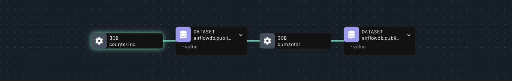
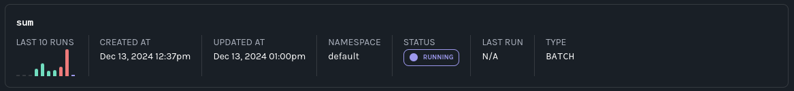
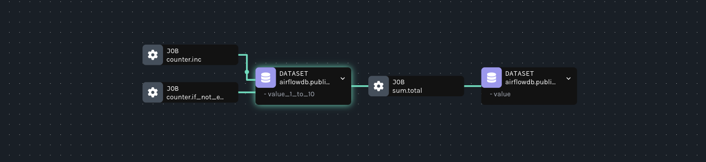
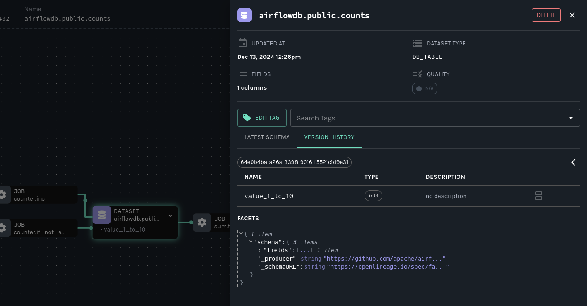
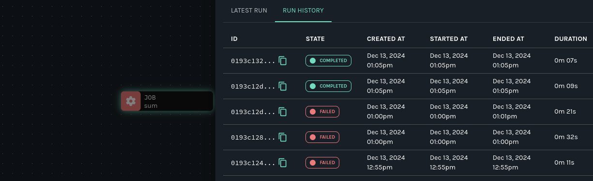

import Tabs from '@theme/Tabs'; import TabItem from '@theme/TabItem';

# Getting Started with Airflow and OpenLineage+Marquez

In this tutorial, you'll configure Airflow to send OpenLineage events to [Marquez](https://marquezproject.ai/) and explore a realistic troubleshooting scenario. 

### Table of Contents

1. [Prerequisites](#prerequisites)
2. [Get and start Marquez](#get-marquez)
3. [Configure Apache Airflow to send OpenLineage events to Marquez](#configure-airflow)
4. [Write Airflow DAGs](#write-airflow-dags)
5. [View Collected Lineage in Marquez](#view-collected-metadata)
6. [Troubleshoot a Failing DAG with Marquez](#troubleshoot-a-failing-dag-with-marquez)

## Prerequisites {#prerequisites}

Before you begin, make sure you have installed:

* [Docker 17.05](https://docs.docker.com/install)+
* [Airflow 2.8+](https://airflow.apache.org/docs/apache-airflow/stable/start.html) running locally

:::tip

For an easy path to standing up a local Airflow instance, see this Airflow [Quick Start](https://airflow.apache.org/docs/apache-airflow/2.10.3/start.html). 

:::

## Get and start Marquez {#get-marquez}

1. Create a directory for Marquez. Then, check out the Marquez source code by running:

    <Tabs groupId="os">
    <TabItem value="macos" label="MacOS/Linux">

    ```bash
    $ git clone https://github.com/MarquezProject/marquez && cd marquez
    ```

    </TabItem>
    <TabItem value="windows" label="Windows">

    ```bash
    $ git config --global core.autocrlf false
    $ git clone https://github.com/MarquezProject/marquez && cd marquez
    ```

    </TabItem>
    </Tabs>

2. Both Airflow and Marquez require port 5432 for their metastores, but the Marquez services are easier to configure. You can also assign the database service to a new port on the fly. To start Marquez using port 2345 for the database, run:

    <Tabs groupId="os">
    <TabItem value="macos" label="MacOS/Linux">

    ```bash
    $ ./docker/up.sh --db-port 2345
    ```

    </TabItem>
    <TabItem value="windows" label="Windows">

    Verify that Postgres and Bash are in your `PATH`, then run:

    ```bash
    $ sh ./docker/up.sh --db-port 2345
    ```

    </TabItem>
    </Tabs>

3. To view the Marquez UI and verify it's running, open [http://localhost:3000](http://localhost:3000). The UI allows you to: 

    - view cross-platform dependencies, meaning you can see the jobs across the tools in your ecosystem that produce or consume a critical table.
    - view run-level metadata of current and previous job runs, enabling you to see the latest status of a job and the update history of a dataset.
    - get a high-level view of resource usage, allowing you to see trends in your operations.

## Configure Airflow to send OpenLineage events to Marquez {#configure-airflow}

1. To configure Airflow to emit OpenLineage events to Marquez, you need to modify your local Airflow environment and add a dependency. First, define an OpenLineage transport. One way you can do this is by using an environment variable. To use `http` and send events to the Marquez API running locally on port `5000`, run:

    <Tabs groupId="os">
    <TabItem value="macos" label="MacOS/Linux">

    ```bash
    $ export AIRFLOW__OPENLINEAGE__TRANSPORT='{"type": "http", "url": "http://localhost:5000", "endpoint": "api/v1/lineage"}'
    ```

    </TabItem>
    <TabItem value="windows" label="Windows">

    ```bash
    $ set AIRFLOW__OPENLINEAGE__TRANSPORT='{"type": "http", "url": "http://localhost:5000", "endpoint": "api/v1/lineage"}'
    ```

    </TabItem>
    </Tabs>

2. You also need to define a namespace for Airflow jobs. It can be any string. Run:

    <Tabs groupId="os">
    <TabItem value="macos" label="MacOS/Linux">

    ```bash
    $ export AIRFLOW__OPENLINEAGE__NAMESPACE='my-team-airflow-instance'
    ```

    </TabItem>
    <TabItem value="windows" label="Windows">

    ```bash
    $ set AIRFLOW__OPENLINEAGE__NAMESPACE='my-team-airflow-instance'
    ```

    </TabItem>
    </Tabs>

3. To add the required Airflow OpenLineage Provider package to your Airflow environment, run:

    <Tabs groupId="os">
    <TabItem value="macos" label="MacOS/Linux">

    ```bash
    $ pip install apache-airflow-providers-openlineage
    ```

    </TabItem>
    <TabItem value="windows" label="Windows">

    ```bash
    $ pip install apache-airflow-providers-openlineage
    ```

    </TabItem>
    </Tabs>

4. To complete this tutorial, you also need to enable local Postgres operations in Airflow. To do this, run:

    <Tabs groupId="os">
    <TabItem value="macos" label="MacOS/Linux">

    ```bash
    $ pip install apache-airflow-providers-postgres
    ```

    </TabItem>
    <TabItem value="windows" label="Windows">

    ```bash
    $ pip install apache-airflow-providers-postgres
    ```

    </TabItem>
    </Tabs>

5. Create a database in your local Postgres instance and create an Airflow Postgres connection using the default ID (`postgres_default`). For help with the former, see: [Postgres Documentation](https://www.postgresql.org/docs/). For help with the latter, see: [Managing Connections](https://airflow.apache.org/docs/apache-airflow/stable/howto/connection.html#managing-connections).

## Write Airflow DAGs

In this step, you will create two new Airflow DAGs that perform simple tasks and add them to your existing Airflow instance. The `counter` DAG adds 1 to a column every minute, while the `sum` DAG calculates a sum every five minutes. This will result in a simple pipeline containing two jobs and two datasets.

1. In `dags/`, create a file named `counter.py` and add the following code:

    ```python
    import pendulum
    from airflow.decorators import dag, task
    from airflow.providers.postgres.operators.postgres import PostgresOperator
    from airflow.utils.dates import days_ago

    @dag(
        schedule='*/1 * * * *',
        start_date=days_ago(1),
        catchup=False,
        is_paused_upon_creation=False,
        max_active_runs=1,
        description='DAG that generates a new count value equal to 1.'
    )

    def counter():

        query1 = PostgresOperator(
            task_id='if_not_exists',
            postgres_conn_id='postgres_default',
            sql='''
            CREATE TABLE IF NOT EXISTS counts (value INTEGER);
            ''',
        )

        query2 = PostgresOperator(
            task_id='inc',
            postgres_conn_id='postgres_default',
            sql='''
            INSERT INTO "counts" (value) VALUES (1);
            ''',
        )

        query1 >> query2

    counter()

    ```

2. In `dags/`, create a file named `sum.py` and add the following code:

    ```python
    import pendulum
    from airflow.decorators import dag, task
    from airflow.providers.postgres.operators.postgres import PostgresOperator
    from airflow.utils.dates import days_ago

    @dag(
        start_date=days_ago(1),
        schedule='*/5 * * * *',
        catchup=False,
        is_paused_upon_creation=False,
        max_active_runs=1,
        description='DAG that sums the total of generated count values.'
    )

    def sum():

        query1 = PostgresOperator(
            task_id='if_not_exists',
            postgres_conn_id='postgres_default',
            sql='''
            CREATE TABLE IF NOT EXISTS sums (
                value INTEGER
            );'''
        )

        query2 = PostgresOperator(
            task_id='total',
            postgres_conn_id='postgres_default',
            sql='''
            INSERT INTO sums (value)
                SELECT SUM(value) FROM counts;
            '''
        )

        query1 >> query2

    sum()

    ```

3. Restart Airflow to apply the changes.

## View Collected Lineage in Marquez

1. To view lineage collected by Marquez from Airflow, browse to the Marquez UI by visiting [http://localhost:3000](http://localhost:3000). Then, use the _search_ bar in the upper right-side of the page and search for the `counter.inc` job. To view lineage metadata for `counter.inc`, click on the job from the drop-down list:

<p align="center">
  
</p>

2. Look at the lineage graph for `counter.inc`, where you should see `<database>.public.counts` as an output dataset and `sum.total` as a downstream job:

    

## Troubleshoot a Failing DAG with Marquez

1. In this step, you'll simulate a pipeline outage due to a cross-DAG dependency change and see how the enhanced lineage from OpenLineage+Marquez makes breaking schema changes easy to troubleshoot.

    Say `Team A` owns the DAG `counter`. `Team A` updates `counter` to rename the `values` column in the `counts` table to `value_1_to_10` without properly communicating the schema change to the team that owns `sum`.

    Apply the following changes to `counter` to simulate the breaking change:

    ```diff
    query1 = PostgresOperator(
    -   task_id='if_not_exists',
    +   task_id='alter_name_of_column',
        postgres_conn_id='example_db',
        sql='''
    -   CREATE TABLE IF NOT EXISTS counts (
    -     value INTEGER
    -   );''',
    +   ALTER TABLE "counts" RENAME COLUMN "value" TO "value_1_to_10";
    +   '''
    )
    ```

    ```diff
    query2 = PostgresOperator(
        task_id='inc',
        postgres_conn_id='example_db',
        sql='''
    -    INSERT INTO counts (value)
    +    INSERT INTO counts (value_1_to_10)
             VALUES (1)
        ''',
    )
    ```

    Like the owner of `sum`, `Team B`, would do, note the failed runs in the DataOps view in Marquez:

    

    `Team B` can only guess what might have caused the DAG failure as no recent changes have been made to the DAG. So, the team decides to check Marquez.

2. In Marquez, navigate to the Datasets view and select your Postgres instance from the namespace dropdown menu in the top-right corner. Then, click on the `<database>.public.counts` dataset and inspect the graph. You'll find the schema on the node:

    

3. Imagine you don't recognize the column and want to know what it was originally and when it changed. Clicking on the node will open the detail drawer. There, using the version history, find the run in which the schema changed:

    

4. In Airflow, fix the downstream DAG that broke by updating the task that calculates the count total to use the new column name:

    ```diff
    query2 = PostgresOperator(
        task_id='total',
        postgres_conn_id='example_db',
        sql='''
    -    INSERT INTO sums (value)
    -       SELECT SUM(value) FROM counts;
    +       SELECT SUM(value_1_to_10) FROM counts;
        '''
    )
    ```

5. Rerun the DAG. In Marquez, verify the fix by looking at the recent run history in the DataOps view:

    

## Next Steps

* Review the Marquez [HTTP API](https://marquezproject.github.io/marquez/openapi.html) used to collect Airflow DAG metadata and learn how to build your own integrations using OpenLineage.
* Take a look at the [`openlineage-spark`](https://openlineage.io/docs/integrations/spark/) integration that can be used with Airflow.

## Feedback

What did you think of this example? You can reach out to us on [Slack](http://bit.ly/MqzSlack) and leave us feedback, or [open a pull request](https://github.com/MarquezProject/marquez/blob/main/CONTRIBUTING.md#submitting-a-pull-request) with your suggested changes!
