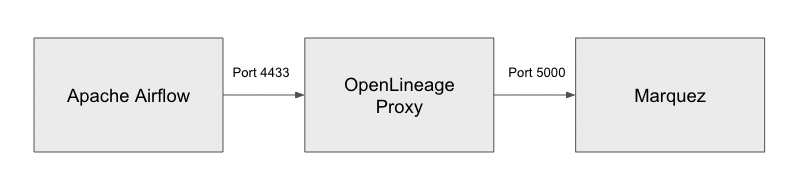

# Using the OpenLineage Proxy with Airflow

This tutorial introduces you to using the [OpenLineage Proxy](https://github.com/OpenLineage/OpenLineage/tree/main/proxy) with Airflow. OpenLineage has various integrations that will enable Airflow to emit OpenLineage events when using [Airflow Integrations](https://openlineage.io/docs/integrations/airflow/). In this tutorial, you will be running a local instance of Airflow using Docker Compose and learning how to enable and setup OpenLineage to emit data lineage events. The tutorial will use two backends to check the data lineage, 1) the Proxy, and 2) [Marquez](https://marquezproject.ai/).

## Table of Contents
- Setting up a Local Airflow Environment using Docker Compose
- Setting up Marquez
- Running Everything
- Accessing the Airflow UI
- Running an Example DAG

## Setting up a Local Airflow Environment using Docker Compose

Airflow has a convenient way to set up and run a fully functional environment using [Docker Compose](https://docs.docker.com/compose/). The following are therefore required to be installed before we begin this tutorial.

### Prerequisites

- Docker 20.10.0+
- Docker Desktop
- Docker Compose
- Java 11

:::info
If you are using MacOS Monterey (MacOS 12), port 5000 will have to be released by [disabling the AirPlay Receiver](https://developer.apple.com/forums/thread/682332). Also, port 3000 will need to be free if access to the Marquez Web UI is desired.
:::

Use the following [instructions](https://airflow.apache.org/docs/apache-airflow/stable/start/docker.html) to set up and run Airflow using Docker Compose. 

First, let's start out by creating a new directory that will contain all of our work.

```
mkdir ~/airflow-ol &&
cd ~/airflow-ol
```

Then, let's download the Docker Compose file that we'll be running in it.

```
curl -LfO 'https://airflow.apache.org/docs/apache-airflow/2.3.3/docker-compose.yaml'
```

This will allow a new environment variable `OPENLINEAGE_URL` to be passed to the Docker containers, which is needed for OpenLineage to work.

Then, let's create the following directories that will be mounted and used by the Docker Compose that will start Airflow.

```
mkdir dags &&
mkdir logs &&
mkdir plugins
```

Also, create a file `.env` that will contain an environment variable that is going to be used by Airflow to install additional Python packages that are needed. In this tutorial, the `openlineage-airflow` package will be installed.

```
echo "_PIP_ADDITIONAL_REQUIREMENTS=openlineage-airflow" > .env
```

You also need to let OpenLineage know where to send lineage data. 

```
echo "OPENLINEAGE_URL=http://host.docker.internal:4433" >> .env
```

The reason why we are setting the backend to `host.docker.internal` is that we are going to be running the OpenLineage Proxy outside Airflow's Docker environment on the host machine itself. Port 4433 is where the proxy will be listening for lineage data.

## Setting up OpenLineage Proxy as Receiving End

The OpenLineage Proxy is a simple tool that you can easily set up and run to receive OpenLineage data. The proxy does not do anything other than display what it receives. Optionally, it can also forward data to any OpenLineage-compatible backend via HTTP.

Let's download the proxy code from git and build it:

```
cd ~ &&
git clone https://github.com/OpenLineage/OpenLineage.git &&
cd OpenLineage/proxy/backend &&
./gradlew build
```

Now, copy `proxy.dev.yml` and edit its content as the following, and save it as `proxy.yml`.

```yaml
# Licensed under the Apache License, Version 2.0 (the "License");
# you may not use this file except in compliance with the License.
# You may obtain a copy of the License at
#
#     http://www.apache.org/licenses/LICENSE-2.0
#
# Unless required by applicable law or agreed to in writing, software
# distributed under the License is distributed on an "AS IS" BASIS,
# WITHOUT WARRANTIES OR CONDITIONS OF ANY KIND, either express or implied.
# See the License for the specific language governing permissions and
# limitations under the License.

server:
  applicationConnectors:
    - type: http
      port: ${OPENLINEAGE_PROXY_PORT:-4433}
  adminConnectors:
    - type: http
      port: ${OPENLINEAGE_PROXY_ADMIN_PORT:-4434}

logging:
  level: ${LOG_LEVEL:-INFO}
  appenders:
    - type: console

proxy:
  source: openLineageProxyBackend
  streams:
    - type: Console
    - type: Http
      url: http://localhost:5000/api/v1/lineage
```

## Setting up Marquez

The last piece of the setup is the Marquez backend. Using Marquez's [quickstart document](https://github.com/MarquezProject/marquez/blob/main/docs/quickstart.md), set up the Marquez environment.

```
cd ~ &&
git clone https://github.com/MarquezProject/marquez.git
```

In marquez/docker-compose.dev.yml, change the ports for pghero to free up port 8080 for Airflow:

```
version: "3.7"
services:
  api:
    build: .

  seed_marquez:
    build: .

  pghero:
    image: ankane/pghero
    container_name: pghero
    ports:
      - "8888:8888"
    environment:
      DATABASE_URL: postgres://postgres:password@db:5432
```

## Running Everything

### Running Marquez

Start Docker Desktop, then:

```
cd ~/marquez &&
./docker/up.sh
```

### Running OpenLineage proxy

```
cd ~/OpenLineage/proxy/backend &&
./gradlew runShadow
```

### Running Airflow

```
cd ~/airflow-ol
docker-compose up
``` 



At this point, Apache Airflow should be running and able to send lineage data to the OpenLineage Proxy, with the OpenLineage Proxy forwarding the data to Marquez. Consequently, we can both inspect data payloads and see lineage data in graph form.

## Accessing the Airflow UI

With everything up and running, we can now login to Airflow's UI by opening up a browser and accessing `http://localhost:8080`.

Initial ID and password to login would be `airflow/airflow`.

## Running an Example DAG

When you log into Airflow UI, you will notice that there are several example DAGs already populated when it started up. We can start running some of them to see the OpenLineage events they generate.

### Running Bash Operator

In the DAGs page, locate the `example_bash_operator`.


Clicke the ► button at the right, which will show up a popup. Select `Trigger DAG` to trigger and run the DAG manually.

You should see DAG running, and eventually completing.

### Check the OpenLineage events
Once everything is finished, you should be able to see a number of JSON data payloads output in OpenLineage proxy's console.

```json
INFO  [2022-08-16 21:39:41,411] io.openlineage.proxy.api.models.ConsoleLineageStream: {
  "eventTime" : "2022-08-16T21:39:40.854926Z",
  "eventType" : "START",
  "inputs" : [ ],
  "job" : {
    "facets" : { },
    "name" : "example_bash_operator.runme_2",
    "namespace" : "default"
  },
  "outputs" : [ ],
  "producer" : "https://github.com/OpenLineage/OpenLineage/tree/0.12.0/integration/airflow",
  "run" : {
    "facets" : {
      "airflow_runArgs" : {
        "_producer" : "https://github.com/OpenLineage/OpenLineage/tree/0.12.0/integration/airflow",
        "_schemaURL" : "https://raw.githubusercontent.com/OpenLineage/OpenLineage/main/spec/OpenLineage.json#/definitions/BaseFacet",
        "externalTrigger" : true
      },
      "airflow_version" : {
        "_producer" : "https://github.com/OpenLineage/OpenLineage/tree/0.12.0/integration/airflow",
        "_schemaURL" : "https://raw.githubusercontent.com/OpenLineage/OpenLineage/main/spec/OpenLineage.json#/definitions/BaseFacet",
        "airflowVersion" : "2.3.3",
        "openlineageAirflowVersion" : "0.12.0",
        "operator" : "airflow.operators.bash.BashOperator",
        "taskInfo" : "{'_BaseOperator__init_kwargs': {'task_id': 'runme_2', 'params': <***.models.param.ParamsDict object at 0xffff7467b610>, 'bash_command': 'echo \"example_bash_operator__runme_2__20220816\" && sleep 1'}, '_BaseOperator__from_mapped': False, 'task_id': 'runme_2', 'task_group': <weakproxy at 0xffff74676ef0 to TaskGroup at 0xffff7467ba50>, 'owner': '***', 'email': None, 'email_on_retry': True, 'email_on_failure': True, 'execution_timeout': None, 'on_execute_callback': None, 'on_failure_callback': None, 'on_success_callback': None, 'on_retry_callback': None, '_pre_execute_hook': None, '_post_execute_hook': None, 'executor_config': {}, 'run_as_user': None, 'retries': 0, 'queue': 'default', 'pool': 'default_pool', 'pool_slots': 1, 'sla': None, 'trigger_rule': <TriggerRule.ALL_SUCCESS: 'all_success'>, 'depends_on_past': False, 'ignore_first_depends_on_past': True, 'wait_for_downstream': False, 'retry_delay': datetime.timedelta(seconds=300), 'retry_exponential_backoff': False, 'max_retry_delay': None, 'params': <***.models.param.ParamsDict object at 0xffff7467b4d0>, 'priority_weight': 1, 'weight_rule': <WeightRule.DOWNSTREAM: 'downstream'>, 'resources': None, 'max_active_tis_per_dag': None, 'do_xcom_push': True, 'doc_md': None, 'doc_json': None, 'doc_yaml': None, 'doc_rst': None, 'doc': None, 'upstream_task_ids': set(), 'downstream_task_ids': {'run_after_loop'}, 'start_date': DateTime(2021, 1, 1, 0, 0, 0, tzinfo=Timezone('UTC')), 'end_date': None, '_dag': <DAG: example_bash_operator>, '_log': <Logger ***.task.operators (INFO)>, 'inlets': [], 'outlets': [], '_inlets': [], '_outlets': [], '_BaseOperator__instantiated': True, 'bash_command': 'echo \"example_bash_operator__runme_2__20220816\" && sleep 1', 'env': None, 'output_encoding': 'utf-8', 'skip_exit_code': 99, 'cwd': None, 'append_env': False}"
      },
      "nominalTime" : {
        "_producer" : "https://github.com/OpenLineage/OpenLineage/tree/0.12.0/integration/airflow",
        "_schemaURL" : "https://raw.githubusercontent.com/OpenLineage/OpenLineage/main/spec/OpenLineage.json#/definitions/NominalTimeRunFacet",
        "nominalStartTime" : "2022-08-16T21:39:38.005668Z"
      },
      "parentRun" : {
        "_producer" : "https://github.com/OpenLineage/OpenLineage/tree/0.12.0/integration/airflow",
        "_schemaURL" : "https://raw.githubusercontent.com/OpenLineage/OpenLineage/main/spec/OpenLineage.json#/definitions/ParentRunFacet",
        "job" : {
          "name" : "example_bash_operator",
          "namespace" : "default"
        },
        "run" : {
          "runId" : "39ad10d1-72d9-3fe9-b2a4-860c651b98b7"
        }
      }
    },
    "runId" : "313b4e71-9cde-4c83-b641-dd6773bf114b"
  }
}
```

### Check Marquez

You can also open up the browser and visit `http://localhost:3000` to access Marquez UI, and take a look at the OpenLineage events originating from Airflow.


### Running other DAGs

Due to the length of this tutorial, we are not going to be running additional example DAGs, but you can try running them and it would be interesting to see how each of them are going to be emitting OpenLineage events. Please try running other examples like `example_python_operator` which will also emit OpenLineage events.

Normally, DataLineage will be much more complete and useful if a DAG run involves certain `datasets` that either get used or created during the runtime of it. When you run those DAGs, you will be able to see the connection between different DAGs and Tasks touching the same dataset that will eventually turn into Data Lineage graph that may look something like this:


Currently, these are the Airflow operators that have extractors that can extract and emit OpenLineage events.

- PostgresOperator
- MySqlOperator
- BigQueryOperator
- SnowflakeOperator
- GreatExpectationsOperator
- PythonOperator

See additional [Apache Examples](https://github.com/MarquezProject/marquez/tree/main/examples/airflow) for DAGs that you can run in Airflow for OpenLineage.

## Troubleshooting

- You might not see any data going through the proxy or via Marquez. In that case, please check the task log of Airflow and see if you see the following message: `[2022-08-16, 21:23:19 UTC] {factory.py:122} ERROR - Did not find openlineage.yml and OPENLINEAGE_URL is not set`. In that case, it means that the environment variable `OPENLINEAGE_URL` was not set properly, thus OpenLineage was not able to emit any events. Please make sure to follow instructions in setting up the proper environment variable when setting up the Airflow via docker compose.
- Sometimes, Marquez would not respond and fail to receive any data via its API port 5000. You should be able to notice that if you start receiving response code 500 from Marquez or the Marquez UI hangs. In that case, simply stop and restart Marquez.

## Conclusion

In this short tutorial, we have learned how to setup and run a simple Apache Airflow environment that can emit OpenLineage events during its DAG run. We have also monitored and received the lineage events using combination of OpenLineage proxy and Marquez. We hope this tutorial was helpful in understanding how Airflow could be setup with OpenLineage and how you can easily monitor its data and end result using proxy and Marquez.
