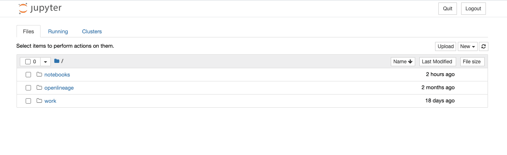
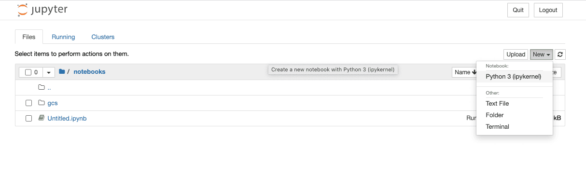
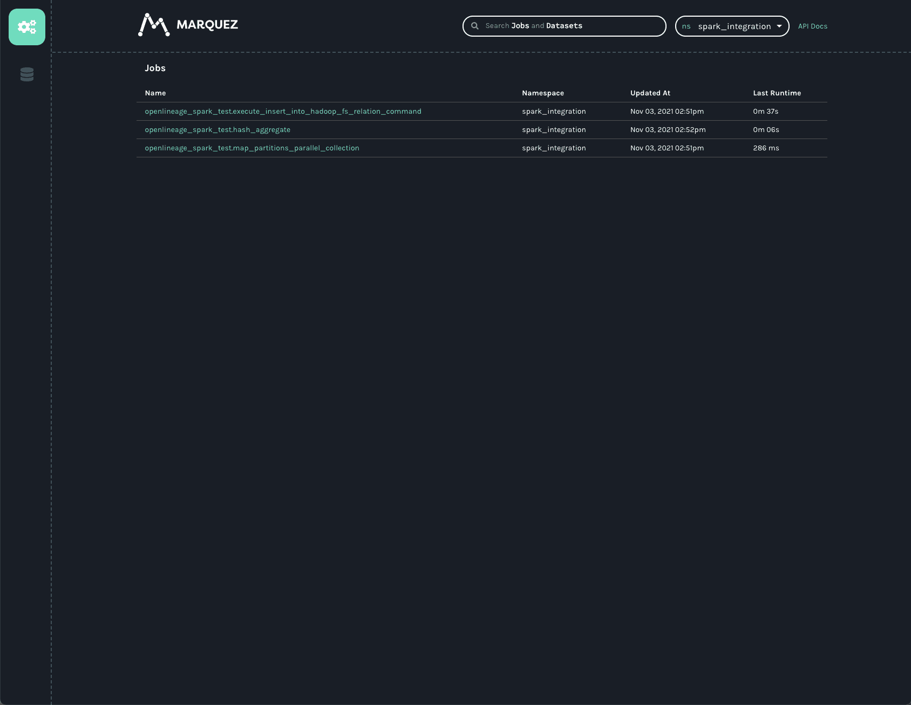
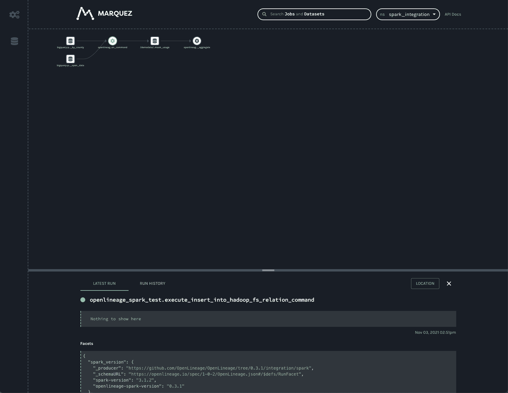
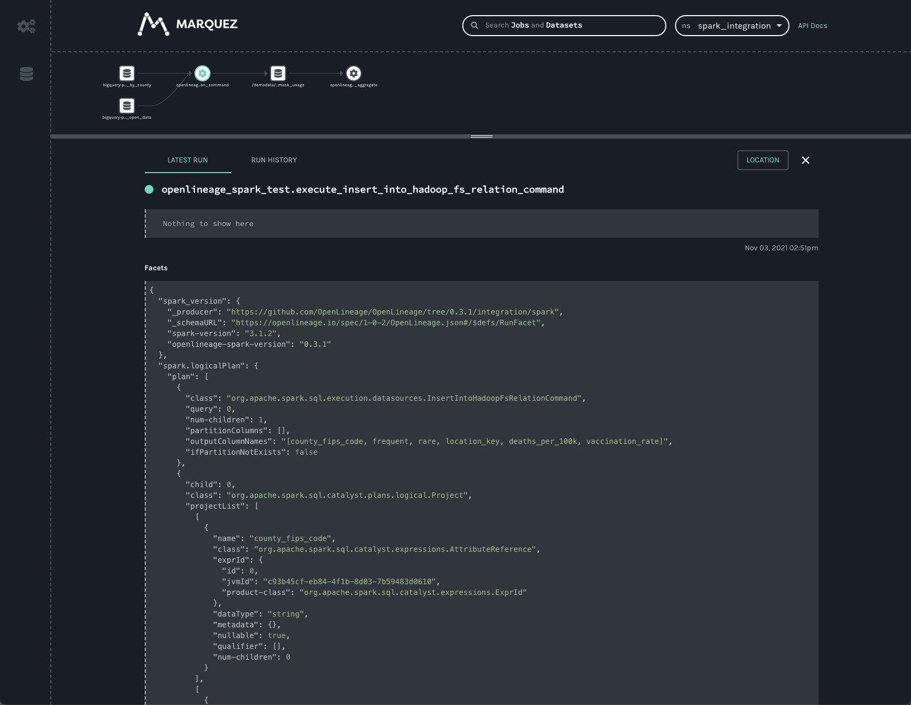
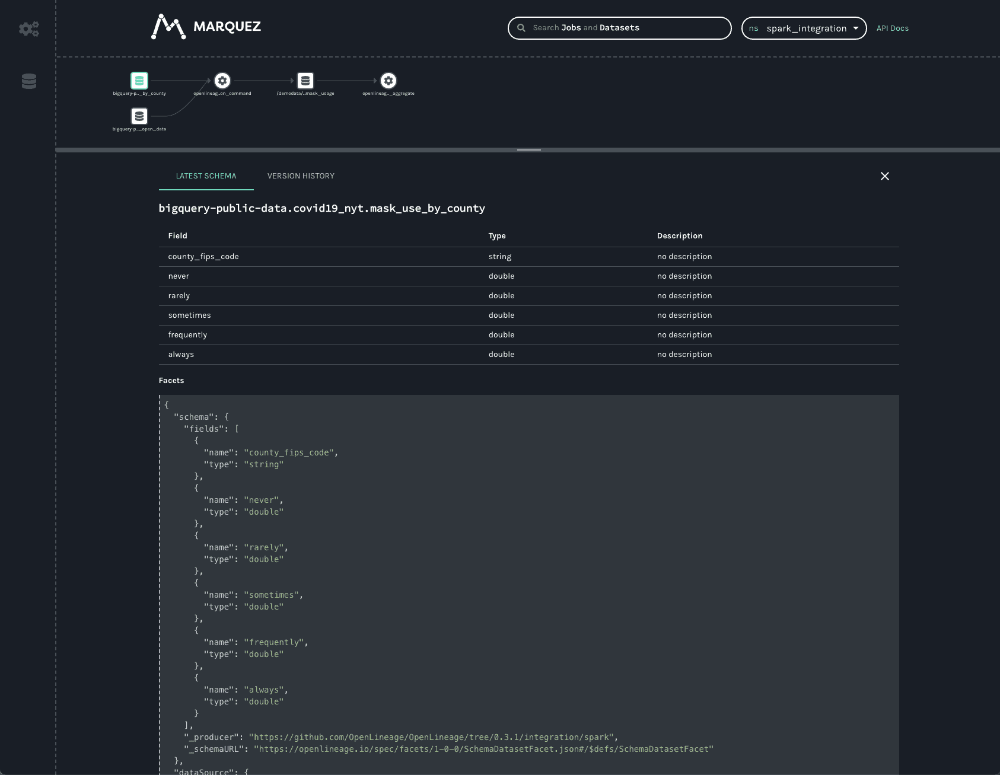
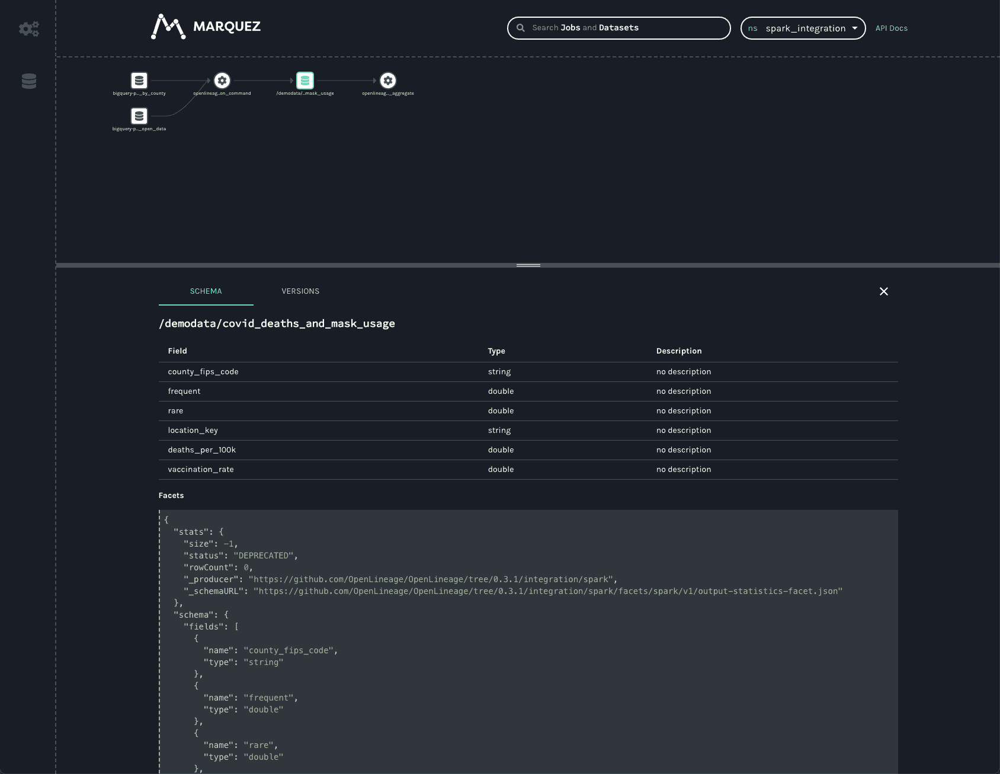
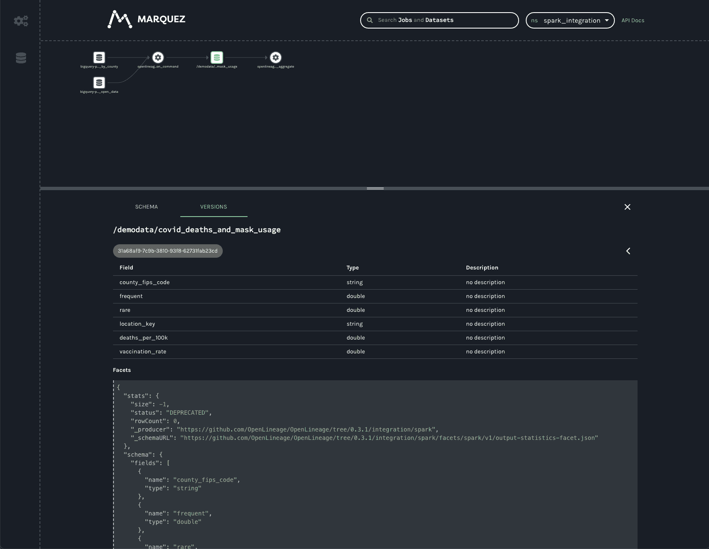

# Using OpenLineage with Spark

#### Adapted from a [blog post](https://openlineage.io/blog/openlineage-spark/) by Michael Collado

:::caution
This guide was developed using an **earlier version** of this integration and may require modification for recent releases.
:::

Adding OpenLineage to Spark is refreshingly uncomplicated, and this is thanks to Spark's SparkListener interface. OpenLineage integrates with Spark by implementing SparkListener and collecting information about jobs executed inside a Spark application. To activate the listener, add the following properties to your Spark configuration in your cluster's `spark-defaults.conf` file or, alternatively, add them to specific jobs on submission via the `spark-submit` command:

```
spark.jars.packages     io.openlineage:openlineage-spark:1.23.0
spark.extraListeners    io.openlineage.spark.agent.OpenLineageSparkListener
```

Once activated, the listener needs to know where to report lineage events, as well as the namespace of your jobs. Add the following additional configuration lines to your `spark-defaults.conf` file or your Spark submission script:

```
spark.openlineage.transport.url      {your.openlineage.host}
spark.openlineage.transport.type     {your.openlineage.transport.type}
spark.openlineage.namespace {your.openlineage.namespace}
```

## Running Spark with OpenLineage

### Prerequisites

- Docker Desktop
- git
- Google Cloud Service account  
- Google Cloud Service account JSON key file

Note: your Google Cloud account should have access to BigQuery and read/write access to your GCS bucket. Giving your key file an easy-to-remember name (bq-spark-demo.json) is recommended. Finally, if using macOS Monterey (macOS 12), port 5000 will have to be released by [disabling the AirPlay Receiver](https://developer.apple.com/forums/thread/682332).

### Instructions

Clone the OpenLineage project, navigate to the spark directory, and create a directory for your Google Cloud Service credentials:

```
git clone https://github.com/OpenLineage/OpenLineage
cd integration/spark
mkdir -p docker/notebooks/gcs
```

Copy your Google Cloud Service credentials file into that directory, then run:

```
docker-compose up
```

This launches a Jupyter notebook with Spark as well as a Marquez API endpoint already installed to report lineage. Once the notebook server is up and running, you should see something like the following in the logs:

```
notebook_1  | [I 21:43:39.014 NotebookApp] Jupyter Notebook 6.4.4 is running at:
notebook_1  | [I 21:43:39.014 NotebookApp] http://082cb836f1ec:8888/?token=507af3cf9c22f627f6c5211d6861fe0804d9f7b19a93ca48
notebook_1  | [I 21:43:39.014 NotebookApp]  or http://127.0.0.1:8888/?token=507af3cf9c22f627f6c5211d6861fe0804d9f7b19a93ca48
notebook_1  | [I 21:43:39.015 NotebookApp] Use Control-C to stop this server and shut down all kernels (twice to skip confirmation).
```

Copy the URL with 127.0.0.1 as the hostname from your own log (the token will be different from this one) and paste it into your browser window. You should have a blank Jupyter notebook environment ready to go.



Click on the notebooks directory, then click on the New button to create a new Python 3 notebook.



In the first cell in the window paste the below text. Update the GCP project and bucket names and the service account credentials file, then run the code:

```
from pyspark.sql import SparkSession
import urllib.request

# Download dependencies for BigQuery and GCS
gc_jars = ['https://repo1.maven.org/maven2/com/google/cloud/bigdataoss/gcs-connector/hadoop3-2.1.1/gcs-connector-hadoop3-2.1.1-shaded.jar',
        'https://repo1.maven.org/maven2/com/google/cloud/bigdataoss/bigquery-connector/hadoop3-1.2.0/bigquery-connector-hadoop3-1.2.0-shaded.jar',
        'https://repo1.maven.org/maven2/com/google/cloud/spark/spark-bigquery-with-dependencies_2.12/0.22.2/spark-bigquery-with-dependencies_2.12-0.22.2.jar']

files = [urllib.request.urlretrieve(url)[0] for url in gc_jars]

# Set these to your own project and bucket
project_id = 'bq-openlineage-spark-demo'
gcs_bucket = 'bq-openlineage-spark-demo-bucket'
credentials_file = '/home/jovyan/notebooks/gcs/bq-spark-demo.json'

spark = (SparkSession.builder.master('local').appName('openlineage_spark_test')
        .config('spark.jars', ",".join(files))
        
        # Install and set up the OpenLineage listener
        .config('spark.jars.packages', 'io.openlineage:openlineage-spark:1.23.0')
        .config('spark.extraListeners', 'io.openlineage.spark.agent.OpenLineageSparkListener')
        .config('spark.openlineage.transport.url', 'http://marquez-api:5000')
        .config('spark.openlineage.transport.type', 'http')
        .config('spark.openlineage.namespace', 'spark_integration')
        
        # Configure the Google credentials and project id
        .config('spark.executorEnv.GCS_PROJECT_ID', project_id)
        .config('spark.executorEnv.GOOGLE_APPLICATION_CREDENTIALS', '/home/jovyan/notebooks/gcs/bq-spark-demo.json')
        .config('spark.hadoop.google.cloud.auth.service.account.enable', 'true')
        .config('spark.hadoop.google.cloud.auth.service.account.json.keyfile', credentials_file)
        .config('spark.hadoop.fs.gs.impl', 'com.google.cloud.hadoop.fs.gcs.GoogleHadoopFileSystem')
        .config('spark.hadoop.fs.AbstractFileSystem.gs.impl', 'com.google.cloud.hadoop.fs.gcs.GoogleHadoopFS')
        .config("spark.hadoop.fs.gs.project.id", project_id)
        .getOrCreate())
```

Most of this is boilerplate for installing the BigQuery and GCS libraries in the notebook environment. This also sets the configuration parameters to tell the libraries what GCP project to use and how to authenticate with Google. The parameters specific to OpenLineage are the four already mentioned: `spark.jars.packages`, `spark.extraListeners`, `spark.openlineage.host`, `spark.openlineage.namespace`. Here, the host has been configured to be the `marquez-api` container started by Docker.

With OpenLineage configured, it's time to get some data. The below code populates Spark DataFrames with data from two COVID-19 public data sets. Create a new cell in the notebook and paste the following: 

```
from pyspark.sql.functions import expr, col

mask_use = spark.read.format('bigquery') \
    .option('parentProject', project_id) \
    .option('table', 'bigquery-public-data:covid19_nyt.mask_use_by_county') \
    .load() \
    .select(expr("always + frequently").alias("frequent"),
            expr("never + rarely").alias("rare"),
            "county_fips_code")
        
opendata = spark.read.format('bigquery') \
    .option('parentProject', project_id) \
    .option('table', 'bigquery-public-data.covid19_open_data.covid19_open_data') \
    .load() \
    .filter("country_name == 'United States of America'") \
    .filter("date == '2021-10-31'") \
    .select("location_key",
            expr('cumulative_deceased/(population/100000)').alias('deaths_per_100k'),
            expr('cumulative_persons_fully_vaccinated/(population - population_age_00_09)').alias('vaccination_rate'),
            col('subregion2_code').alias('county_fips_code'))
joined = mask_use.join(opendata, 'county_fips_code')

joined.write.mode('overwrite').parquet(f'gs://{gcs_bucket}/demodata/covid_deaths_and_mask_usage/')
```

Some background on the above: the `covid19_open_data` table is being filtered to include only U.S. data and data for Halloween 2021. The `deaths_per_100k` data point is being calculated using the existing `cumulative_deceased` and `population` columns and the `vaccination_rate` using the total population, subtracting the 0-9 year olds, since they were ineligible for vaccination at the time. For the `mask_use_by_county` data, "rarely" and "never" data are being combined into a single number, as are "frequently" and "always." The columns selected from the two datasets are then stored in GCS.

Now, add a cell to the notebook and paste this line:

```
spark.read.parquet(f'gs://{gcs_bucket}/demodata/covid_deaths_and_mask_usage/').count()
```

The notebook should print a warning and a stacktrace (probably a debug statement), then return a total of 3142 records.

Now that the pipeline is operational it is available for lineage collection.

The `docker-compose.yml` file that ships with the OpenLineage repo includes only the Jupyter notebook and the Marquez API. To explore the lineage visually, start up the Marquez web project. Without terminating the existing docker containers, run the following command in a new terminal:

```
docker run --network spark_default -p 3000:3000 -e MARQUEZ_HOST=marquez-api -e MARQUEZ_PORT=5000 -e WEB_PORT=3000 --link marquez-api:marquez-api marquezproject/marquez-web:0.19.1
```

Next, open a new browser tab and navigate to http://localhost:3000, which should look like this:



Note: the `spark_integration` namespace is automatically chosen because there are no other namespaces available. Three jobs are listed on the jobs page of the UI. They all start with `openlineage_spark_test`, which is the appName passed to the SparkSession when the first cell of the notebook was built. Each query execution or RDD action is represented as a distinct job and the name of the action is appended to the application name to form the name of the job. Clicking on the `openlineage_spark_test.execute_insert_into_hadoop_fs_relation_command` node calls up the lineage graph for our notebook:



The graph shows that the `openlineage_spark_test.execute_insert_into_hadoop_fs_relation_command` job reads from two input datasets, `bigquery-public-data.covid19_nyt.mask_use_by_county` and `bigquery-public-data.covid19_open_data.covid19_open_data`, and writes to a third dataset, `/demodata/covid_deaths_and_mask_usage`. The namespace is missing from that third dataset, but the fully qualified name is `gs://<your_bucket>/demodata/covid_deaths_and_mask_usage`.

The bottom bar shows some interesting data that was collected from the Spark job. Dragging the bar up expands the view to offer a closer look.



Two facets always collected from Spark jobs are the `spark_version` and the `spark.logicalPlan`. The first simply reports what version of Spark was executing, as well as the version of the openlineage-spark library. This is helpful for debugging job runs.

The second facet is the serialized optimized LogicalPlan Spark reports when the job runs. Spark’s query optimization can have dramatic effects on the execution time and efficiency of the query job. Tracking how query plans change over time can significantly aid in debugging slow queries or `OutOfMemory` errors in production.

Clicking on the first BigQuery dataset provides information about the data:



One can see the schema of the dataset as well as the datasource.

Similar information is available about the dataset written to in GCS:



As in the BigQuery dataset, one can see the output schema and the datasource — in this case, the `gs://` scheme and the name of the bucket written to.

In addition to the schema, one can also see a stats facet, reporting the number of output records and bytes as -1. 

The VERSIONS tab on the bottom bar would display multiple versions if there were any (not the case here). Clicking on the version shows the same schema and statistics facets, but they are specific to the version selected.



In production, this dataset would have many versions, as each time a job runs a new version of the dataset is created. This permits the tracking of changes to the statistics and schema over time, aiding in debugging slow jobs or data quality issues and job failures.

The final job in the UI is a HashAggregate job. This represents the `count()` method called at the end to show the number of records in the dataset. Rather than a `count()`, this could easily be a `toPandas()` call or some other job that reads and processes that data -- perhaps one that stores output back into GCS or updates a Postgres database, publishes a new model, etc. Regardless of where the output gets stored, the OpenLineage integration allows one to see the entire lineage graph, unifying datasets in object stores, relational databases, and more traditional data warehouses.

### Conclusion

The Spark integration from OpenLineage offers users insights into graphs of datasets stored in object stores like S3, GCS, and Azure Blob Storage, as well as BigQuery and relational databases like Postgres. Now with support for Spark 3.1, OpenLineage offers visibility into more environments, such as Databricks, EMR, and Dataproc clusters.