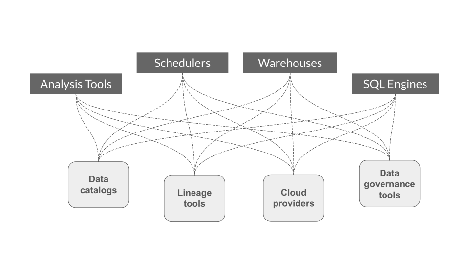
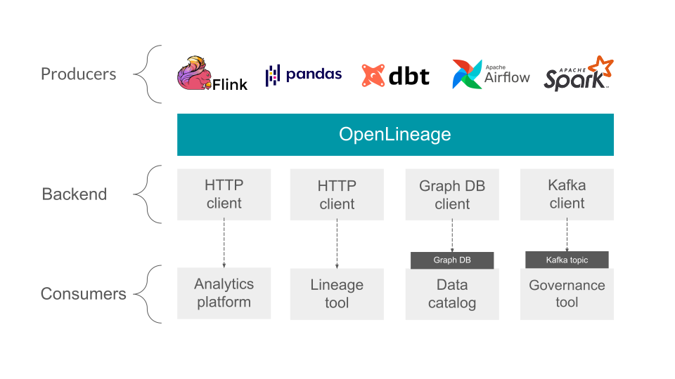

<Head>
  <meta property="og:title" content="Documentation | OpenLineage" />
  <meta property="og:image" content="https://openlineage.io/img/docs-thumb.png" />
  <meta property="twitter:image" content="https://openlineage.io/img/docs-thumb.png" />
</Head>

# About OpenLineage

OpenLineage is an open framework for data lineage collection and analysis. At its core is an extensible specification that systems can use to interoperate with lineage metadata.

### Design

OpenLineage is an _Open Standard_ for lineage metadata collection designed to record metadata for a _job_ in execution.

The standard defines a generic model of _dataset_, _job_, and _run_ entities uniquely identified using consistent naming strategies. The core model is highly extensible via facets. A **facet** is user-defined metadata and enables entity enrichment. We encourage you to familiarize yourself with the core model below:

### How OpenLineage Benefits the Ecosystem

Below, we illustrate the challenges of collecting lineage metadata from multiple sources, schedulers and/or data processing frameworks. We then outline the design benefits of defining an _Open Standard_ for lineage metadata collection.

#### BEFORE:

* Each project has to instrument its own custom metadata collection integration, therefore duplicating efforts.
* Integrations are external and can break with new versions of the underlying scheduler and/or data processing framework, requiring projects to ensure _backwards_ compatibility.

#### WITH OPENLINEAGE:

* Integration efforts are shared _across_ projects.
* Integrations can be _pushed_ to the underlying scheduler and/or data processing framework; no longer does one need to play catch up and ensure compatibility!

## Scope
OpenLineage defines the metadata for running jobs and their corresponding events.
A configurable backend allows the user to choose what protocol to send the events to.
 

## Core model

 

 A facet is an atomic piece of metadata attached to one of the core entities.
 See the spec for more details.

## Spec
The [specification](https://github.com/OpenLineage/OpenLineage/blob/main/spec/OpenLineage.md) is defined using OpenAPI and allows extension through custom facets.

## Integrations

The OpenLineage repository contains integrations with several systems.

- [Apache Airflow](https://github.com/OpenLineage/OpenLineage/tree/main/integration/airflow)
- [Apache Flink](https://github.com/OpenLineage/OpenLineage/tree/main/integration/flink)
- [Apache Spark](https://github.com/OpenLineage/OpenLineage/tree/main/integration/spark)
- [dbt](https://github.com/OpenLineage/OpenLineage/tree/main/integration/dbt)
- [SQL](https://github.com/OpenLineage/OpenLineage/tree/main/integration/sql)

## Related projects
- [Marquez](https://marquezproject.ai/): Marquez is an [LF AI & DATA](https://lfaidata.foundation/) project to collect, aggregate, and visualize a data ecosystem's metadata. It is the reference implementation of the OpenLineage API.
  - [OpenLineage collection implementation](https://github.com/MarquezProject/marquez/blob/main/api/src/main/java/marquez/api/OpenLineageResource.java)
- [Egeria](https://egeria.odpi.org/): Egeria Open Metadata and Governance. A metadata bus.