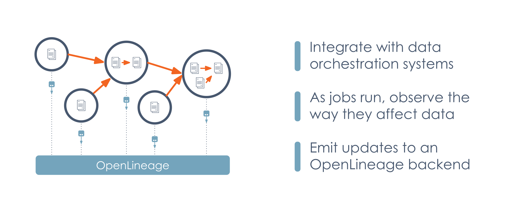
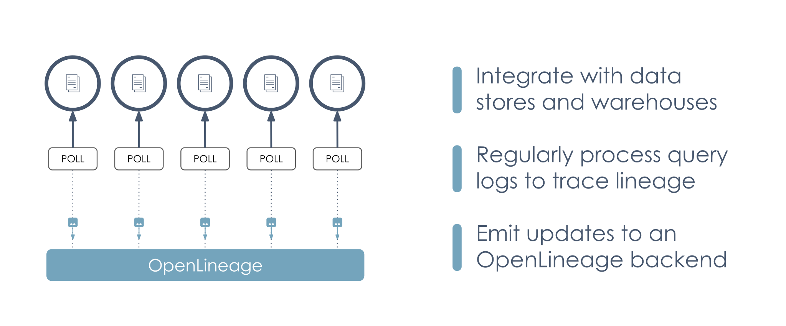

# OpenLineage Integrations

## Capability Matrix

:::caution
This matrix is not yet complete.
:::

The matrix below shows the relationship between an input facet and various mechanisms OpenLineage uses to gather metadata. Not all mechanisms collect data to fill in all facets, and some facets are specific to one integration.  
✔️: The mechanism does implement this facet.  
✖️: The mechanism does not implement this facet.  
An empty column means it is not yet documented if the mechanism implements this facet.

| Mechanism          | Integration       | Metadata Gathered                             | InputDatasetFacet | OutputDatasetFacet | SqlJobFacet | SchemaDatasetFacet | DataSourceDatasetFacet | DataQualityMetricsInputDatasetFacet | DataQualityAssertionsDatasetFacet | SourceCodeJobFacet | ExternalQueryRunFacet | DocumentationDatasetFacet | SourceCodeLocationJobFacet | DocumentationJobFacet | ParentRunFacet |
|:-------------------|:------------------|:----------------------------------------------|:------------------|:-------------------|:------------|:-------------------|:-----------------------|:------------------------------------|:----------------------------------|:-------------------|:----------------------|:--------------------------|:---------------------------|:----------------------|:---------------|
| dbt                | dbt Project Files | Lineage Row count Byte count.       | ✔️                 |                    |             |                    |                        |                                     |                                   |                    |                       |                           |                            |                       |                |
| Great Expectations | Action            | Data quality assertions                       | ✔️                 |                    |             |                    |                        | ✔️                                   | ✔️                                 |                    |                       |                           |                            |                       |                |
| Spark              | SparkListener     | Schema Row count  Column lineage    | ✔️                 |                    |             |                    |                        |                                     |                                   |                    |                       |                           |                            |                       |                |

## Compatibility matrix

This matrix shows which data sources are known to work with each integration, along with the minimum versions required in the target system or framework.

| Platform	| Version	| Data Sources                                                                                                                                                                                                                         |
|:-------------------|:-------------------------------|:-------------------------------------------------------------------------------------------------------------------------------------------------------------------------------------------------------------------------------------|
| Apache Spark | 2.4+ | JDBC HDFS Google Cloud Storage Google BigQuery BigTable Spanner CloudSQL Google BigQuery Google BigQuery Amazon S3 Azure Blob Storage Azure Data Lake Gen2 Azure Synapse |
| dbt | 0.20+ | Snowflake  Google BigQuery                                                                                                                                                                                                      |

## Integration strategies

:::info
This section could use some more detail! You're welcome to contribute using the Edit link at the bottom.
:::

### Integrating with pipelines

### Integrating with data sources

