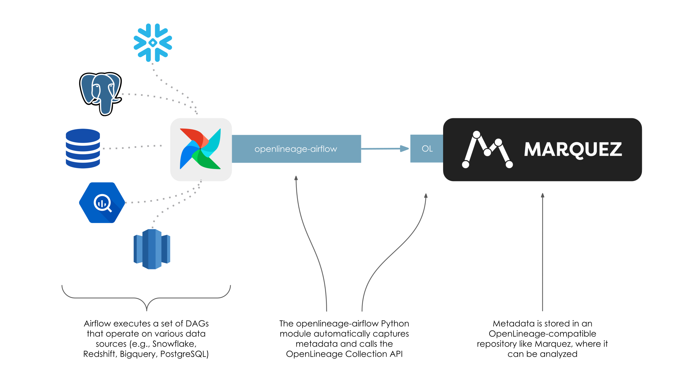

:::caution
This page is about Airflow's external integration that works mainly for Airflow versions \<2.7. 
[If you're using Airflow 2.7+, look at native Airflow OpenLineage provider documentation.](https://airflow.apache.org/docs/apache-airflow-providers-openlineage/stable/index.html)     

The ongoing development and enhancements will be focused on the `apache-airflow-providers-openlineage` package, 
while the `openlineage-airflow` will primarily be updated for bug fixes. See [all Airflow versions supported by this integration](older.md#supported-airflow-versions)
:::

**Airflow** is a widely-used workflow automation and scheduling platform that can be used to author and manage data pipelines. Airflow uses workflows made of directed acyclic graphs (DAGs) of tasks. To learn more about Airflow, check out the Airflow [documentation](https://airflow.apache.org/docs/apache-airflow/stable/index.html).

## How does Airflow work with OpenLineage?

Understanding complex inter-DAG dependencies and providing up-to-date runtime visibility into DAG execution can be challenging. OpenLineage integrates with Airflow to collect DAG lineage metadata so that inter-DAG dependencies are easily maintained and viewable via a lineage graph, while also keeping a catalog of historical runs of DAGs.

The DAG metadata collected can answer questions like:

* Why has a DAG failed?
* Why has the DAG runtime increased after a code change?
* What are the upstream dependencies of a DAG?

## How can I use this integration?

To instrument your Airflow instance with OpenLineage, follow [these instructions](usage.md).

## How to add lineage coverage for more operators?

OpenLineage provides a set of `extractors` that extract lineage from operators. 

If you want to add lineage coverage for your own custom operators, follow these [instructions to add lineage to operators](default-extractors.md).

If you want to add coverage for operators you can not modify, follow [instructions to add custom extractors](extractors/custom-extractors.md).

If you want to expose lineage as a one off in your workflow, [you can also manually annotate the tasks in your DAG](manual.md).

## Where can I learn more?

* Take a look at Marquez's Airflow [example](https://github.com/MarquezProject/marquez/tree/main/examples/airflow) to learn how to enable OpenLineage metadata collection for Airflow DAGs and troubleshoot failing DAGs using Marquez.
* Watch [Data Lineage with OpenLineage and Airflow](https://www.youtube.com/watch?v=2s013GQy1Sw)

## Feedback

You can reach out to us on [slack](https://join.slack.com/t/openlineage/shared_invite/zt-3arpql6lg-Nt~hicnDsnDY_GK_LEX06w) and leave us feedback!  
