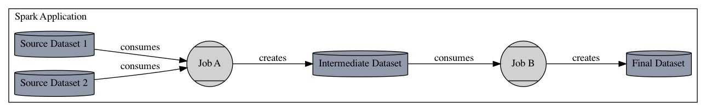

Spark jobs typically run on clusters of machines. A single machine hosts the "driver" application,
which constructs a graph of jobs - e.g., reading data from a source, filtering, transforming, and
joining records, and writing results to some sink- and manages execution of those jobs. Spark's
fundamental abstraction is the Resilient Distributed Dataset (RDD), which encapsulates distributed
reads and modifications of records. While RDDs can be used directly, it is far more common to work
with Spark Datasets or Dataframes, which is an API that adds explicit schemas for better performance
and the ability to interact with datasets using SQL. The Dataframe's declarative API enables Spark
to optimize jobs by analyzing and manipulating an abstract query plan prior to execution.

## Collecting Lineage in Spark

Collecting lineage requires hooking into Spark's `ListenerBus` in the driver application and
collecting and analyzing execution events as they happen. Both raw RDD and Dataframe jobs post events
to the listener bus during execution. These events expose the structure of the job, including the
optimized query plan, allowing the Spark integration to analyze the job for datasets consumed and
produced, including attributes about the storage, such as location in GCS or S3, table names in a
relational database or warehouse, such as Redshift or Bigquery, and schemas. In addition to dataset
and job lineage, Spark SQL jobs also report logical plans, which can be compared across job runs to
track important changes in query plans, which may affect the correctness or speed of a job.

A single Spark application may execute multiple jobs. The Spark OpenLineage integration maps one
Spark job to a single OpenLineage Job. The application will be assigned a Run id at startup and each
job that executes will report the application's Run id as its parent job run. Thus, an application
that reads one or more source datasets, writes an intermediate dataset, then transforms that
intermediate dataset and writes a final output dataset will report three jobs- the parent application
job, the initial job that reads the sources and creates the intermediate dataset, and the final job
that consumes the intermediate dataset and produces the final output. As an image:

