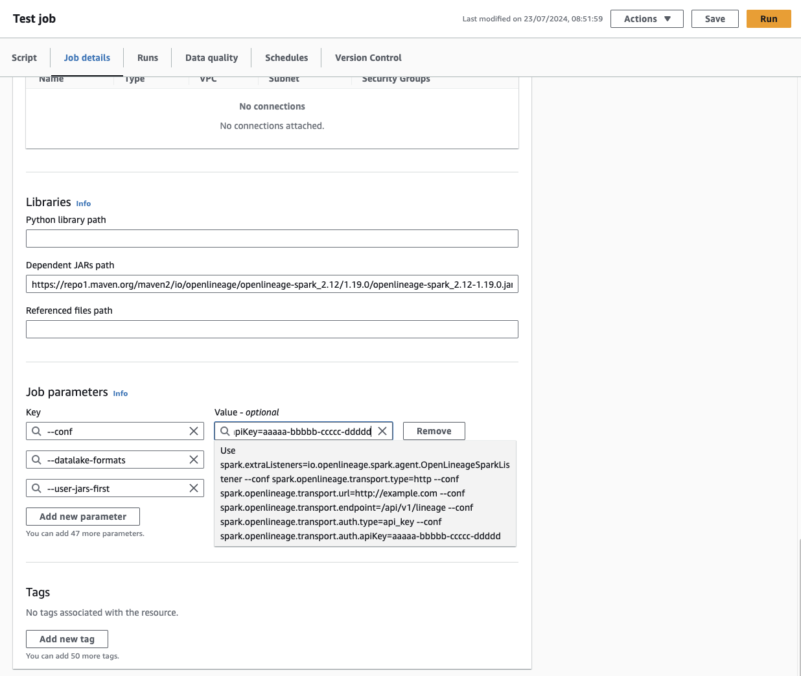

## Enable OpenLineage

:::caution
The configuration must be specified in the **Job details** tab. AWS Glue may ignore the properties if they are specified in the application source code.
:::

Follow these steps to enable OpenLineage on AWS Glue:

1. **Specify the OpenLineage JAR URL**

    In the **Job details** tab, navigate to **Advanced properties** → **Libraries** → **Dependent Jars path**
    * Use the URL directly from **[Maven Central openlineage-spark](https://mvnrepository.com/artifact/io.openlineage/openlineage-spark)**
    * Ensure you select the version for **Scala 2.12**, as Glue Spark is compiled with Scala 2.12 and version 2.13 won't be compatible.
    * On the page for the specific OpenLineage version for Scala 2.12, copy the URL of the jar file from the Files row and use it in Glue.
    * **Alternatively**, upload the jar to an **S3 bucket** and use its URL. The URL should use the `s3` scheme: `s3://<your bucket>/path/to/openlineage-spark_2.12-<version>.jar`
2. **Add OpenLineage configuration in Job Parameters**

    In the same **Job details** tab, add a new property under **Job parameters**:
    * Use the format **`param1=value1 --conf param2=value2 ... --conf paramN=valueN`**.
    * Make sure every parameter except the first has an extra **`--conf`** in front of it.
    * Example: `spark.extraListeners=io.openlineage.spark.agent.OpenLineageSparkListener --conf spark.openlineage.transport.type=http --conf spark.openlineage.transport.url=http://example.com --conf spark.openlineage.transport.endpoint=/api/v1/lineage --conf  spark.openlineage.transport.auth.type=api_key --conf spark.openlineage.transport.auth.apiKey=aaaaa-bbbbb-ccccc-ddddd`

3. **Set User Jars First Parameter**

    Add the **`--user-jars-first`** parameter and set its value to **`true`**



## Verification

To confirm that OpenLineage registration has been successful, check the logs for the following entry:
```
INFO SparkContext: Registered listener io.openlineage.spark.agent.OpenLineageSparkListener
```

If you see this log message, it indicates that OpenLineage has been correctly registered with your AWS Glue job.
