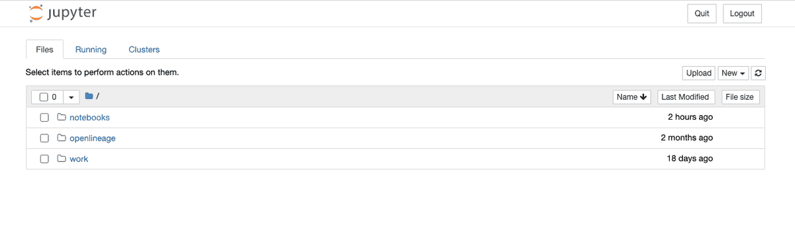
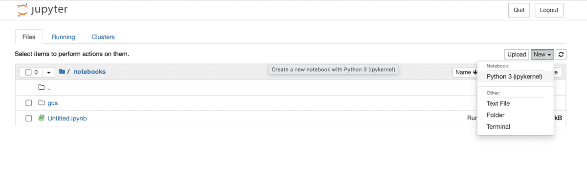

Trying out the Spark integration is super easy if you already have Docker Desktop and git installed. 

:::info
If you're on macOS Monterey (macOS 12) you'll have to release port 5000 before beginning by disabling the [AirPlay Receiver](https://developer.apple.com/forums/thread/682332).
:::

Check out the OpenLineage project into your workspace with:
```
git clone https://github.com/OpenLineage/OpenLineage
```

From the spark integration directory ($OPENLINEAGE_ROOT/integration/spark) execute
```bash
docker-compose up
```
This will start Marquez as an Openlineage client and Jupyter Spark notebook on localhost:8888. On startup, the notebook container logs will show a list of URLs
including an access token, such as
```bash
notebook_1  |     To access the notebook, open this file in a browser:
notebook_1  |         file:///home/jovyan/.local/share/jupyter/runtime/nbserver-9-open.html
notebook_1  |     Or copy and paste one of these URLs:
notebook_1  |         http://abc12345d6e:8888/?token=XXXXXX
notebook_1  |      or http://127.0.0.1:8888/?token=XXXXXX
```

Copy the URL with 127.0.0.1 as the hostname from your own log (the token will be different from mine) and paste it into your browser window. You should have a blank Jupyter notebook environment ready to go.



Once your notebook environment is ready, click on the notebooks directory, then click on the New button to create a new Python 3 notebook.



In the first cell in the window paste the following text:

```python 
from pyspark.sql import SparkSession

spark = (SparkSession.builder.master('local')
         .appName('sample_spark')
         .config('spark.extraListeners', 'io.openlineage.spark.agent.OpenLineageSparkListener')
         .config('spark.jars.packages', 'io.openlineage:openlineage-spark:1.7.0')
         .config('spark.openlineage.transport.type', 'console')
         .getOrCreate())
```
Once the Spark context is started, we adjust logging level to `INFO` with: 
```python
spark.sparkContext.setLogLevel("INFO")
```
and create some Spark table with:
```python
spark.createDataFrame([
    {'a': 1, 'b': 2},
    {'a': 3, 'b': 4}
]).write.mode("overwrite").saveAsTable("temp")
```

The command should output OpenLineage event in a form of log:
```
22/08/01 06:15:49 INFO ConsoleTransport: {"eventType":"START","eventTime":"2022-08-01T06:15:49.671Z","run":{"runId":"204d9c56-6648-4d46-b6bd-f4623255d324","facets":{"spark_unknown":{"_producer":"https://github.com/OpenLineage/OpenLineage/tree/0.12.0-SNAPSHOT/integration/spark","_schemaURL":"https://openlineage.io/spec/1-0-2/OpenLineage.json#/$defs/RunFacet","inputs":[{"description":{"@class":"org.apache.spark.sql.execution.LogicalRDD","id":1,"streaming":false,"traceEnabled":false,"canonicalizedPlan":false},"inputAttributes":[],"outputAttributes":[{"name":"a","type":"long","metadata":{}},{"name":"b","type":"long","metadata":{}}]}]},"spark.logicalPlan":{"_producer":"https://github.com/OpenLineage/OpenLineage/tree/0.12.0-SNAPSHOT/integration/spark","_schemaURL":"https://openlineage.io/spec/1-0-2/OpenLineage.json#/$defs/RunFacet","plan":[{"class":"org.apache.spark.sql.execution.command.CreateDataSourceTableAsSelectCommand","num-children":1,"table":{"product-class":"org.apache.spark.sql.catalyst.catalog.CatalogTable","identifier":{"product-class":"org.apache.spark.sql.catalyst.TableIdentifier","table":"temp"},"tableType":{"product-class":"org.apache.spark.sql.catalyst.catalog.CatalogTableType","name":"MANAGED"},"storage":{"product-class":"org.apache.spark.sql.catalyst.catalog.CatalogStorageFormat","compressed":false,"properties":null},"schema":{"type":"struct","fields":[]},"provider":"parquet","partitionColumnNames":[],"owner":"","createTime":1659334549656,"lastAccessTime":-1,"createVersion":"","properties":null,"unsupportedFeatures":[],"tracksPartitionsInCatalog":false,"schemaPreservesCase":true,"ignoredProperties":null},"mode":null,"query":0,"outputColumnNames":"[a, b]"},{"class":"org.apache.spark.sql.execution.LogicalRDD","num-children":0,"output":[[{"class":"org.apache.spark.sql.catalyst.expressions.AttributeReference","num-children":0,"name":"a","dataType":"long","nullable":true,"metadata":{},"exprId":{"product-class":"org.apache.spark.sql.catalyst.expressions.ExprId","id":6,"jvmId":"6a1324ac-917e-4e22-a0b9-84a5f80694ad"},"qualifier":[]}],[{"class":"org.apache.spark.sql.catalyst.expressions.AttributeReference","num-children":0,"name":"b","dataType":"long","nullable":true,"metadata":{},"exprId":{"product-class":"org.apache.spark.sql.catalyst.expressions.ExprId","id":7,"jvmId":"6a1324ac-917e-4e22-a0b9-84a5f80694ad"},"qualifier":[]}]],"rdd":null,"outputPartitioning":{"product-class":"org.apache.spark.sql.catalyst.plans.physical.UnknownPartitioning","numPartitions":0},"outputOrdering":[],"isStreaming":false,"session":null}]},"spark_version":{"_producer":"https://github.com/OpenLineage/OpenLineage/tree/0.12.0-SNAPSHOT/integration/spark","_schemaURL":"https://openlineage.io/spec/1-0-2/OpenLineage.json#/$defs/RunFacet","spark-version":"3.1.2","openlineage-spark-version":"0.12.0-SNAPSHOT"}}},"job":{"namespace":"default","name":"sample_spark.execute_create_data_source_table_as_select_command","facets":{}},"inputs":[],"outputs":[{"namespace":"file","name":"/home/jovyan/notebooks/spark-warehouse/temp","facets":{"dataSource":{"_producer":"https://github.com/OpenLineage/OpenLineage/tree/0.12.0-SNAPSHOT/integration/spark","_schemaURL":"https://openlineage.io/spec/facets/1-0-0/DatasourceDatasetFacet.json#/$defs/DatasourceDatasetFacet","name":"file","uri":"file"},"schema":{"_producer":"https://github.com/OpenLineage/OpenLineage/tree/0.12.0-SNAPSHOT/integration/spark","_schemaURL":"https://openlineage.io/spec/facets/1-0-0/SchemaDatasetFacet.json#/$defs/SchemaDatasetFacet","fields":[{"name":"a","type":"long"},{"name":"b","type":"long"}]},"lifecycleStateChange":{"_producer":"https://github.com/OpenLineage/OpenLineage/tree/0.12.0-SNAPSHOT/integration/spark","_schemaURL":"https://openlineage.io/spec/facets/1-0-0/LifecycleStateChangeDatasetFacet.json#/$defs/LifecycleStateChangeDatasetFacet","lifecycleStateChange":"CREATE"}},"outputFacets":{}}],"producer":"https://github.com/OpenLineage/OpenLineage/tree/0.12.0-SNAPSHOT/integration/spark","schemaURL":"https://openlineage.io/spec/1-0-2/OpenLineage.json#/$defs/RunEvent"}
```

Generated JSON contains output dataset name and location `{"namespace":"file","name":"/home/jovyan/notebooks/spark-warehouse/temp"`, schema fields `[{"name":"a","type":"long"},{"name":"b","type":"long"}]`, etc. 


More comprehensive demo, that integrates Spark events with Marquez backend can be found on our blog [Tracing Data Lineage with OpenLineage and Apache Spark](https://openlineage.io/blog/openlineage-spark/)
