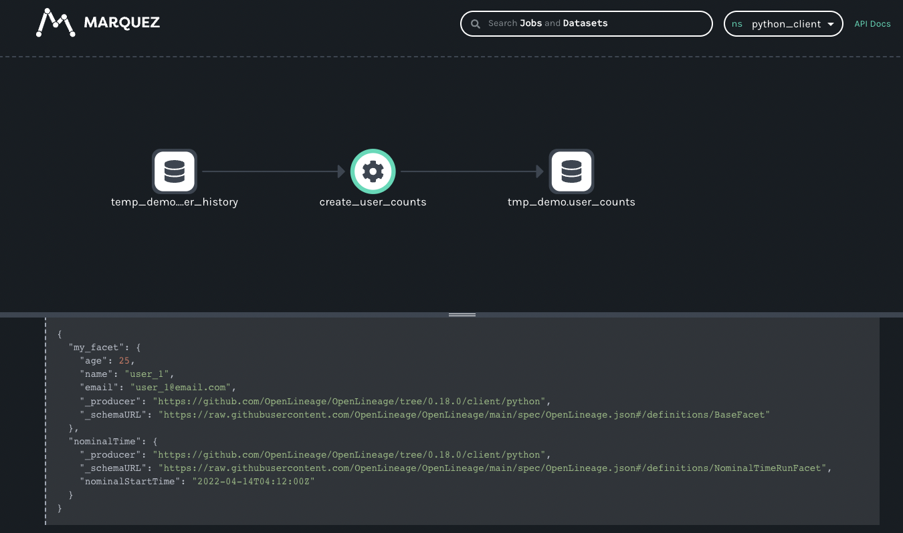

# Custom Facets

In addition to the existing facets mentioned in this documentation, users can extend the base facets and provide their own facet definition as part of the payload in OpenLineage event. For example, when OpenLineage event is emitted from the Apache Airflow using OpenLineage's Airflow integration, the following facets can be observed:

```json
{
  "eventTime": "2022-10-03T00:07:56.891667Z",
  "eventType": "START",
  "inputs": [],
  "job": {
    "facets": {},
    "name": "inlet_outlet_demo.test-operator",
    "namespace": "uninhabited-magnify-7821"
  },
  "outputs": [],
  "producer": "https://github.com/OpenLineage/OpenLineage/tree/0.13.0/integration/airflow",
  "run": {
    "facets": {
      "airflow_runArgs": {
        "_producer": "https://github.com/OpenLineage/OpenLineage/tree/0.13.0/integration/airflow",
        "_schemaURL": "https://raw.githubusercontent.com/OpenLineage/OpenLineage/main/spec/OpenLineage.json#/definitions/BaseFacet",
        "externalTrigger": true
      },
      "airflow_version": {
        "_producer": "https://github.com/OpenLineage/OpenLineage/tree/0.13.0/integration/airflow",
        "_schemaURL": "https://raw.githubusercontent.com/OpenLineage/OpenLineage/main/spec/OpenLineage.json#/definitions/BaseFacet",
        "airflowVersion": "2.3.4+astro.1",
        "openlineageAirflowVersion": "0.13.0",
        "operator": "airflow.operators.python.PythonOperator",
        "taskInfo": {
          "_BaseOperator__from_mapped": false,
          "_BaseOperator__init_kwargs": {
            "depends_on_past": false,
            "email": [],
            "email_on_failure": false,
            "email_on_retry": false,
            "op_kwargs": {
              "x": "Apache Airflow"
            },
            "owner": "demo",
            "python_callable": "<function python_operator at 0x40414aa040>",
            "start_date": "2022-10-02T00:00:00+00:00",
            "task_id": "test-operator"
          },
          "_BaseOperator__instantiated": true,
          "_dag": {
            "dag_id": "inlet_outlet_demo",
            "tags": []
          },
          "_inlets": [],
          "_log": "<Logger airflow.task.operators (DEBUG)>",
          "_outlets": [],
          "depends_on_past": false,
          "do_xcom_push": true,
          "downstream_task_ids": "{'end'}",
          "email": [],
          "email_on_failure": false,
          "email_on_retry": false,
          "executor_config": {},
          "ignore_first_depends_on_past": true,
          "inlets": [],
          "op_args": [],
          "op_kwargs": {
            "x": "Apache Airflow"
          },
          "outlets": [],
          "owner": "demo",
          "params": "{}",
          "pool": "default_pool",
          "pool_slots": 1,
          "priority_weight": 1,
          "python_callable": "<function python_operator at 0x40414aa040>",
          "queue": "default",
          "retries": 0,
          "retry_delay": "0:05:00",
          "retry_exponential_backoff": false,
          "show_return_value_in_logs": true,
          "start_date": "2022-10-02T00:00:00+00:00",
          "task_group": "<airflow.utils.task_group.TaskGroup object at 0x40416160a0>",
          "task_id": "test-operator",
          "trigger_rule": "all_success",
          "upstream_task_ids": "{'begin'}",
          "wait_for_downstream": false,
          "weight_rule": "downstream"
        }
      },
      "parentRun": {
        "_producer": "https://github.com/OpenLineage/OpenLineage/tree/0.13.0/integration/airflow",
        "_schemaURL": "https://raw.githubusercontent.com/OpenLineage/OpenLineage/main/spec/OpenLineage.json#/definitions/ParentRunFacet",
        "job": {
          "name": "inlet_outlet_demo",
          "namespace": "uninhabited-magnify-7821"
        },
        "run": {
          "runId": "4da6f6d2-8902-3b6c-be7e-9269610a8c8f"
        }
      }
    },
    "runId": "753b0c7c-e424-4e10-a5ab-062ae5be43ee"
  }
}
```
Both `airflow_runArgs` and `airflow_version` are not part of the default OpenLineage facets found [here](https://openlineage.io/apidocs/openapi). However, as long as they follow the [BaseFacet](https://openlineage.io/spec/1-0-2/OpenLineage.json#/$defs/BaseFacet) to contain the two mandatory element `_producer` and `_schemaURL`, it will be accepted and stored as part of the OpenLineage event, and will be able to be retrieved when you query those events.

Custom facets are not part of the default facets. Therefore, it will be treated as a payload data as-is, but applications retrieving those, if they have the capability to understand its structure and use them, should be able to do so without any problems.

## Example of creating your first custom facet

Let's look at this sample OpenLineage client code written in python, that defines and uses a custom facet called `my-facet`.

```python
#!/usr/bin/env python3
from openlineage.client.run import (
    RunEvent,
    RunState,
    Run,
    Job,
    Dataset,
    OutputDataset,
    InputDataset,
)
from openlineage.client.client import OpenLineageClient, OpenLineageClientOptions
from openlineage.client.facet import (
    BaseFacet,
    SqlJobFacet,
    SchemaDatasetFacet,
    SchemaField,
    SourceCodeLocationJobFacet,
    NominalTimeRunFacet,
)
from openlineage.client.uuid import generate_new_uuid
from datetime import datetime, timezone, timedelta
from typing import List
import attr
from random import random

import logging, os
logging.basicConfig(level=logging.DEBUG)

PRODUCER = f"https://github.com/openlineage-user"
namespace = "python_client"

url = "http://localhost:5000"
api_key = "1234567890ckcu028rzu5l"

client = OpenLineageClient(
    url=url,
	# optional api key in case the backend requires it
    options=OpenLineageClientOptions(api_key=api_key),
)

# generates job facet
def job(job_name, sql, location):
    facets = {
        "sql": SqlJobFacet(sql)
    }
    if location != None:
        facets.update(
            {"sourceCodeLocation": SourceCodeLocationJobFacet("git", location)}
        )
    return Job(namespace=namespace, name=job_name, facets=facets)

@attr.define
class MyFacet(BaseFacet):
    name: str
    age: str
    email: str
    _additional_skip_redact: List[str] = ['name', 'age', 'email']
    def __init__(self, name, age, email):
        super().__init__()
        self.name = name
        self.age = age
        self.email = email

# geneartes run racet
def run(run_id, hour, name, age, email):
    return Run(
        runId=run_id,
        facets={
            "nominalTime": NominalTimeRunFacet(
                nominalStartTime=f"2022-04-14T{twoDigits(hour)}:12:00Z"
            ),
            "my_facet": MyFacet(name, age, email)
        },
    )

# generates dataset
def dataset(name, schema=None, ns=namespace):
    if schema == None:
        facets = {}
    else:
        facets = {"schema": schema}
    return Dataset(namespace, name, facets)


# generates output dataset
def outputDataset(dataset, stats):
    output_facets = {"stats": stats, "outputStatistics": stats}
    return OutputDataset(dataset.namespace, dataset.name, dataset.facets, output_facets)


# generates input dataset
def inputDataset(dataset, dq):
    input_facets = {
        "dataQuality": dq,
    }
    return InputDataset(dataset.namespace, dataset.name, dataset.facets, input_facets)


def twoDigits(n):
    if n < 10:
        result = f"0{n}"
    elif n < 100:
        result = f"{n}"
    else:
        raise f"error: {n}"
    return result


now = datetime.now(timezone.utc)


# generates run Event
def runEvents(job_name, sql, inputs, outputs, hour, min, location, duration):
    run_id = str(generate_new_uuid())
    myjob = job(job_name, sql, location)
    myrun = run(run_id, hour, 'user_1', 25, 'user_1@email.com')
    st = now + timedelta(hours=hour, minutes=min, seconds=20 + round(random() * 10))
    end = st + timedelta(minutes=duration, seconds=20 + round(random() * 10))
    started_at = st.isoformat()
    ended_at = end.isoformat()
    return (
        RunEvent(
            eventType=RunState.START,
            eventTime=started_at,
            run=myrun,
            job=myjob,
            producer=PRODUCER,
            inputs=inputs,
            outputs=outputs,
        ),
        RunEvent(
            eventType=RunState.COMPLETE,
            eventTime=ended_at,
            run=myrun,
            job=myjob,
            producer=PRODUCER,
            inputs=inputs,
            outputs=outputs,
        ),
    )


# add run event to the events list
def addRunEvents(
    events, job_name, sql, inputs, outputs, hour, minutes, location=None, duration=2
):
    (start, complete) = runEvents(
        job_name, sql, inputs, outputs, hour, minutes, location, duration
    )
    events.append(start)
    events.append(complete)

events = []

# create dataset data
for i in range(0, 5):

    user_counts = dataset("tmp_demo.user_counts")
    user_history = dataset(
        "temp_demo.user_history",
        SchemaDatasetFacet(
            fields=[
                SchemaField(name="id", type="BIGINT", description="the user id"),
                SchemaField(
                    name="email_domain", type="VARCHAR", description="the user id"
                ),
                SchemaField(name="status", type="BIGINT", description="the user id"),
                SchemaField(
                    name="created_at",
                    type="DATETIME",
                    description="date and time of creation of the user",
                ),
                SchemaField(
                    name="updated_at",
                    type="DATETIME",
                    description="the last time this row was updated",
                ),
                SchemaField(
                    name="fetch_time_utc",
                    type="DATETIME",
                    description="the time the data was fetched",
                ),
                SchemaField(
                    name="load_filename",
                    type="VARCHAR",
                    description="the original file this data was ingested from",
                ),
                SchemaField(
                    name="load_filerow",
                    type="INT",
                    description="the row number in the original file",
                ),
                SchemaField(
                    name="load_timestamp",
                    type="DATETIME",
                    description="the time the data was ingested",
                ),
            ]
        ),
        "snowflake://",
    )

    create_user_counts_sql = """CREATE OR REPLACE TABLE TMP_DEMO.USER_COUNTS AS (
			SELECT DATE_TRUNC(DAY, created_at) date, COUNT(id) as user_count
			FROM TMP_DEMO.USER_HISTORY
			GROUP BY date
			)"""

    # location of the source code
    location = "https://github.com/some/airflow/dags/example/user_trends.py"

    # run simulating Airflow DAG with snowflake operator
    addRunEvents(
        events,
        "create_user_counts",
        create_user_counts_sql,
        [user_history],
        [user_counts],
        i,
        11,
        location,
    )


for event in events:
    from openlineage.client.serde import Serde
    # print(Serde.to_json(event))
    # time.sleep(1)
    client.emit(event)

```

As you can see in the source code, there is a class called `MyFacet` which extends from the `BaseFacet` of OpenLineage, having three attributes of `name`, `age`, and `email`.

```python
@attr.define
class MyFacet(BaseFacet):
    name: str
    age: str
    email: str
    _additional_skip_redact: List[str] = ['name', 'age', 'email']
    def __init__(self, name, age, email):
        super().__init__()
        self.name = name
        self.age = age
        self.email = email
```

And, when the application is generating a Run data, you can see the instantiation of `MyFacet`, having the name `my_facet`.

```python
def run(run_id, hour, name, age, email):
    return Run(
        runId=run_id,
        facets={
            "nominalTime": NominalTimeRunFacet(
                nominalStartTime=f"2022-04-14T{twoDigits(hour)}:12:00Z"
            ),
            "my_facet": MyFacet(name, age, email)
        },
    )
```

When you run this application with python (and please make sure you have installed `openlineage-python` using pip before running it), you will see a series of JSON output that represents the OpenLineage events being submitted. Here is one example.

```json
{
  "eventTime": "2022-12-09T09:17:28.239394+00:00",
  "eventType": "COMPLETE",
  "inputs": [
    {
      "facets": {
        "schema": {
          "_producer": "https://github.com/OpenLineage/OpenLineage/tree/0.18.0/client/python",
          "_schemaURL": "https://raw.githubusercontent.com/OpenLineage/OpenLineage/main/spec/OpenLineage.json#/definitions/SchemaDatasetFacet",
          "fields": [
            {
              "description": "the user id",
              "name": "id",
              "type": "BIGINT"
            },
            {
              "description": "the user id",
              "name": "email_domain",
              "type": "VARCHAR"
            },
            {
              "description": "the user id",
              "name": "status",
              "type": "BIGINT"
            },
            {
              "description": "date and time of creation of the user",
              "name": "created_at",
              "type": "DATETIME"
            },
            {
              "description": "the last time this row was updated",
              "name": "updated_at",
              "type": "DATETIME"
            },
            {
              "description": "the time the data was fetched",
              "name": "fetch_time_utc",
              "type": "DATETIME"
            },
            {
              "description": "the original file this data was ingested from",
              "name": "load_filename",
              "type": "VARCHAR"
            },
            {
              "description": "the row number in the original file",
              "name": "load_filerow",
              "type": "INT"
            },
            {
              "description": "the time the data was ingested",
              "name": "load_timestamp",
              "type": "DATETIME"
            }
          ]
        }
      },
      "name": "temp_demo.user_history",
      "namespace": "python_client"
    }
  ],
  "job": {
    "facets": {
      "sourceCodeLocation": {
        "_producer": "https://github.com/OpenLineage/OpenLineage/tree/0.18.0/client/python",
        "_schemaURL": "https://raw.githubusercontent.com/OpenLineage/OpenLineage/main/spec/OpenLineage.json#/definitions/SourceCodeLocationJobFacet",
        "type": "git",
        "url": "https://github.com/some/airflow/dags/example/user_trends.py"
      },
      "sql": {
        "_producer": "https://github.com/OpenLineage/OpenLineage/tree/0.18.0/client/python",
        "_schemaURL": "https://raw.githubusercontent.com/OpenLineage/OpenLineage/main/spec/OpenLineage.json#/definitions/SqlJobFacet",
        "query": "CREATE OR REPLACE TABLE TMP_DEMO.USER_COUNTS AS (\n\t\t\tSELECT DATE_TRUNC(DAY, created_at) date, COUNT(id) as user_count\n\t\t\tFROM TMP_DEMO.USER_HISTORY\n\t\t\tGROUP BY date\n\t\t\t)"
      }
    },
    "name": "create_user_counts",
    "namespace": "python_client"
  },
  "outputs": [
    {
      "facets": {},
      "name": "tmp_demo.user_counts",
      "namespace": "python_client"
    }
  ],
  "producer": "https://github.com/openlineage-user",
  "run": {
    "facets": {
      "my_facet": {
        "_producer": "https://github.com/OpenLineage/OpenLineage/tree/0.18.0/client/python",
        "_schemaURL": "https://raw.githubusercontent.com/OpenLineage/OpenLineage/main/spec/OpenLineage.json#/definitions/BaseFacet",
        "age": 25,
        "email": "user_1@email.com",
        "name": "user_1"
      },
      "nominalTime": {
        "_producer": "https://github.com/OpenLineage/OpenLineage/tree/0.18.0/client/python",
        "_schemaURL": "https://raw.githubusercontent.com/OpenLineage/OpenLineage/main/spec/OpenLineage.json#/definitions/NominalTimeRunFacet",
        "nominalStartTime": "2022-04-14T04:12:00Z"
      }
    },
    "runId": "7886a902-8fec-422f-9ee4-818489e59f5f"
  }
}
```

Notice the facet information `my_facet` that has is now part of the OpenLineage event.
```json
  ...
  "run": {
    "facets": {
      "my_facet": {
        "_producer": "https://github.com/OpenLineage/OpenLineage/tree/0.18.0/client/python",
        "_schemaURL": "https://raw.githubusercontent.com/OpenLineage/OpenLineage/main/spec/OpenLineage.json#/definitions/BaseFacet",
        "age": 25,
        "email": "user_1@email.com",
        "name": "user_1"
      },
    ...
```

OpenLineage backend should be able to store this information when submitted, and later, when you access the Lineage, you should be able to view the facet information that you submitted, along with your custom facet that you made. Below is the screen shot of one of the OpenLineage backend called [Marquez](https://marquezproject.ai/), that shows th custom facet that the application has submitted.



You might have noticed the schema URL is actually that of `BaseFacet`. By default, if the facet class did not specify its own schema URL, that value would be that of BaseFacet. From the view of OpenLineage specification, this is legal. However, if you have your own JSON spec defined, and has it publically accessible, you can specify it by overriding the `_get_schema` function as such:

```python
@attr.define
class MyFacet(BaseFacet):
    name: str
    age: str
    email: str
    _additional_skip_redact: List[str] = ['name', 'age', 'email']
    def __init__(self, name, age, email):
        super().__init__()
        self.name = name
        self.age = age
        self.email = email

    @staticmethod
    def _get_schema() -> str:
        return "https://somewhere/schemas/myfacet.json#/definitions/MyFacet"
```

And the `_schemaURL` of the OpenLineage event would now reflect the change as such:

```json
  "run": {
    "facets": {
      "my_facet": {
        "_producer": "https://github.com/OpenLineage/OpenLineage/tree/0.18.0/client/python",
        "_schemaURL": "https://somewhere/schemas/myfacet.json#/definitions/MyFacet",
        "age": 25,
        "email": "user_1@email.com",
        "name": "user_1"
      },
```
