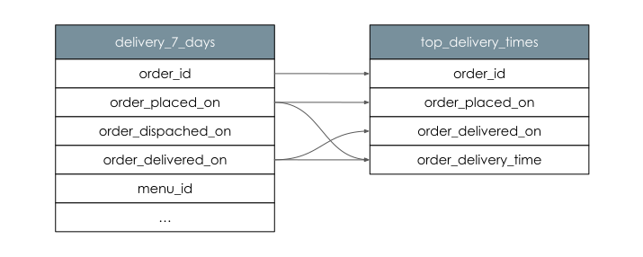

# Column Level Lineage Dataset Facet

Column level lineage provides fine grained information on datasets' dependencies. 
Not only we know the dependency exist, but we are also able to understand 
which input columns are used to produce which output columns and in what way. 
This allows answering questions like *Which root input columns are used to construct column x?* 

For example, a Job might executes the following query:

```sql
INSERT INTO top_delivery_times (
    order_id,
    order_placed_on,
    order_delivered_on,
    order_delivery_time
)
SELECT
    order_id,
    order_placed_on,
    order_delivered_on,
    DATEDIFF(minute, order_placed_on, order_delivered_on) AS order_delivery_time,
FROM delivery_7_days
ORDER BY order_delivery_time DESC
LIMIT 1;
```

This would establish the following relationships between the `delivery_7_days` and `top_delivery_times` tables:



An OpenLinage run state update that represent this query using column-level lineage facets might look like:

```json
{
    "eventType": "START",
    "eventTime": "2020-02-22T22:42:42.000Z",
    "run": ...,
    "job": ...,
    "inputs": [
        {
          "namespace": "food_delivery",
          "name": "public.delivery_7_days"
        }
    ],
    "outputs": [
        {
            "namespace": "food_delivery",
            "name": "public.top_delivery_times",
            "facets": {
                "columnLineage": {
                    "_producer": "https://some.producer.com/version/1.0",
                    "_schemaURL": "https://openlineage.io/spec/facets/1-2-0/ColumnLineageDatasetFacet.json",
                    "fields": {
                        "order_id": {
                            "inputFields": [
                                {
                                    "namespace": "food_delivery",
                                    "name": "public.delivery_7_days",
                                    "field": "order_id",
                                    "transformations": [
                                        {
                                            "type": "DIRECT",
                                            "subtype": "IDENTITY",
                                            "description": "",
                                            "masking": false
                                        }
                                    ]
                                }
                            ]
                        },
                        "order_placed_on": {
                            "inputFields": [
                                {
                                    "namespace": "food_delivery",
                                    "name": "public.delivery_7_days",
                                    "field": "order_placed_on",
                                    "transformations": [
                                        {
                                            "type": "DIRECT",
                                            "subtype": "IDENTITY",
                                            "description": "",
                                            "masking": false
                                        }
                                    ]                                  
                                }
                            ]
                        },
                        "order_delivered_on": {
                            "inputFields": [
                                {
                                    "namespace": "food_delivery",
                                    "name": "public.delivery_7_days",
                                    "field": "order_delivered_on",
                                    "transformations": [
                                        {
                                            "type": "DIRECT",
                                            "subtype": "IDENTITY",
                                            "description": "",
                                            "masking": false
                                        }
                                    ]
                                }
                            ]
                        },
                        "order_delivery_time": {
                            "inputFields": [
                                {
                                    "namespace": "food_delivery",
                                    "name": "public.delivery_7_days",
                                    "field": "order_placed_on",
                                    "transformations": [
                                        {
                                            "type": "DIRECT",
                                            "subtype": "TRANSFORMATION",
                                            "description": "",
                                            "masking": false
                                        }
                                    ]
                                },
                                {
                                    "namespace": "food_delivery",
                                    "name": "public.delivery_7_days",
                                    "field": "order_delivered_on",
                                    "transformations": [
                                        {
                                            "type": "DIRECT",
                                            "subtype": "TRANSFORMATION",
                                            "description": "",
                                            "masking": false
                                        }
                                    ]
                                }
                            ]
                        }
                    },
                    "dataset": [
                        {
                            "namespace": "food_delivery",
                            "name": "public.delivery_7_days",
                            "field": "order_placed_on",
                            "transformations": [
                                {
                                    "type": "INDIRECT",
                                    "subtype": "SORT",
                                    "description": "",
                                    "masking": false
                                }
                            ]
                        },
                        {
                            "namespace": "food_delivery",
                            "name": "public.delivery_7_days",
                            "field": "order_delivered_on",
                            "transformations": [
                                {
                                    "type": "INDIRECT",
                                    "subtype": "SORT",
                                    "description": "",
                                    "masking": false
                                }
                            ],
                        }
                    ]
                }
            }
        }
    ],
    ...
}
```

The facet specification can be found [here](https://openlineage.io/spec/facets/1-2-0/ColumnLineageDatasetFacet.json).

## Transformation Type

To provide the best information about each field lineage, each `inputField` of an output can contain 
the `transformations` field. This field describes what is the nature of relation between the input and the output columns.
Each transformation is described by 4 fields: `type`, `subtype`, `description` and `masking`. 

#### Type
Indicates how direct is the relationship e.g. in query 
```roomsql
SELECT 
    source AS result 
FROM TAB 
WHERE pred = true;
```
1. `DIRECT` - output column value was somehow derived from `inputField` value. In example `result` value is derived from `source`
2. `INDIRECT` - output column value is impacted by the value of `inputField` column, but it's not derived from it. In example no part `result` value is derived from `pred` but `pred` has impact on the values of `result` in the output dataset 

#### Subtype
Contains more specific information about the transformation

Direct:
- `IDENTITY` - output value is taken as is from the input
- `TRANSFORMATION` - output value is transformed source value from input row 
- `AGGREGATION` - output value is aggregation of source values from multiple input rows

Indirect:
- `JOIN` - input used in join condition
- `GROUP_BY` - output is aggregated based on input (e.g. `GROUP BY` clause)
- `FILTER` - input used as a filtering condition (e.g. `WHERE` clause)
- `SORT` - output is sorted based on input field (e.g. `ORDER BY` clause)
- `WINDOW` - output is windowed based on input field
- `CONDITIONAL` - input value is used in `IF`, `CASE WHEN` or `COALESCE` statements

#### Masking
Boolean value indicating if the input value was obfuscated during the transformation. 
The examples are: `hash` for `TRANSFORMATION` and `count` for `AGGREGATION`.
List of available methods that are considered masking is dependent on the source system.

## Legacy representation

For Spark, the result above is produced using config option `spark.openlineage.columnLineage.datasetLineageEnabled=True`.
Default option value is `False` which moves all columns from `"dataset"` field to `"fields"`:
```json
{
    "columnLineage": {
        "_producer": "https://some.producer.com/version/1.0",
        "_schemaURL": "https://openlineage.io/spec/facets/1-2-0/ColumnLineageDatasetFacet.json",
        "fields": {
            "order_id": {
                "inputFields": [
                    {
                        "namespace": "food_delivery",
                        "name": "public.delivery_7_days",
                        "field": "order_id",
                        "transformations": [
                            {
                                "type": "DIRECT",
                                "subtype": "IDENTITY",
                                "description": "",
                                "masking": false
                            },
                        ]
                    },
                    {
                        "namespace": "food_delivery",
                        "name": "public.delivery_7_days",
                        "field": "order_placed_on",
                        "transformations": [
                            {
                                "type": "INDIRECT",
                                "subtype": "SORT",
                                "description": "",
                                "masking": false
                            }
                        ]
                    },
                    {
                        "namespace": "food_delivery",
                        "name": "public.delivery_7_days",
                        "field": "order_delivered_on",
                        "transformations": [
                            {
                                "type": "INDIRECT",
                                "subtype": "SORT",
                                "description": "",
                                "masking": false
                            }
                        ],
                    }
                ]
            },
            "order_placed_on": {
                "inputFields": [
                    {
                        "namespace": "food_delivery",
                        "name": "public.delivery_7_days",
                        "field": "order_placed_on",
                        "transformations": [
                            {
                                "type": "DIRECT",
                                "subtype": "IDENTITY",
                                "description": "",
                                "masking": false
                            }
                        ]                                  
                    },
                    {
                        "namespace": "food_delivery",
                        "name": "public.delivery_7_days",
                        "field": "order_placed_on",
                        "transformations": [
                            {
                                "type": "INDIRECT",
                                "subtype": "SORT",
                                "description": "",
                                "masking": false
                            }
                        ]
                    },
                    {
                        "namespace": "food_delivery",
                        "name": "public.delivery_7_days",
                        "field": "order_delivered_on",
                        "transformations": [
                            {
                                "type": "INDIRECT",
                                "subtype": "SORT",
                                "description": "",
                                "masking": false
                            }
                        ],
                    }
                ]
            }
            // ... other fields
        },
        "dataset": [] // empty
    }
}
```

So each target dataset field depends on each source dataset field with `INDIRECT` column lineage,
producing almost a cartesian product of all dataset fields. This is very inefficient.

It is recommended to use `spark.openlineage.columnLineage.datasetLineageEnabled=True`,
as this produces more compact column lineage representation.
Default value may be changed in future versions of OpenLineage.
