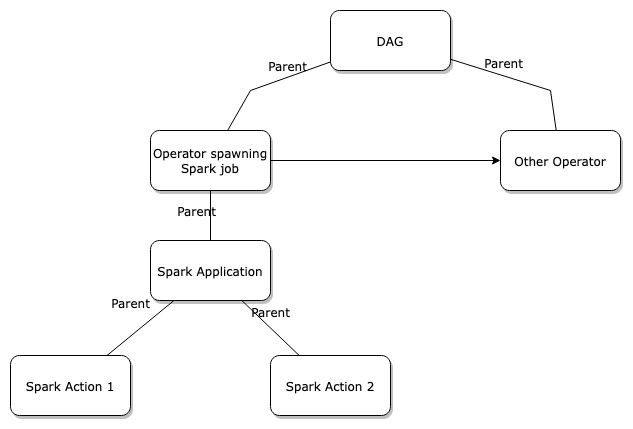
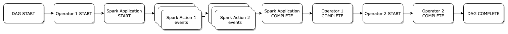

# Job Hierarchy

:::info
This feature is available in OpenLineage versions >= 1.9.0.
:::

In a complex environment, where there are thousands of processing jobs daily, there can be a lot of chaos. 
Understanding not only which jobs produced what dataset, but also answering questions like: 
- why did the job ran?
- when it ran?
- who scheduled the job?
- why did the job ran after other one finished? 
can be often muddy.

Fortunately, OpenLineage gives us not only the ability to understand the dataset-to-dataset lineage, but also
includes a description of the job hierarchy in its model. 

The tool OpenLineage provides for that is the ParentRunFacet. For a given run, it describes what other run spawned it.

```json
"parent": {
 "_producer": "https://github.com/OpenLineage/OpenLineage/tree/0.0.1/integration/dbt",
 "_schemaURL": "https://openlineage.io/spec/facets/1-0-0/ParentRunFacet.json",
 "run": {
   "runId": "f99310b4-3c3c-1a1a-2b2b-c1b95c24ff11"
 },
 "job": {
   "namespace": "dbt",
   "name": "dbt-job-name"
 }
}
```

Data processing systems often integrate built-in hierarchies. Schedulers, for instance, use large, schedulable units like Airflow DAGs, which in turn comprise smaller, executable units like Airflow Tasks. OpenLineage seamlessly reflects this natural organization by mirroring the job hierarchy within its model.

## Complex Job Hierarchy

The simple mechanism on which OpenLineage bases it's job hierarchy model also allows us to describe more complex environments.
In this case, we have an Airflow DAG that has two tasks; one of which spawns a Spark job with two actions. The parent structure is shown in following diagram:



Following diagram shows order in which events from those jobs are coming:


