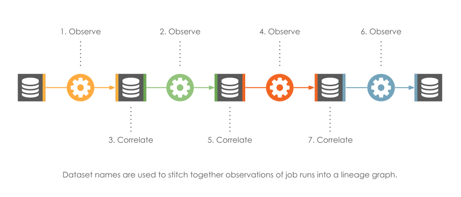

# Naming Conventions

Employing a unique naming strategy per resource ensures that the spec is followed uniformly regardless of metadata
producer.

Jobs and Datasets have their own namespaces, job namespaces being derived from schedulers and dataset namespaces from
datasources.

## Dataset Naming

A dataset, or `table`, is organized according to a producer, namespace, database and (optionally) schema.

| Data Store                    | Type                                 | Namespace                                                                                                                          | Name                                                                         |
|:------------------------------|:-------------------------------------|:-----------------------------------------------------------------------------------------------------------------------------------|:-----------------------------------------------------------------------------|
| Athena                        | Warehouse                            | `awsathena://athena.{region_name}.amazonaws.com`                                                                                   | `{catalog}.{database}.{table}`                                               |
| AWS Glue                      | Data catalog                         | `arn:aws:glue:{region}:{account id}`                                                                                               | `table/{database name}/{table name}`                                         |
| Azure Cosmos DB               | Warehouse                            | `azurecosmos://{host}/dbs/{database}`                                                                                              | `colls/{table}`                                                              |
| Azure Data Explorer           | Warehouse                            | `azurekusto://{host}.kusto.windows.net`                                                                                            | `{database}/{table}`                                                         |
| Azure Synapse                 | Warehouse                            | `sqlserver://{host}:{port}`                                                                                                        | `{schema}.{table}`                                                           |
| BigQuery                      | Warehouse                            | `bigquery`                                                                                                                         | `{project id}.{dataset name}.{table name}`                                   |
| Cassandra                     | Warehouse                            | `cassandra://{host}:{port}`                                                                                                        | `{keyspace}.{table}`                                                         |
| MySQL                         | Warehouse                            | `mysql://{host}:{port}`                                                                                                            | `{database}.{table}`                                                         |
| CrateDB                       | Warehouse                            | `crate://{host}:{port}`                                                                                                            | `{database}.{schema}.{table}`                                                |
| DB2                           | Warehouse                            | `db2://{host}:{port}`                                                                                                              | `{database}.{schema}.{table}`                                                |
| Hive                          | Warehouse                            | `hive://{host}:{port}`                                                                                                             | `{database}.{table}`                                                         |
| MSSQL                         | Warehouse                            | `mssql://{host}:{port}`                                                                                                            | `{database}.{schema}.{table}`                                                |
| OceanBase                     | Warehouse                            | `oceanbase://{host}:{port}`                                                                                                        | `{database}.{table}`                                                         |
| Oracle                        | Warehouse                            | `oracle://{host}:{port}`                                                                                                           | `{serviceName}.{schema}.{table} or {sid}.{schema}.{table}`                   |
| Postgres                      | Warehouse                            | `postgres://{host}:{port}`                                                                                                         | `{database}.{schema}.{table}`                                                |
| Teradata                      | Warehouse                            | `teradata://{host}:{port}`                                                                                                         | `{database}.{table}`                                                         |
| Redshift                      | Warehouse                            | `redshift://{cluster_identifier}.{region_name}:{port}`                                                                             | `{database}.{schema}.{table}`                                                |
| Snowflake                     | Warehouse                            | `snowflake://{organization name}-{account name}` or `snowflake://{account-locator}(.{compliance})(.{cloud_region_id})(.{cloud})`   | `{database}.{schema}.{table}`                                                |
| Spanner                       | Warehouse                            | `spanner://{projectId}:{instanceId}`                                                                                               | `{database}.{schema}.{table}`                                                |
| Trino                         | Warehouse                            | `trino://{host}:{port}`                                                                                                            | `{catalog}.{schema}.{table}`                                                 |
| ABFSS (Azure Data Lake Gen2)  | Data lake                            | `abfss://{container name}@{service name}.dfs.core.windows.net`                                                                     | `{path}`                                                                     |
| DBFS (Databricks File System) | Distributed file system              | `dbfs://{workspace name}`                                                                                                          | `{path}`                                                                     |
| GCS                           | Blob storage                         | `gs://{bucket name}`                                                                                                               | `{object key}`                                                               |
| HDFS                          | Distributed file system              | `hdfs://{namenode host}:{namenode port}`                                                                                           | `{path}`                                                                     |
| Kafka                         | Distributed event streaming platform | `kafka://{bootstrap server host}:{port}`                                                                                           | `{topic}`                                                                    |
| Local file system             | File system                          | `file`                                                                                                                             | `{path}`                                                                     |
| Remote file system            | File system                          | `file://{host}`                                                                                                                    | `{path}`                                                                     |
| S3                            | Blob Storage                         | `s3://{bucket name}`                                                                                                               | `{object key}`                                                               |
| WASBS (Azure Blob Storage)    | Blob Storage                         | `wasbs://{container name}@{service name}.dfs.core.windows.net`                                                                     | `{object key}`                                                               |
| PubSub                        | Distributed event streaming platform | `pubsub`                                                                                                                           | `topic:{projectId}:{topicId}` or `subscription:{projectId}:{subscriptionId}` |
| In memory                     | In-memory (temporary datasets) with no persistance backend  | `inmemory://`                                                       | `{temporary dataset name or ID}` | 


Snowflake is a special case where we don't have a single standardized namespace, due to it's account identifier model.
When possible, instead of using legacy account locator format, you should migrate to the orgname-accountname one.
Using the legacy Snowflake account locator format (that will create `snowflake://{locator}.{region}.{cloud}` dataset IDs) is supported, 
but it forces dataset IDs that won’t match IDs created with the orgname-account_name format.
If you switch formats later, existing lineage nodes won’t connect to new ones.

## Job Naming

A `Job` is a recurring data transformation with inputs and outputs. Each execution is captured as a `Run` with
corresponding metadata.
A `Run` event identifies the `Job` it instances by providing the job’s unique identifier.
The `Job` identifier is composed of a `Namespace` and `Name`. The job namespace is usually set in OpenLineage client
config. The job name is unique within its namespace.

| Job type     | Name                          | Example                                                      |
|:-------------|:------------------------------|:-------------------------------------------------------------|
| Airflow task | `{dag_id}.{task_id}`          | `orders_etl.count_orders`                                    |
| Spark job    | `{appName}.{command}.{table}` | `my_awesome_app.execute_insert_into_hive_table.mydb_mytable` |
| SQL          | `{schema}.{table}`            | `gx.validate_datasets`                                       |
| Debezium     | `{topic.prefix}.{taskId}`     | `inventory.0`                                                |

## Run Naming

Runs are named using client-generated UUIDs. The OpenLineage client is responsible for generating them and maintaining
them throughout the duration of the runcycle.

```python
from openlineage.client.run import Run
from openlineage.client.uuid import generate_new_uuid

run = Run(str(generate_new_uuid()))
```

## Why Naming Matters

Naming enables focused insight into data flows, even when datasets and workflows are distributed across an organization.
This focus enabled by naming is key to the production of useful lineage.



## Additional Resources

* [The OpenLineage Naming Spec](https://github.com/OpenLineage/OpenLineage/blob/main/spec/Naming.md)
* [What's in a Namespace Blog Post](https://openlineage.io/blog/whats-in-a-namespace/)
