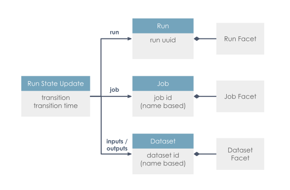

# Object Model

OpenLineage was designed to enable large-scale observation of datasets as they move through a complex pipeline.

Because of this, it integrates with various tools with the aim of emitting real-time lineage events as datasets are created and transformed. The object model is flexible, with abstract definitions for Dataset and Job that support a variety of underlying data architectures. OpenLineage cares how Datasets come into being, not just that relationships exist between them. Accordingly, its object model contains both Jobs *and* Datasets.

Logically, an OpenLineage backend learns about Datasets by receiving information about Jobs that run. Most Jobs have at least one input or output Dataset, and a lineage graph can be created by weaving together observations of many Jobs across multiple platforms.

This information is in the form of **Run State Updates**, which contain information about Jobs, Datasets, and Runs.

## Run State Update
A Run State Update is prepared and sent when something important occurs within your pipeline, and each one can be thought of as a distinct observation. This commonly happens when a Job starts or finishes.

The run state itself refers to a stage within the [run cycle](./run-cycle.md) of the current run. Usually, the first Run State for a Job would be `START` and the last would be `COMPLETE`. A run cycle is likely to have at least two Run State Updates, and perhaps more. Each one will also have timestamp of when this particular state change happened.

Each Run State Update can include detail about the Job, the Run, and the input and output Datasets involved in the run. Subsequent updates are additive: input Datasets, for example, can be specified along with `START`, along with `COMPLETE`, or both. This accommodates situations where information is only available at certain times.

Each of these three core entities can also be extended through the use of facets, some of which are documented in the relevant sections below.

## Job
A Job is a process that consumes or produces Datasets.

This is abstract, and can map to different things in different operational contexts. For example, a job could be a task in a workflow orchestration system. It could also be a model, a query, or a checkpoint. Depending on the system under observation, a Job can represent a small or large amount of work.

A Job is the part of the object model that represents a discrete bit of defined work. If, for example, you have cron running a Python script that executes a `CREATE TABLE x AS SELECT * FROM y` query every day, the Python script is the Job. 

Jobs are identified by a unique name within a `namespace`. They are expected to evolve over time and their changes can be captured through Run State Updates. 

### Job Facets
Facets that can be used to augment the metadata of a Job include:

- **sourceCodeLocation**: Captures the source code location and version (e.g., the git SHA) of the job.

- **sourceCode**: Captures the language (e.g. python) and complete source code of the job. Using this source code, users can gain useful information about what the job does.

For more details, please refer to the [Job Facets](./facets/job-facets).

## Run
A Run is an instance of a Job that represents one of its occurrences in time.

Each run will have a uniquely identifiable `runId` that is generated by the client as [UUID](https://en.wikipedia.org/wiki/Universally_unique_identifier). The client is responsible for maintaining the `runId` between different Run State Updates in the same Run. It is recommended to use [UUIDv7](https://datatracker.ietf.org/doc/draft-ietf-uuidrev-rfc4122bis/) format.

Runs can be used to observe changes in Jobs between their instances. If, for example, you have cron running a Python script that repeats a query every day, this should resuilt in a separate Run for each day.

### Run Facets

Facets that can be used to augment the metadata of a Run include:

- **nominalTime**: Captures the time this run is scheduled for. This is typically used for scheduled jobs. The job has a nominally scheduled time that will be different from the actual time it ran.

- **parent**: Captures the parent Job and Run, for instances where this Run was spawned from a parent Run. For example in the case of [Airflow](https://airflow.apache.org/), there's a Run that represents the DAG itself that is the parent of the individual Runs that represent the tasks it spawns. Similarly when a SparkOperator starts a Spark job, this creates a separate run that refers to the task run as its parent.

- **errorMessage**: Captures potential error messages - and optionally stack traces - with which the run failed.

- **sql**: Captures the SQL query, if this job runs one.

For more details, please refer to the [Run Facets](./facets/run-facets).

## Dataset
A Dataset is an abstract representation of data. This can refer to a small amount or large amount of data, as long as it's discrete. For databases, this should be a table. For cloud storage, this is often an object in a bucket. This can represent a directory of a filesystem.

It has a unique name within a namespace derived from its physical location (i.e., db.host.database.schema.table). The combined namespace and name for a Dataset should be enough to uniquely identify it within a data ecosystem.

Typically, a *Dataset* changes when a job writing to it completes. Similarly to the *Job* and *Run* distinction, metadata that is more static from Run to Run is captured in a DatasetFacet - for example, the schema that does not change every run). What changes every *Run* is captured as an *InputFacet* or an *OutputFacet* - for example, a time partition indicating the subset of the data set that was read or written).

A Dataset is the part of the object model that represents a discrete collection of data. If, for example, you have cron running a Python script that executes a `CREATE TABLE x AS SELECT * FROM y` query every day, the `x` and `y` tables are Datasets.

### Dataset Facets

Facets that can be used to augment the metadata of a Dataset include:

- **schema**: Captures the schema of the dataset

- **dataSource**: Captures the database instance containing this Dataset (e.g., database schema, object store bucket)

- **lifecycleStateChange**: Captures the lifecycle states of the Dataset (e.g., alter, create, drop, overwrite, rename, truncate)

- **version**: Captures the dataset version when versioning is defined by the data store (e.g.. Iceberg snapshot ID)

Input Datasets have the following facets:
- **dataQualityMetrics**: Captures dataset-level and column-level data quality metrics (row count, byte size, null count, distinct count, average, min, max, quantiles)

- **dataQualityAssertions**: Captures the result of running data tests on dataset or its columns

Output Datasets have the following facets:
- **outputStatistics**: Captures the size of the output written to a dataset (e.g., row count and byte size)

For more details, please refer to the [Dataset Facets](./facets/dataset-facets).
