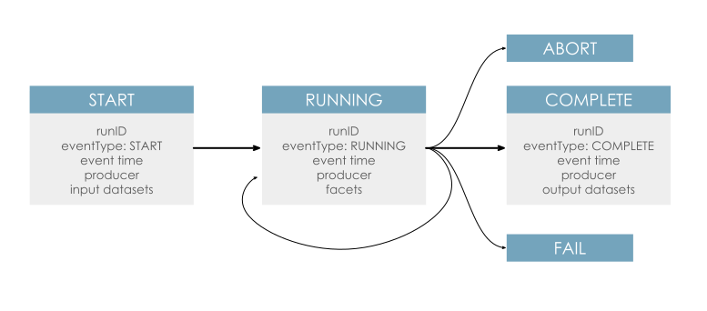

# The Run Cycle

The OpenLineage [object model](object-model.md) is event-based and updates provide an OpenLineage backend with details about the activities of a Job.

The OpenLineage Run Cycle has several defined states that correspond to changes in the state of a pipeline task. When a task transitions between these - e.g. it is initiated, finishes, or fails - a Run State Update is sent that describes what happened.

Each Run State Update contains the run state (i.e., `START`) along with metadata about the Job, its current Run, and its input and output Datasets. It is common to add additional metadata throughout the lifecycle of the run as it becomes available.

## Run States

There are six run states currently defined in the OpenLineage [spec](https://openlineage.io/apidocs/openapi/):

* `START` to indicate the beginning of a Job

* `RUNNING` to provide additional information about a running Job

* `COMPLETE` to signify that execution of the Job has concluded

* `ABORT` to signify that the Job has been stopped abnormally

* `FAIL` to signify that the Job has failed

* `OTHER` to send additional metadata outside standard run cycle

We assume events describing a single run are **accumulative** and 
`COMPLETE`, `ABORT` and `FAIL` are terminal events. Sending any of terminal events
means no other events related to this run will be emitted. 

Additionally, we allow `OTHER` to be sent anytime before the terminal states, 
also before `START`. The purpose of this is the agility to send additional
metadata outside standard run cycle - e.g., on a run that hasn't yet started 
but is already awaiting the resources.

## Typical Scenarios

A batch Job - e.g., an Airflow task or a dbt model - will typically be represented as a `START` event followed by a `COMPLETE` event. Occasionally, an `ABORT` or `FAIL` event will be sent when a job does not complete successfully.

A long-running Job - e.g., a microservice or a stream - will typically be represented by a `START` event followed by a series of `RUNNING` events that report changes in the run or emit performance metrics. Occasionally, a `COMPLETE`, `ABORT`, or `FAIL` event will occur, often followed by a `START` event as the job is reinitiated. 

