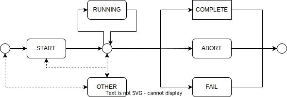
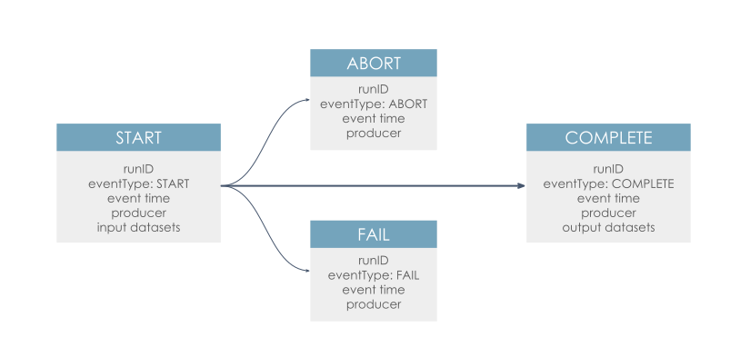
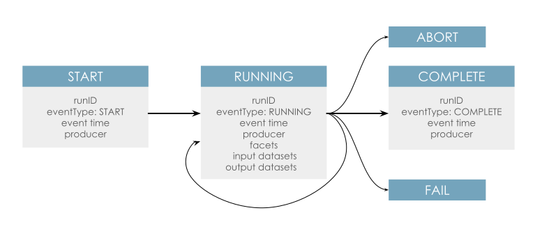

# The Run Cycle

The OpenLineage [object model](object-model.md) is event-based and updates provide an OpenLineage backend with details about the activities of a Job.

The OpenLineage Run Cycle has several defined states that correspond to changes in the state of a pipeline task. When a task transitions between these - e.g. it is initiated, finishes, or fails - a Run State Update is sent that describes what happened.

Each Run State Update contains the run state (i.e., `START`) along with metadata about the Job, its current Run, and its input and output Datasets. It is common to add additional metadata throughout the lifecycle of the run as it becomes available.

## Run States

There are six run states currently defined in the OpenLineage [spec](https://openlineage.io/apidocs/openapi/):

* `START` to indicate the beginning of a Job

* `RUNNING` to provide additional information about a running Job

* `COMPLETE` to signify that execution of the Job has concluded

* `ABORT` to signify that the Job has been stopped abnormally

* `FAIL` to signify that the Job has failed

* `OTHER` to send additional metadata outside standard run cycle

Unless specified otherwise, we assume events describing a single run are **accumulative** and
`COMPLETE`, `ABORT` and `FAIL` are terminal events. Sending any of terminal events
means no other events related to this run will be emitted.

Additionally, we allow `OTHER` to be sent anytime before the terminal states,
also before `START`. The purpose of this is the agility to send additional
metadata outside standard run cycle - e.g., on a run that hasn't yet started
but is already awaiting the resources.

## Processing Types and Job Lifecycles

Jobs can have different processing types that define their lifecycle characteristics. The [JobTypeJobFacet](facets/job-facets/job-type.md) `processingType` field indicates the nature of the job:

### BATCH Jobs (Finite)

**BATCH jobs** are finite jobs with a clear start and end point. They are expected to terminate naturally after completing their work.

**Characteristics:**
- Emit `START` → [optional `RUNNING`] → `COMPLETE`/`FAIL`/`ABORT` events
- Events are typically **accumulative** - each event contains cumulative state since job start
- Examples: Batch ETL jobs, Airflow tasks, dbt models, bounded stream processing

### STREAMING Jobs (Continuous)

**STREAMING jobs** are continuous jobs that process data streams indefinitely with no natural completion point.

**Characteristics:**
- No expected terminal event under normal operation
- Typically emit events periodically at regular intervals
- Events can be either accumulative or complete snapshots for time windows
- Examples: Kafka Streams, Flink streaming jobs, Spark Streaming applications
- While `START`, `COMPLETE`, `ABORT`, or `FAIL` events can be emitted, they should not be relied upon as they might occur only occasionally when the streaming job is restarted

**Event Patterns:**

- **Periodic with Complete Snapshots** (recommended for streaming):
   - Each event contains complete information for a specific time window (e.g., 5 minutes). Events can be processed independently.
- **Periodic with Accumulative State**:
   - Each event contains cumulative metrics since job start. Consumers need only the latest event.

### SERVICE Jobs (Continuous)

**SERVICE jobs** are continuous long-running services or microservices that run indefinitely.

**Characteristics:**
- Similar to STREAMING but for general-purpose (web) services rather than data stream processing
- No expected terminal event under normal operation
- Typically emit periodic events with cumulative or snapshot metrics
- Examples: Microservices, background workers, API services
- While `START`, `COMPLETE`, `ABORT`, or `FAIL` events can be emitted, they should not be relied upon as they might occur only occasionally when the service is restarted

## Event Completeness

The `eventCompleteness` field in the emission pattern describes what information events contain:

### Accumulative Events

**Accumulative events** may contain only partial information and the complete information can be collected by combining information from all the events emmited by a specific job run:
- Individual events are more likely to contain partial rather then complete information
- Consumers need to combine all events for a specif run to have complete information about the job run

### Complete Snapshot Events

**Complete snapshot events** contain complete state for a specific time window:
- Each event is self-contained for its time period
- Events can be processed independently without reference to previous events
- Example: Records processed in last 5 minutes = 50,000
- Ideal for streaming jobs with time-windowed processing
- Addresses the needs of long-running streaming processes that don't fit the traditional start-complete lifecycle

## Typical Scenarios

### Batch Jobs (processingType: BATCH)

A batch Job - e.g., an Airflow task or a dbt model - will typically be represented as a `START` event followed by a `COMPLETE` event. Occasionally, an `ABORT` or `FAIL` event will be sent when a job does not complete successfully.

### Streaming Jobs (processingType: STREAMING)

A streaming Job - e.g., a Kafka Streams application or Flink job - will typically emit periodic events at regular intervals. Each event represents a complete snapshot of activity within a specific time window.

### Long-Running Services (processingType: SERVICE)

A long-running service - e.g., a microservice - may emit periodic or event-based (e.g. per-request) events with metrics. It will typically be represented by a `START` event followed by a series of `RUNNING` events that report changes in the run or emit performance metrics. Occasionally, a `COMPLETE`, `ABORT`, or `FAIL` event will occur, often followed by a `START` event as the service is reinitiated.

### Key differences between continous (STREAMING, SERVICE) and finite (BATCH) jobs
- Continuous jobs can emit `START`, `COMPLETE`, `ABORT`, or `FAIL` events, however they should not be relied upon as they might be emitted only occasionally when the streaming job is restarted
- Events are typically emitted at regular intervals (e.g., every 5 minutes)
- Each event is self-contained for its time window
- No need to accumulate information across multiple events
- Consumers can process each event independently