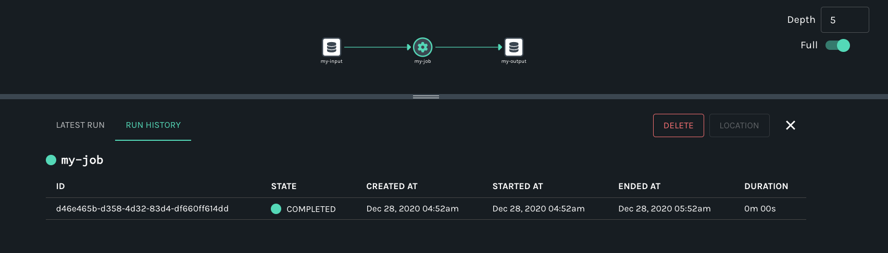
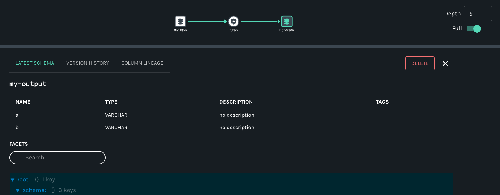

<div id="post-content" className="boxed">
<div className="title px-4 py-12 text-center lg:py-14 lg:px-0">
    <h2 className="text-5xl text-color-1">
        Getting Started
    </h2>
</div>

This guide covers how you can quickly get started collecting _dataset_, _job_, and _run_ metadata using OpenLineage. We'll show how to collect _run-level_ metadata as OpenLineage events using [Marquez](https://marquezproject.ai) as the [HTTP backend](https://github.com/OpenLineage/OpenLineage#scope), then explore lineage metadata via the Marquez UI.

## Prerequisites

Before you begin, make sure you have installed:

* [Docker 17.05](https://docs.docker.com/install)+
* [Docker Compose](https://docs.docker.com/compose/install)

:::info
In this guide, we'll be using Marquez as the OpenLineage HTTP backend and running the HTTP server via Docker.
:::

### Run Marquez with [Docker](https://github.com/MarquezProject/marquez/blob/main/Dockerfile)

The easiest way to get up and running with Marquez is Docker. Check out the Marquez source code and run the `./docker/up.sh` script:

```bash
$ git clone https://github.com/MarquezProject/marquez.git && cd marquez

$ ./docker/up.sh
```

:::info
Pass the `--build` flag to the script to build images from source, or `--tag X.Y.Z` to use a tagged image.

Users on Apple silicon architecture encountering platform-related errors from Docker might need to enable emulation and customize the Docker services. Tips can be found in [this guide](https://medium.com/@email.bajaj/docker-image-platform-compatibility-issue-with-mac-silicon-processors-m1-m2-ee2d5ea3ff0e).

The Marquez backend uses port `5432`.
:::

To view the Marquez UI and verify it's running, open [http://localhost:3000](http://localhost:3000). 

**The UI enables you to discover dependencies between jobs and the datasets they produce and consume via the lineage graph, view run-level metadata of current and previous job runs, and much more.**

## Collect Run-Level Metadata

Marquez, the reference implementation of the OpenLineage standard, is an [LF AI & DATA](https://lfaidata.foundation) incubation project to collect, aggregate, and visualize a data ecosystem’s metadata.

In this example, you will learn how to collect dataset and job metadata using the [Marquez](https://marquezproject.github.io/marquez/) [LineageAPI](https://marquezproject.github.io/marquez/openapi.html#tag/Lineage) and [UI](https://github.com/MarquezProject/marquez/tree/main/web).

When you submit a lineage event, you first need to define a unique `run ID` similar to `0176a8c2-fe01-7439-87e6-56a1a1b4029f`. [UUIDv7](https://datatracker.ietf.org/doc/draft-ietf-uuidrev-rfc4122bis/) format is recommended, and it should be unique. This run ID will enable the tracking of run-level metadata over time for a _job_ that may have a name, like `my-job`. So, let's get started!

:::info
The example shows how to collect metadata via direct HTTP API calls using `curl`. But, you can also get started using either of our client libraries for [Java](https://github.com/MarquezProject/marquez/tree/main/clients/java) or [Python](https://github.com/MarquezProject/marquez/tree/main/clients/python).
:::

### Step 1: Start a Run

Use the run ID `0176a8c2-fe01-7439-87e6-56a1a1b4029f` to **start** the run for `my-job` with `my-input` as the input dataset:

#### REQUEST

```bash
$ curl -X POST http://localhost:5000/api/v1/lineage \
  -i -H 'Content-Type: application/json' \
  -d '{
        "eventType": "START",
        "eventTime": "2020-12-28T19:52:00.001+10:00",
        "run": {
          "runId": "0176a8c2-fe01-7439-87e6-56a1a1b4029f"
        },
        "job": {
          "namespace": "my-namespace",
          "name": "my-job"
        },
        "inputs": [{
          "namespace": "my-namespace",
          "name": "my-input"
        }],  
        "producer": "https://github.com/OpenLineage/OpenLineage/blob/v1-0-0/client",
        "schemaURL": "https://openlineage.io/spec/1-0-5/OpenLineage.json#/definitions/RunEvent"
      }'
```

#### RESPONSE

`201 CREATED`

### Step 2: Complete a Run

Use `0176a8c2-fe01-7439-87e6-56a1a1b4029f` to **complete** the run for `my-job` with `my-output` as the output dataset. We also specify the [schema](https://github.com/OpenLineage/OpenLineage/blob/main/spec/OpenLineage.md#dataset-facets) **facet** to collect the schema for `my-output` before marking the run as completed. Note, you don't have to specify the input dataset `my-input` again for the run since it has already been associated with the run ID:

#### REQUEST

```bash
$ curl -X POST http://localhost:5000/api/v1/lineage \
  -i -H 'Content-Type: application/json' \
  -d '{
        "eventType": "COMPLETE",
        "eventTime": "2020-12-28T20:52:00.001+10:00",
        "run": {
          "runId": "0176a8c2-fe01-7439-87e6-56a1a1b4029f"
        },
        "job": {
          "namespace": "my-namespace",
          "name": "my-job"
        },
        "outputs": [{
          "namespace": "my-namespace",
          "name": "my-output",
          "facets": {
            "schema": {
              "_producer": "https://github.com/OpenLineage/OpenLineage/blob/v1-0-0/client",
              "_schemaURL": "https://github.com/OpenLineage/OpenLineage/blob/v1-0-0/spec/OpenLineage.json#/definitions/SchemaDatasetFacet",
              "fields": [
                { "name": "a", "type": "VARCHAR"},
                { "name": "b", "type": "VARCHAR"}
              ]
            }
          }
        }],     
        "producer": "https://github.com/OpenLineage/OpenLineage/blob/v1-0-0/client",
        "schemaURL": "https://openlineage.io/spec/1-0-5/OpenLineage.json#/definitions/RunEvent"
      }'
```

#### RESPONSE

`201 CREATED`

## View Collected Lineage Metadata

### Search Job Metadata

To view lineage metadata collected by Marquez, browse to the UI by visiting [http://localhost:3000](http://localhost:3000). Then, use the search bar in the upper right-side of the page and search for the job `my-job`. To view lineage metadata for `my-job`, click on the job from the drop-down list:

<p align="center">
  
</p>

### View Job Metadata

In the search result, you should see the job `namespace` and `name`, and in the lineage graph you should see `my-input` as an input dataset and `my-output` as an output dataset. In the `RUN HISTORY` tab on the Job Detail page below the graph, the job run state should be `COMPLETED`. 



### View Input Dataset Metadata

Finally, click on the output dataset `my-output` for `my-job`. Metadata displayed includes the name, column names, data types, and more:



## Summary

In this simple example, we showed you how to use Marquez to collect dataset and job metadata with Openlineage. We also walked you through the set of HTTP [API](https://marquezproject.github.io/marquez/openapi.html) calls to successfully mark a run as **complete** and view the lineage metadata collected with Marquez.

## Next Steps

* Take a look at Marquez's Airflow [example](https://github.com/MarquezProject/marquez/tree/main/examples/airflow) to learn how to enable OpenLineage metadata collection for Airflow DAGs and troubleshoot failing DAGs using Marquez.
* Watch [Cross-platform Data Lineage with OpenLineage](https://www.databricks.com/dataaisummit/session/cross-platform-data-lineage-openlineage/).
* Watch [Column-level Lineage is Coming to the Rescue](https://youtu.be/xFVSZCCbZlY).
* Watch [Observability for Data Pipelines with OpenLineage](https://youtu.be/HEJFCQLwdtk?si=ILsLdCfJqCP8SifQ).
* Watch [Data Observability and Pipelines: OpenLineage and Marquez](https://mattturck.com/datakin/).
* Listen to [Solving Data Lineage Tracking And Data Discovery At WeWork](https://www.dataengineeringpodcast.com/marquez-data-lineage-episode-111).
* Listen to [Unlocking The Power of Data Lineage In Your Platform with OpenLineage](https://www.dataengineeringpodcast.com/openlineage-data-lineage-specification-episode-187).

## Feedback

What did you think of this guide? We would love to hear feedback, and we can be found on the [OpenLineage Slack](https://join.slack.com/t/openlineage/shared_invite/zt-2u4oiyz5h-TEmqpP4fVM5eCdOGeIbZvA).

<br></br><br></br>
</div>


import Footer from '@site/src/components/footer';

<Footer />
